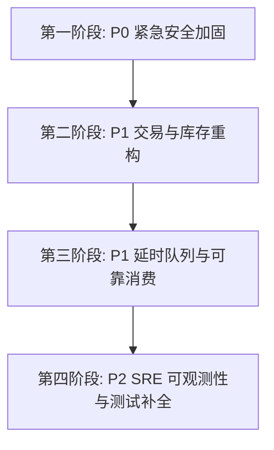

# 《online-mall-application》企业级架构审计与迭代实施指南

> **文档定位**：本指南基于对项目全量源码（Spring Boot 3.5 / MyBatis-Plus / Redis Lua / Redisson / AI Assistant）的多专家视角联合审计，针对安全性、高并发交易一致性、分布式可扩展性及工程就绪度提供系统化的迭代指引与落地代码蓝图。

---

## 目录
- [一、 评审概览与成熟度评分矩阵](#一-评审概览与成熟度评分矩阵)
- [二、 核心缺陷与隐患清单 (P0 / P1 / P2)](#二-核心缺陷与隐患清单-p0--p1--p2)
- [三、 迭代实施蓝图与改造指引](#三-迭代实施蓝图与改造指引)
  - [阶段一：紧急安全加固与权限隔离 (P0 迭代)](#阶段一紧急安全加固与权限隔离-p0-迭代)
  - [阶段二：高并发库存与交易链路重构 (P1 迭代)](#阶段二高并发库存与交易链路重构-p1-迭代)
  - [阶段三：延时队列与分布式消费可靠性优化 (P1 迭代)](#阶段三延时队列与分布式消费可靠性优化-p1-迭代)
  - [阶段四：工程质量、可观测性与测试补全 (P2 迭代)](#阶段四工程质量可观测性与测试补全-p2-迭代)
- [四、 生产上线验收标准 (Definition of Done)](#四-生产上线验收标准-definition-of-done)

---

## 一、 评审概览与成熟度评分矩阵

### 1.1 综合评估：`5.8 / 10.0`
* **架构定位**：具备良好的现代 Java 17 + Spring Boot 3.5 技术栈和 AI 助手原型设计，实现了初步的防重放、Redis Lua 预占库存与状态机控制。
* **主要差距**：距离金融级交易一致性、高并发秒杀抗争用、分布式 Cluster 横向扩容及生产级安全防越权存在明显短板。

| 评估维度 | 成熟度评分 (1-10) | 核心现状与关键痛点 |
| :--- | :---: | :--- |
| **🛡️ 安全防护与权限风控** | **5.5** | 接口存在大面积水平/垂直越权（IDOR）；密码明文存储；JWT 拦截器吞异常；文件上传未授权。 |
| **⚡ 高并发交易与核心库存** | **5.0** | DB 绝对值更新致并发更新丢失；Lua 破坏 Cluster 分片；`hgetall` O(N) 阻塞与误清空预占。 |
| **🏛️ 架构与分布式可扩展性** | **6.0** | 延时扫描吞吐严重不足（0.3单/s）；消费者写死冲突；一对多 Collection 关联导致分页错乱。 |
| **📈 工程质量与生产就绪度** | **6.5** | 核心电商交易单测覆盖率 0%；缺乏全局 TraceId 链路追踪；存在硬编码敏感凭据。 |

---

## 二、 核心缺陷与隐患清单 (P0 / P1 / P2)

### 2.1 【P0 级 - 致命缺陷与高危安全漏洞】

| 缺陷编号 | 影响模块 / 代码位置 | 缺陷现象与根本原因 | 严重后果 |
| :--- | :--- | :--- | :--- |
| **SEC-01** | `OrderServiceImpl.java`<br>• `cancelOrder`<br>• `approveReturn` | 取消待支付订单未校验当前用户；退货审批比对前端传入的 `merchantId` 而非当前登录商户。 | 任意用户可取消全站他人订单；普通买家可越权批准退款并回补库存。 |
| **SEC-02** | `UserAddressServiceImpl.java`<br>• `setDefaultAddress` | 设置默认地址执行未带 `userId` 的全局更新：<br>`lambdaUpdate().set(getIsDefault, 0).eq(getIsDefault, 1)` | 任意用户设默认地址时，**全站所有用户的默认地址均被清空**。 |
| **SEC-03** | `CartController.java`<br>`ProductReviewServiceImpl.java` | 购物车删除（`removeById`）未校验归属；评价仅校验订单状态未校验订单归属。 | 任意用户可清空他人购物车；伪造评价操纵店铺与商品评分。 |
| **SEC-04** | `RefreshInterceptor.java`<br>`JwtUtils.java` | `finally { return true; }` 吞掉 `AuthorizeException`；时间戳比较错误；JWT Secret 硬编码。 | 过期/伪造 Token 直接放行；Token 临期刷新失常；秘钥泄露后可伪造身份。 |
| **SEC-05** | `UserServiceImpl.java` | 注册、登录、改密均采用明文密码比对与入库。 | 数据库一旦泄露，用户凭据批量失窃。 |
| **SEC-06** | `WebConfig.java`<br>`ImageController.java` | `/image/upload` 被加入免登录白名单，且无文件类型、魔数与大小限制。 | 任意公网匿名用户可将服务作为免费图床或上传恶意攻击载荷。 |

### 2.2 【P1 级 - 交易并发、数据一致性与可用性瓶颈】

| 缺陷编号 | 影响模块 / 代码位置 | 缺陷现象与根本原因 | 严重后果 |
| :--- | :--- | :--- | :--- |
| **TRD-01** | `ProductServiceImpl.java`<br>• `modifyStockQuantity` | 内存计算库存后直接执行 `UPDATE product SET stock_quantity = ?` 覆盖更新。 | 并发支付/调库存发生 **Lost Update（更新丢失）**，产生严重超卖。 |
| **TRD-02** | `resources/lua/reserve-stock.lua`<br>`rollback-reserve-stock.lua` | Java 层传空 KEYS；Lua 内部拼接 key 及全局单 key `order:id:map:to:temp:id`。 | 部署 Redis Cluster 时触发 `CROSSSLOT` 报错崩溃；产生热点 BigKey。 |
| **TRD-03** | `resources/lua/update-stock.lua` | 使用 `hgetall` 遍历预占 Hash；当 `available < 0` 时直接执行 `del stockReserveKey`。 | 大促秒杀单线程阻塞；正在收银台付款用户的**有效预占被一网打尽清空**。 |
| **TRD-04** | `OrderServiceImpl.java`<br>`PayServiceImpl.java` | 循环内加 Redisson 锁包装单命令 Lua；支付方法在事务内 `finally` 解锁。 | 加锁性能抵消 Redis 吞吐；事务未提交即释放锁引发并发脏读。 |
| **TRD-05** | `OrderTimeOutTask.java` | 每 10 秒只拉 3 单；消费者固定 `"c1"`；`handlePendingList` 为空。 | 3000 单超时需 2.7 小时才能释放库存；多实例 PEL 冲突；宕机丢单。 |
| **ARCH-01**| `OrderMapper.xml`<br>• `getMerchantOrdersWithPagination` | 1:N 表关联结果集使用 `<collection>` 映射同时配置物理分页插件。 | 分页 `LIMIT` 作用于拍平后的商品行，导致订单分页数量严重缩水错乱。 |

---

## 三、 迭代实施蓝图与改造指引



---

### 阶段一：紧急安全加固与权限隔离 (P0 迭代)

#### 1. 修复 `RefreshInterceptor` 异常吞噬与 Token 刷新
* **改造要点**：
  1. 移除 `finally` 块中的 `return true;`，确保未授权异常正常中断；
  2. 修复临期时间戳差值计算；
  3. 密钥外置到配置项 `mall.jwt.secret`。

```java
// com.scutmmq.interceptor.RefreshInterceptor.java
@Override
public boolean preHandle(HttpServletRequest request, HttpServletResponse response, Object handler) throws Exception {
    String token = request.getHeader("Authorization");
    if (token == null || token.isBlank()) {
        return true;
    }
    if (token.startsWith("Bearer ")) {
        token = token.substring(7).trim();
    }
    try {
        Claims claims = JwtUtils.parseJwtToken(token);
        UserDTO userDTO = BeanUtil.fillBeanWithMap(claims, new UserDTO(), true);

        Boolean hasKey = stringRedisTemplate.hasKey(TOKEN_KEY + token);
        if (!Boolean.TRUE.equals(hasKey)) {
            return true;
        }

        long remainMillis = claims.getExpiration().getTime() - System.currentTimeMillis();
        Long redisExpireMillis = stringRedisTemplate.getExpire(TOKEN_KEY + token, TimeUnit.MILLISECONDS);

        // 剩余时间小于 20 分钟且有效时触发滑动续期
        if (remainMillis > 0 && remainMillis < 20 * 60 * 1000L && redisExpireMillis != null && redisExpireMillis > 0) {
            String newToken = JwtUtils.generateJwtToken(claims);
            userDTO.setToken(newToken);
            UserHolder.saveUser(userDTO);
            response.setHeader("Authorization", newToken);

            stringRedisTemplate.opsForValue().set(TOKEN_KEY + newToken, USER_PERMISSION, TOKEN_EXPIRATION, TOKEN_TIME_UNIT);
            stringRedisTemplate.expire(TOKEN_KEY + token, 15, TimeUnit.SECONDS); // 15秒平滑过渡
            return true;
        }

        userDTO.setToken(token);
        UserHolder.saveUser(userDTO);
        return true;
    } catch (ExpiredJwtException e) {
        log.warn("JWT 已过期: {}", e.getMessage());
        throw new AuthorizeException("登录已过期，请重新登录");
    } catch (Exception e) {
        log.error("JWT 解析异常: {}", e.getMessage());
        throw new AuthorizeException("登录凭据无效");
    }
    // 禁止在 finally 块中编写 return 语句！
}
```

#### 2. 全面消除 IDOR 水平/垂直越权漏洞
* **订单操作校验**：
  ```java
  // OrderServiceImpl.java: cancelOrder 必须校验当前登录人
  Long currentUserId = UserHolder.getUser().getId();
  Orders order = this.getById(dto.getOrderId());
  if (order == null) throw new BusinessException("订单不存在");
  if (!Objects.equals(order.getUserId(), currentUserId)) {
      throw new BusinessException("无权取消该订单");
  }
  ```
* **退款审批绑定商户**：
  ```java
  // OrderServiceImpl.java: approveReturn 必须校验当前登录人持有的商户 ID
  Long currentUserId = UserHolder.getUser().getId();
  Long myMerchantId = merchantUserMapper.getMerchantIdByUserId(currentUserId);
  if (myMerchantId == null || !Objects.equals(order.getMerchantId(), myMerchantId)) {
      throw new BusinessException("无权审批非本店订单");
  }
  ```
* **收货地址默认设置**：
  ```java
  // UserAddressServiceImpl.java: 仅清除当前用户的默认标记
  Long userId = UserHolder.getUser().getId();
  lambdaUpdate().set(UserAddress::getIsDefault, 0)
                .eq(UserAddress::getUserId, userId)
                .eq(UserAddress::getIsDefault, 1)
                .update();
  lambdaUpdate().set(UserAddress::getIsDefault, 1)
                .eq(UserAddress::getId, addressId)
                .eq(UserAddress::getUserId, userId)
                .update();
  ```

#### 3. 密码加密存储迁移
* 引入 `BCryptPasswordEncoder`，在注册和更新密码时执行加盐哈希，废除 SQL 明文比对。

#### 4. 收紧 `/image/upload` 接口
* 从 `WebConfig` 免认证列表移除；增加白名单限制（只允许 `jpg, png, webp`）、文件头 Magic Number 检测以及最大 5MB 限制。

---

### 阶段二：高并发库存与交易链路重构 (P1 迭代)

#### 1. 数据库底层原子相对扣减（防超卖安全底线）
* 废除 Java 内存计算绝对值覆盖，在 `ProductMapper.xml` 中编写原子更新 SQL：
```xml
<!-- ProductMapper.xml -->
<update id="decreaseStock">
    UPDATE product
    SET stock_quantity = stock_quantity - #{quantity},
        update_time = NOW()
    WHERE id = #{productId}
      AND stock_quantity >= #{quantity}
</update>

<update id="increaseStock">
    UPDATE product
    SET stock_quantity = stock_quantity + #{quantity},
        update_time = NOW()
    WHERE id = #{productId}
</update>
```

#### 2. 标准化 Cluster 兼容的预占 Lua 脚本
* 引入 Hash Tag `{p:productId}` 约束相同分片，使用 `KEYS` 传参，避免全量 `hgetall`：

```lua
-- src/main/resources/lua/reserve-stock-v2.lua
-- KEYS[1]: product:stock:available:{p:productId}
-- KEYS[2]: product:stock:reserve:{p:productId}
-- ARGV[1]: quantity
-- ARGV[2]: tempOrderId

local stockKey = KEYS[1]
local stockReserveKey = KEYS[2]
local quantity = tonumber(ARGV[1])
local tempOrderId = ARGV[2]

local stockVal = redis.call('get', stockKey)
if not stockVal then
    return -1 -- 触发应用层同步加载 DB 库存快照
end

local available = tonumber(stockVal)
if available < quantity then
    return 0 -- 库存不足
end

redis.call('decrby', stockKey, quantity)
redis.call('hset', stockReserveKey, tempOrderId, quantity)
return 1
```

```lua
-- src/main/resources/lua/rollback-reserve-stock-v2.lua
-- KEYS[1]: product:stock:available:{p:productId}
-- KEYS[2]: product:stock:reserve:{p:productId}
-- ARGV[1]: tempOrderId

local stockKey = KEYS[1]
local stockReserveKey = KEYS[2]
local tempOrderId = ARGV[1]

local quantity = tonumber(redis.call('hget', stockReserveKey, tempOrderId))
if quantity and quantity > 0 then
    redis.call('incrby', stockKey, quantity)
    redis.call('hdel', stockReserveKey, tempOrderId)
    return 1
end
return 0
```

---

### 阶段三：延时队列与分布式消费可靠性优化 (P1 迭代)

#### 1. 原子批量出队 Lua 脚本
* 替代原有 `rangeByScore` + 异步 `remove` 的非原子双步操作：
```lua
-- src/main/resources/lua/zset-pop-timeout.lua
-- KEYS[1]: order:timeout:trigger
-- ARGV[1]: maxScore (当前时间戳)
-- ARGV[2]: limit (批次大小，如 100)

local members = redis.call('zrangebyscore', KEYS[1], 0, ARGV[1], 'LIMIT', 0, tonumber(ARGV[2]))
if #members > 0 then
    redis.call('zrem', KEYS[1], unpack(members))
    return members
end
return {}
```

#### 2. `OrderTimeOutTask` 改造要点
1. **吞吐量提升**：批次扫描从 3 提升至 100；
2. **多节点消费者动态隔离**：消费者名称使用 `c-` + 机器主机名/Pod名；
3. **Pending 消息恢复**：在 `handlePendingList()` 中定期调用 `XPENDING` 与 `XCLAIM` 重新认领超过 60 秒未 ACK 的死信消息；
4. **修复分页错乱**：在 `OrderMapper.xml` 中将订单分页改为**先分页查询订单主表 ID 列表，再通过 `order_id IN (...)` 关联查询子项**。

---

### 阶段四：工程质量、可观测性与测试补全 (P2 迭代)

#### 1. 核心业务单测工程补齐
在 `src/test/java/com/scutmmq/` 建立与 `com.scutmmq.service` 对应的完整单测矩阵：
* `OrderServiceConcurrentTest`: 模拟 100 线程并发抢购同个只有 10 件库存的商品，校验最终库存为 0 且无超卖；
* `PayServiceIdempotencyTest`: 模拟并发双击支付与重复回调，校验订单状态机与流水幂等；
* `IdorSecurityTest`: 模拟普通用户 A 调用接口修改用户 B 订单/地址，校验预期抛出权限异常。

#### 2. MDC 全局链路追踪 (TraceId)
在 `RefreshInterceptor` 生成 `traceId = UUID.randomUUID().toString().replace("-", "")` 并置入 `MDC.put("traceId", traceId)`，在 `logback.xml` 中配置输出格式 `%X{traceId}`，并在响应头返回 `X-Trace-Id`。

#### 3. 生产环境敏感配置彻底外置
* 将 `application-dev.yaml` 与 `application-prod.yaml` 中的硬编码数据库账密、Redis 密码、阿里云 OSS 密钥统一替换为纯环境变量引用（如 `${MYSQL_PASSWORD}`），从 Git 历史中消除敏感记录。

---

## 四、 生产上线验收标准 (Definition of Done)

- [ ] **安全基线**：全站所有增删改查 Controller 均已校验资源归属，未登录状态无法调用除白名单外的任何接口；
- [ ] **密码防护**：数据库中无任何明文密码，全部经过 BCrypt 单向哈希；
- [ ] **并发防超卖**：高并发压测下（JMeter / Locust 1000 QPS），`product.stock_quantity` 扣减绝对准确，Redis 与 MySQL 最终一致，无超卖、无负库存；
- [ ] **分布式适配**：Lua 脚本通过 Redis Cluster 分片验证，无 CrossSlot 异常；
- [ ] **延时任务吞吐**：10,000 单超时订单在 60 秒内全部完成状态流转与库存回滚，单节点宕机后未确认消息被其他节点自动认领；
- [ ] **测试覆盖率**：核心交易与库存包（`service.Impl`）行覆盖率达 80% 以上，分支覆盖率达 75% 以上。
