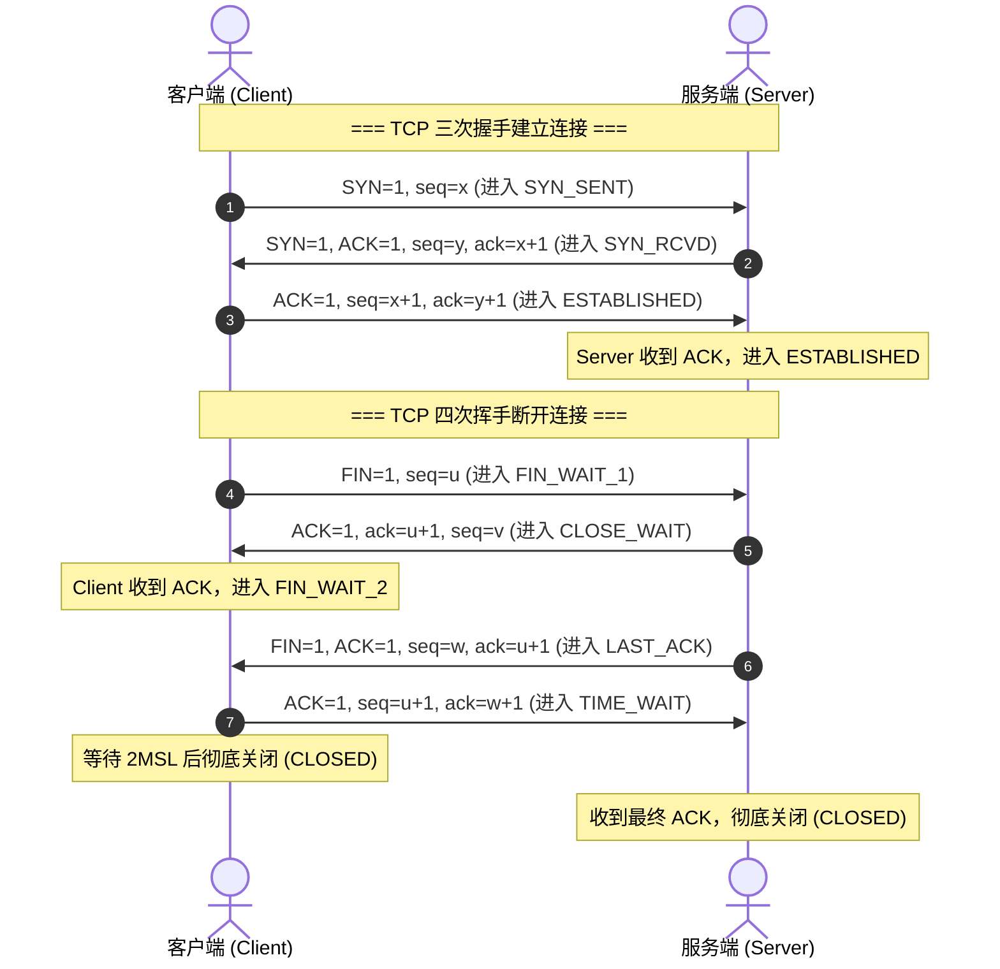
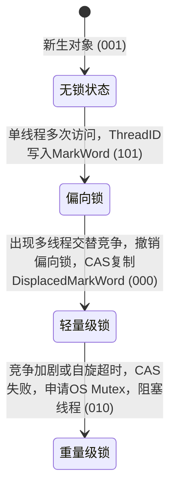

# 🎯 TP-LINK（普联）软件研发工程师一面极速通关宝典

> **编写背景**：针对 TP-LINK 软件研发工程师校招/秋招技术一面（通常为 25~30 分钟技术快面），紧密结合**华南理工大学科班背景**、**云智易（Netty 物联网长连接网关）**、**凯通科技（电信级中台慢 SQL 治理）**以及**荒天商城高并发微服务**量身打造。  
> **核心战术**：30 分钟短平快面试中，掌握节奏者胜。将面试官的提问靶心从宽泛八股精准引流到**网络通信（普联特产）+ Netty 高并发底座 + 数据库调优**这三大优势领地。

---

## 目录
- [一、30分钟极速面试战术地图与面试官画像](#一30分钟极速面试战术地图与面试官画像)
- [二、普联定制版 2 分钟黄金自我介绍（直击通信心智）](#二普联定制版-2-分钟黄金自我介绍直击通信心智)
- [三、实习深挖：普联视角下的高频拷打与破局连击](#三实习深挖普联视角下的高频拷打与破局连击)
  - [1. 云智易：Netty IoT 长连接与二进制通信协议](#1-云智易netty-iot-长连接与二进制通信协议)
  - [2. 凯通科技：电信中台海量数据慢 SQL 治理与大事务优化](#2-凯通科技电信中台海量数据慢-sql-治理与大事务优化)
- [四、普联“特产”：计算机网络高频 8 问硬核深度拆解](#四普联特产计算机网络高频-8-问硬核深度拆解)
  - [Q1. 数据包跨路由器转发全链路（IP vs MAC 变化深度剖析）](#q1-数据包跨路由器转发全链路ip-vs-mac-变化深度剖析)
  - [Q2. ARP 协议工作原理与免费 ARP（Gratuitous ARP）的作用](#q2-arp-协议工作原理与免费-arpgratuitous-arp的作用)
  - [Q3. CIDR 子网掩码与网络号速算实战](#q3-cidr-子网掩码与网络号速算实战)
  - [Q4. NAT 与 NAPT（端口映射）原理与内网穿透机制](#q4-nat-与-napt端口映射原理与内网穿透机制)
  - [Q5. TCP 三次握手/四次挥手、TIME_WAIT（2MSL）与 CLOSE_WAIT 泄漏根治](#q5-tcp-三次握手四次挥手time_wait2msl与-close_wait-泄漏根治)
  - [Q6. SYN Flood 洪水攻击原理与内核级防御（SYN Cookie）](#q6-syn-flood-洪水攻击原理与内核级防御syn-cookie)
  - [Q7. TCP 滑动窗口、流量控制与拥塞控制算法](#q7-tcp-滑动窗口流量控制与拥塞控制算法)
  - [Q8. HTTP 1.0 / 1.1 / 2.0 / 3.0 演进与 QUIC 解决队头阻塞](#q8-http-10--11--20--30-演进与-quic-解决队头阻塞)
- [五、软件开发通用高频核心八股（Java 并发 + MySQL）](#五软件开发通用高频核心八股java-并发--mysql)
  - [1. Java 核心：HashMap 扩容机制与 ConcurrentHashMap CAS+synchronized 锁细化](#1-java-核心hashmap-扩容机制与-concurrenthashmap-cassynchronized-锁细化)
  - [2. 并发编程：ThreadPoolExecutor 七大核心参数与任务饱和丢弃策略](#2-并发编程threadpoolexecutor-七大核心参数与任务饱和丢弃策略)
  - [3. 锁机制：synchronized 偏向锁/轻量级锁/重量级锁膨胀流程](#3-锁机制synchronized-偏向锁轻量级锁重量级锁膨胀流程)
  - [4. MySQL 存储：B+ 树结构优势、聚簇索引回表与 MVCC 多版本并发控制](#4-mysql-存储b-树结构优势聚簇索引回表与-mvcc-多版本并发控制)
- [六、30分钟高频极简手撕算法预备（10 行秒杀）](#六30分钟高频极简手撕算法预备10-行秒杀)
  - [1. 翻转单链表（迭代法与递归法）](#1-翻转单链表迭代法与递归法)
  - [2. 快慢指针检测单链表环入口](#2-快慢指针检测单链表环入口)
  - [3. 严格二分查找及其左右边界变形](#3-严格二分查找及其左右边界变形)
- [七、TP-LINK 综合文化问答与高质量反问指南](#七tp-link-综合文化问答与高质量反问指南)
  - [1. Base 意向（深圳联洲 / 成都研发中心）高情商回答套路](#1-base-意向深圳联洲--成都研发中心高情商回答套路)
  - [2. 为什么选择 TP-LINK？对普联产品生态的了解](#2-为什么选择-tp-link对普联产品生态的了解)
  - [3. 终局 2 分钟：让面试官眼前一亮的高质量反问](#3-终局-2-分钟让面试官眼前一亮的高质量反问)

---

## 一、30分钟极速面试战术地图与面试官画像

### 1. 面试官画像
- **背景属性**：TP-LINK 软件研发一面面试官通常由业务组 TL、资深系统/后端研发或网通骨干工程师担任。
- **面试考核偏好**：
  1. **计算机网络底子扎实与否**（普联看家本领，几乎每个软件岗必测，无论你是写 Java 还是 C++）。
  2. **工程落地与问题排查逻辑**（不喜夸夸其谈，看重代码规范、异常兜底、慢 SQL/网络抖动分析）。
  3. **节奏干脆利落**：30 分钟要过完简历和基础，最忌讳在概念性问题上兜圈子，要求**定性准确、要点清晰、数字/状态码明确**。

### 2. 30 分钟黄金时间切片

```mermaid
gantt
    title TP-LINK 一面 30 分钟时间线分配
    dateFormat  m
    axisFormat %M分

    section 环节推进
    破冰与自我介绍（立定人设，抛出Netty钩子）   :a1, 0, 2m
    实习深挖（云智易Netty长连接 + 凯通慢SQL治理）  :a2, after a1, 8m
    普联硬核计网特产拷打（路由器转发/ARP/TCP/NAT） :a3, after a2, 10m
    Java核心八股与MySQL底层（JUC/线程池/B+树）    :a4, after a3, 5m
    高频手撕算法口述或极简白板                     :a5, after a4, 3m
    企业意向交流与高逼格技术反问                   :a6, after a5, 2m
```


---

## 二、普联定制版 2 分钟黄金自我介绍（求真务实·应届本科高分范本）

> [!IMPORTANT]
> **本科应届生面试求真铁律（不夸大、不抢功、重求知、懂原理）**：
> - **面试官心理**：普联面试官都是经验丰富的工程师，非常清楚本科实习生在公司中主要是做**业务需求开发、接口对接、日常排查和协助优化**，如果把“团队资深架构师写的 Netty 网关”说成是“我自己独立设计落地的”，会立刻引起警惕并招致毁灭性拷问。
> - **最优人设**：**“踏实做好本职业务 + 极强的好奇心与钻研精神 + 主动阅读团队核心底座源码并吃透了原理”**。
> - **应答技巧**：自我介绍时**务实陈述真实职责**（如做设备上下行业务接口、慢 SQL 排查），同时说明自己**主动研读了 Netty 网关和网络通信源码**。当面试官顺藤摸瓜提问 Netty 原理时，再从容自信地把底层机制（Reactor、粘包拆包、心跳）答得头头是道，既真诚务实，又展现出远超同龄人的技术深度！

---

### 🗣️ 口述实战话术（求真务实版，建议背熟，约 90~110 秒）：

> “面试官您好，我叫**莫明钦**，来自**华南理工大学**。非常高兴能参加今天 TP-LINK 软件研发工程师的面试！
>
> 在校期间，我认真打牢了计算机网络、操作系统、数据结构等计算机核心基础，工程方面主要主修 **Java 后端开发与高并发技术**。
>
> 我的实战积累主要包括两段企业实习和一个微服务项目：
>
> 第一段是在**云智易（AIoT 物联网平台）**担任后端研发实习生：
> 我主要负责智能家居平台的业务接口开发与设备上下行数据处理。当时平台底层采用了基于 **Netty** 构建的海量设备长连接通信网关。在保质保量完成业务需求之余，在组内导师指导下，我深入研读了网关的通信源码，系统学习了团队如何通过 Netty 主从 Reactor 模型支撑高并发、如何利用自定义二进制协议与 LengthField 解决 TCP 粘包拆包，以及如何用 IdleStateHandler 实现心跳保活与异常剔除。这段经历极大地拓展了我在网络编程和高并发通信领域的视野。
>
> 第二段是在**凯通科技**参与电信网络运营中台的研发：
> 我主要负责中台业务功能迭代与数据接口开发。面对业务线中的部分高频慢查询，在导师指导下，我使用 **EXPLAIN** 分析执行计划，针对深分页进行了延迟关联优化，并规范了大事务边界，实实在在地积累了 SQL 性能调优和业务系统排查经验。
>
> 此外，在课余时间，我独立完成了**荒天微服务商城**练手项目，实战了 Redis 缓存与高并发分布式锁等常见场景，平时我也一直在刷题巩固算法和计网基础。
>
> 我了解到 TP-LINK 在网络通信、智能路由和安防硬件生态上一直走在全球前列，工程师文化务实严谨。作为华工应届生，我非常希望能加入普联，从扎实的工程细节做起，持续沉淀技术。谢谢面试官！”

---

## 三、实习深挖：普联视角下的高频拷打与破局连击

> [!TIP]
> **真实应效应答话术前置提示**：
> 当面试官就 Netty 展开追问时，回答的第一句话要体现**务实与钻研**：
> - *“我们平台的 Netty 网关是组内资深工程师搭建的核心组件，我在负责设备上下行业务对接和排查网络连接问题时，专门花时间向导师请教并深入研读了这块源码。我们系统的具体设计思路是这样的……”*
> - 这样定性既 100% 真实坦荡，又能顺理成章把下面的高分技术细节讲得清清楚楚！

### 1. 云智易：Netty IoT 长连接与二进制通信协议

#### 追问 1：Netty 为什么性能这么高？你们网关是如何配置 Reactor 线程模型的？
- **答题逻辑**：
  1. **非阻塞 I/O（I/O 多路复用）**：基于 Linux `epoll` 边缘触发（ET）或水平触发（LT），单线程可轮询成千上万个 Socket Channel，避免传统 BIO“一连接一线程”的高昂上下文切换成本。
  2. **主从 Reactor 多线程模型**：
     - **BossGroup（通常配 1 或 2 个线程）**：专职负责监听 ServerSocketChannel，接收客户端 TCP `SYN`/连接建立，握手完成后生成 `SocketChannel` 并轮询分发给 WorkerGroup。
     - **WorkerGroup（默认 CPU 核心数 * 2）**：负责已建立连接的 SocketChannel 读写事件监听、系统调用 `read()`/`write()`、编解码及 Pipeline 责任链流转。
  3. **业务耗时线程池物理隔离**：
     - **划重点**：设备认证、鉴权、写数据库或调外部 RPC 严禁在 Worker 线程中同步执行，必须提交至自定义业务线程池（`ThreadPoolExecutor`），否则会阻塞 Worker 线程对其他海量 Channel 的 I/O 轮询。
  4. **零拷贝（Zero-Copy）特性**：
     - Netty 内部使用 `ByteBuf` 堆外直接内存（DirectBuffer），避免内核态到用户态堆内存的二次内存拷贝；
     - 使用 `CompositeByteBuf` 聚合多个 Buffer 而无需物理拼接；
     - 文件传输支持 `FileChannel.transferTo()` 直接调用操作系统 `sendfile`。

#### 追问 2：TCP 是面向字节流的，你们平台是如何设计协议解决粘包、半包问题的？你在业务对接时是怎么处理的？
- **答题逻辑**：
  - **产生根源**：TCP 传输层只保证字节流有序送达，底层有 **MTU（通常 1500 字节）**、**MSS（通常 1460 字节）分段**，以及 Nagle 算法合并小包发送；接收端内核 TCP 缓冲区（`rcv_buf`）根据网络滑动窗口动态接收，应用层调用 `read()` 读取到的字节边界与发送方调用 `write()` 的业务报文边界不一致。
  - **主流解决方案对比**：
    | 方案 | 优缺点 | 适用场景 |
    | :--- | :--- | :--- |
    | **固定长度（FixedLengthFrameDecoder）** | 简单，但空间浪费严重，小包需填补空字节 | 报文固定极短的硬件传感器 |
    | **特殊分隔符（DelimiterBasedFrameDecoder）** | 易出现转义问题，需逐字节扫描，CPU 开销大 | FTP、Redis RESP 协议、换行符协议 |
    | **基于长度字段（LengthFieldBasedFrameDecoder）** | **最优解**：灵活高效，支持可变长度二进制载荷 | 工业级 RPC（Dubbo）、IoT 私有协议 |
  - **云智易落地架构**：
    ```
    +---------------+---------------+----------------+-----------------------+
    | Magic (2B)    | Version (1B)  | Length (4B)    | Payload (N 字节)       |
    | 0x7B 0x8A     | 0x01          | 0x00000040     | JSON / Protobuf 数据   |
    +---------------+---------------+----------------+-----------------------+
    ```
    Netty Pipeline 首道关卡配置 `LengthFieldBasedFrameDecoder(maxFrameLength=65535, lengthFieldOffset=3, lengthFieldLength=4, lengthAdjustment=0, initialBytesToStrip=0)`，精准完成单条业务帧的无损切分。

#### 追问 3：弱网环境下，海量 IoT 设备频繁掉线，你们的心跳保活与连接状态如何管理？
- **答题逻辑**：
  1. **为什么不用 TCP Keepalive 而用应用层心跳？**
     - 操作系统内核的 TCP Keepalive 默认保活周期是 **2 小时（7200s）**，检测灵敏度太低，根本无法满足实时感知设备在线/离线的业务诉求；
     - 且 TCP Keepalive 仅代表**内核网络栈存活**，不能代表**应用层进程是否死锁/假死**。
  2. **应用层心跳设计**：
     - Pipeline 中添加 `IdleStateHandler(readerIdleTime=60, writerIdleTime=0, allIdleTime=0, TimeUnit.SECONDS)` 监听读空闲。
     - 设备每 30 秒上报一次轻量 Ping 帧（仅 4 字节），服务端响应 Pong 帧。
     - 若服务端 60 秒未收到任何数据（触发 `READER_IDLE` 事件），在 `userEventTriggered` 回调中计数器 +1。连续 2 次触发且重试探测无应答，主动调用 `ctx.close()` 释放 Channel 资源，注销 ChannelGroup，并异步向 Redis/MQ 广播设备下线事件。

---

### 2. 凯通科技：电信中台海量数据慢 SQL 治理与大事务优化

#### 追问 1：你们千万级数据量的慢 SQL 是怎么排查和优化的？
- **排查路径**：
  1. 开启 MySQL `slow_query_log`，设置阈值 `long_query_time = 0.5s`，利用 `mysqldumpslow` 聚合归类慢 SQL TOP 10。
  2. 提取目标 SQL，使用 `EXPLAIN`（或 `EXPLAIN ANALYZE`）深入查看执行计划：
     - **看 `type`**：是否出现全表扫描 `ALL` 或全索引扫描 `index`，目标必须优化到 `ref`、`range` 或 `const`；
     - **看 `key` 与 `key_len`**：实际走的是哪个索引，复合索引是否发生**最左前缀截断**；
     - **看 `rows` 与 `filtered`**：预估扫描行数与过滤比率；
     - **看 `Extra`**：是否包含致命的 `Using filesort`（额外文件排序）或 `Using temporary`（内存/磁盘临时表），争取达成 `Using index`（覆盖索引）或 `Using index condition`（ICP 索引下推）。
- **实战优化案例（深分页延迟关联）**：
  - **原慢 SQL（扫描 1000 万数据中的后段）**：
    ```sql
    SELECT * FROM t_work_order WHERE tenant_id = 1001 ORDER BY create_time DESC LIMIT 1000000, 20;
    -- 耗时 4.2 秒：即便有 (tenant_id, create_time) 联合索引，MySQL 仍需回表 1000020 次抛弃前 100 万行
    ```
  - **延迟关联优化后**：
    ```sql
    SELECT t.* FROM t_work_order t
    INNER JOIN (
        SELECT id FROM t_work_order WHERE tenant_id = 1001 ORDER BY create_time DESC LIMIT 1000000, 20
    ) lim ON t.id = lim.id;
    -- 耗时仅 75 毫秒：子查询仅扫描覆盖索引拿到 20 个主键 ID，外层只需精准回表 20 次！
    ```

#### 追问 2：为什么不能在大事务中执行 RPC 调用或大量数据更新？你是怎么重构的？
- **危害**：
  - Spring `@Transactional` 默认声明式事务会将整个方法包裹在单个数据库连接事务内。
  - 若事务内穿插第三方 HTTP/RPC 调用、文件 IO 或大循环批量插入，事务占用数据库 Connection 的时间被急剧拉长。
  - 连接迟迟无法归还 HikariCP 连接池，导致连接池迅速打满爆出 `ConnectionTimeoutException`；同时持有的行锁/间隙锁（Gap Lock）长时间不释放，极易诱发级联锁等待甚至**死锁（Deadlock）**。
- **重构治理**：
  - 将声明式事务改为编程式事务 `TransactionTemplate`，仅将核心写库步骤包裹在 `execute()` 内。
  - RPC 远程调用与前置校验、日志记录彻底移出事务外，践行“**精简事务、快进快出**”原则。

---

## 四、普联“特产”：计算机网络高频 8 问硬核深度拆解

> ⚠️ **高能预警**：这是 TP-LINK 面试官区别于一般互联网大厂的**最核心抓手**！普联本身是做路由器、交换机、网卡、AC/AP 起家的硬件通信霸主，面试官骨子里对二层/三层/四层协议转换极为敏感，必须做到秒答且画出全流程。

### Q1. 数据包跨路由器转发全链路（IP vs MAC 变化深度剖析）

**面试官原题**：主机 A（IP_A, MAC_A）要发数据给不在同一局域网的主机 B（IP_B, MAC_B），中间经过路由器 R1（接口1: IP_R1_1, MAC_R1_1; 接口2: IP_R1_2, MAC_R1_2）。请问整个转发链路中，数据帧的源 IP、目的 IP、源 MAC、目的 MAC 分别怎么变？为什么这么设计？

```
+----------+          +-------------------------+          +----------+
|  主机 A  | -------- |  路由器 R1 (网关)        | -------- |  主机 B  |
| IP_A     |  子网1   | 接口1: IP_R1_1, MAC_R1_1 |  子网2   | IP_B     |
| MAC_A    |          | 接口2: IP_R1_2, MAC_R1_2 |          | MAC_B    |
+----------+          +-------------------------+          +----------+
```

#### 详细转发步骤：
1. **主机 A 判定网段**：
   - 主机 A 拿自己的子网掩码与目的 IP_B 进行“与运算”，发现 B **不在同一网段**，必须发往默认网关（R1 的接口 1）。
2. **主机 A 发送给路由器 R1**：
   - 主机 A 查本地 ARP 表获取网关 IP_R1_1 对应的 MAC_R1_1。
   - 组装数据帧封装：
     - **源 IP**：`IP_A`，**目的 IP**：`IP_B`（网络层端到端定址，**不变**）
     - **源 MAC**：`MAC_A`，**目的 MAC**：`MAC_R1_1`（数据链路层逐跳转发，**指向网关**）
3. **路由器 R1 解封装与路由查表**：
   - R1 接口 1 收到帧，比对发现目的 MAC 是自己，剥除二层帧头帧尾。
   - 提取三层 IP 数据报，检查目的 IP 为 `IP_B`，查路由表确定出接口为接口 2。
   - 将 IP 报头中的 **TTL（Time To Live）减 1**，重新计算 IP 头部校验和（Checksum）。
4. **路由器 R1 重新封装并转发给主机 B**：
   - R1 接口 2 通过 ARP 获取 IP_B 对应的物理地址 `MAC_B`。
   - 重新封装二层帧头：
     - **源 IP**：`IP_A`，**目的 IP**：`IP_B`（**依然不变**，若无 NAT 的情况下）
     - **源 MAC**：`MAC_R1_2`（**变为 R1 接口 2 的 MAC**）
     - **目的 MAC**：`MAC_B`（**变为主机 B 的 MAC**）
5. **底层哲学总结**：
   - **IP 地址负责“端到端”（End-to-End）的全局寻址**，决定了数据最终从哪来、去哪去；
   - **MAC 地址负责“点到点”（Point-to-Point）的局部跃点转发**，每跨越一个局域网二层广播域，MAC 地址就必须重写一次。

---

### Q2. ARP 协议工作原理与免费 ARP（Gratuitous ARP）的作用

#### 1. 正常 ARP 解析过程：
- 当主机 A 想要向同网段的 IP_B 发包时，先查本地 ARP 缓存表：
  - 若命中，直接组装目的 MAC 发送；
  - 若未命中，主机 A 在局域网内发起 **ARP Request**：
    - **以太网帧目的 MAC 为全 F 广播地址 `FF:FF:FF:FF:FF:FF`**；
    - ARP 载荷中包含：我的 IP_A、我的 MAC_A、谁是 IP_B？请把你的 MAC 告诉我。
  - 同网段所有主机都会收到该广播，但只有主机 B 发现目标 IP 与自己吻合，主机 B 会向主机 A 发送 **ARP Reply**：
    - ARP Reply 是**单播（Unicast）**，目的 MAC 直接填 `MAC_A`；
  - 主机 A 收到响应，将 `IP_B -> MAC_B` 记录存入本地 ARP 缓存表（默认有老化超时时间，如 20 分钟）。

#### 2. 免费 ARP（Gratuitous ARP）的核心作用：
> **概念**：主机主动发送 ARP 请求，其中**源 IP 与目的 IP 都是自己本身的 IP**。
- **作用一：IP 地址冲突检测**。新机器上线或更改 IP 时，向网络广播免费 ARP，若收到应答，说明网络中已有相同 IP，立即报警并报错“IP 地址冲突”。
- **作用二：通告 MAC 地址变更与刷新交换机 MAC 映射表**。例如在 Keepalived / VRRP 双机热备主备切换时，备机接管虚拟 VIP 后立刻发送免费 ARP，通知局域网交换机更新端口与 MAC 映射关系，秒级将流量引流到新机器。

---

### Q3. CIDR 子网掩码与网络号速算实战

**面试官最爱现场口算题**：请算一下 `192.168.1.130/26` 的网络地址、广播地址、子网掩码以及可用主机数。

#### 极速心算秘籍：
1. **掩码位数分析**：
   - `/26` 代表前 26 位全为 1，属于最后一个字节被切分子网。
   - 前 24 位为标准 C 类网（255.255.255.0）。
   - 第 4 个字节占用了 $26 - 24 = 2$ 位主机位作为网络位：
     - 二进制为 `11000000` = $128 + 64 = 192$。
     - **子网掩码**：`255.255.255.192`。
2. **块大小（Block Size）速算**：
   - 块大小 = $256 - 192 = 64$（即每个子网跨度为 64）。
   - 子网区间划分：
     - 第 1 个子网：`192.168.1.0 ~ 192.168.1.63`
     - 第 2 个子网：`192.168.1.64 ~ 192.168.1.127`
     - 第 3 个子网：`192.168.1.128 ~ 192.168.1.191`
     - 第 4 个子网：`192.168.1.192 ~ 192.168.1.255`
3. **定位 IP 归属**：
   - `130` 落在 `128 ~ 191` 这个区间内：
     - **网络地址（主机位全 0）**：`192.168.1.128`
     - **广播地址（主机位全 1）**：`192.168.1.191`
     - **可用主机 IP 范围**：`192.168.1.129 ~ 192.168.1.190`
     - **最大可用主机数**：$2^{(32 - 26)} - 2 = 2^6 - 2 = 64 - 2 = 62$ 台（减去的 2 个分别是网络地址与广播地址）。

---

### Q4. NAT 与 NAPT（端口映射）原理与内网穿透机制

#### 1. 为什么需要 NAT？
- IPv4 地址池匮乏（总共约 42.9 亿个），私网地址（`10.0.0.0/8`, `172.16.0.0/12`, `192.168.0.0/16`）无法在公网上直接路由。

#### 2. NAT vs NAPT（网络地址端口转换）：
- **静态/动态 NAT**：仅转换 IP（一对一），公网 IP 数量仍然需要与内网并发上网主机数一致，无法解决根本瓶颈。
- **NAPT（Network Address Port Translation，俗称 PAT）**：
  - **TP-LINK 家用路由器的核心运作机制**：
  - 允许多个内网私有 IP 共享**单个公网 IP**。
  - **转换核心依据**：五元组（源 IP、源端口、目的 IP、目的端口、传输层协议）。
  - **NAPT 映射表转换过程**：
    ```
    内网主机发包：   192.168.1.100:5000 -> 8.8.8.8:53
    路由器出公网改写：120.236.1.1:60001  -> 8.8.8.8:53 (并在路由内存维护映射表)
    外网响应回包：   8.8.8.8:53 -> 120.236.1.1:60001
    路由器查表还原： 8.8.8.8:53 -> 192.168.1.100:5000
    ```

---

### Q5. TCP 三次握手/四次挥手、TIME_WAIT（2MSL）与 CLOSE_WAIT 泄漏根治

#### 1. 握手与挥手状态流转图：


#### 2. 核心高频拷问：
- **为什么握手必须是三次，两次不行吗？**
  - **防止历史已失效的连接请求报文突然又传送到了服务端造成资源浪费**。若只有两次握手，客户端发出的第一个 SYN 在网络节点滞留，客户端超时放弃后另起连接并关闭。滞留的 SYN 随后送达服务端，服务端发送 SYN-ACK 即直接进入 ESTABLISHED 状态等待数据，白白消耗内存和 FD。
  - **双向同步双方初始序列号（ISN，Initial Sequence Number）**：序列号是可靠传输的基石，两次握手服务端无法确认客户端是否已正确收到自己的 ISN。
- **为什么主动关闭方必须等待 2MSL 的 TIME_WAIT？**
  - **MSL（Maximum Segment Lifetime）**：报文最大生存时间（RFC 推荐 2 分钟，Linux 通常设为 30 秒，2MSL 即 60 秒）。
  - **原因一：确保最后的 ACK 能送达被动关闭方**。若客户端发出的第 4 次挥手 ACK 丢失，服务端会在超时后重传 FIN。如果客户端不处于 TIME_WAIT 而是直接 CLOSED，收到重传的 FIN 就会回发 RST 报文，导致服务端非正常退出报错。
  - **原因二：防止“旧连接的延迟报文”在新连接中造成数据错乱**。2MSL 刚好足够让本次连接在网络中产生的所有残留报文全部因生命周期过期而消失。
- **服务端出现大量 CLOSE_WAIT 的原因与解决：**
  - **根本原因**：**被动关闭方（服务端）代码层面的 BUG**！收到客户端的 FIN 并由内核回复了 ACK 后，应用层程序没有显式调用 `socket.close()` 或数据库连接没有 close，导致服务端永远卡在 CLOSE_WAIT 状态。
  - **解决手段**：排查代码中 I/O 线程池、HTTP Client 连接泄露，确保在 `finally` 块中关闭连接流。

---

### Q6. SYN Flood 洪水攻击原理与内核级防御（SYN Cookie）

- **攻击原理**：
  - 攻击者伪造海量虚假源 IP，持续向目标服务器端口发送 `SYN` 报文；
  - 服务器回复 `SYN-ACK` 后，等待永远不会到达的客户端第三次握手 `ACK`；
  - 服务器内核维护的**半连接队列（SYN Queue）**在极短时间内被完全撑爆溢出，正常用户的三次握手连接直接被丢弃（拒绝服务）。
- **防御武器：SYN Cookie 机制**：
  - 在 Linux 内核开启 `net.ipv4.tcp_syncookies = 1`。
  - 当半连接队列已满时，服务器不再直接丢弃 SYN，也不将连接放入半连接队列。
  - 而是根据双方 IP、端口、时间戳及内部秘密密钥计算出一个 **Hash Cookie**，将其作为自身发送 `SYN-ACK` 的**初始序列号（ISN）**返回给客户端。
  - 如果是正常客户端，回发 `ACK`（其确认号等于 `Cookie + 1`），服务器校验 Hash 正确无误后，直接分配资源建立全连接，完美绕过半连接队列容量限制。

---

### Q7. TCP 滑动窗口、流量控制与拥塞控制算法

1. **滑动窗口（Sliding Window）**：
   - 允许发送方在未收到确认应答前连续发送多个报文段，提高网络吞吐率。窗口大小由接收方的处理能力和网络拥塞程度共同决定：
     $$	ext{实际发送窗口 W} = \min(	ext{接收窗口 rwnd}, 	ext{拥塞窗口 cwnd})$$
2. **流量控制（Flow Control）**：
   - 防止发送方发送过快导致接收方缓冲区溢出。通过 TCP 报头中的 **16 位 Window 大小** 动态通知发送方自己当前还能接收多少字节。当窗口为 0 时发送方启动坚持定时器（Persist Timer）定期探测。
3. **拥塞控制（Congestion Control）经典四部曲**：
   - **慢启动（Slow Start）**：连接建立初期，`cwnd = 1 MSS`，每经过一个往返时间 RTT，`cwnd` 指数级翻倍（$1 	o 2 	o 4 	o 8 \dots$）。
   - **拥塞避免（Congestion Avoidance）**：当 `cwnd` 达到慢启动阈值 `ssthresh` 后，改为线性增加（每个 RTT 仅增加 1 MSS）。
   - **快重传（Fast Retransmit）**：发送方只要连续收到 **3 个重复的 ACK**，立刻断定该报文丢失，不等超时重传定时器（RTO）到期，直接立即重传。
   - **快恢复（Fast Recovery）**：结合快重传，将 `ssthresh` 降为当前 `cwnd` 的一半，并将 `cwnd` 设置为新的 `ssthresh + 3 MSS`，直接进入拥塞避免线性增长阶段，避免退回到慢启动的低吞吐低谷。

---

### Q8. HTTP 1.0 / 1.1 / 2.0 / 3.0 演进与 QUIC 解决队头阻塞

| 特性 | HTTP/1.0 | HTTP/1.1 | HTTP/2.0 | HTTP/3.0 |
| :--- | :--- | :--- | :--- | :--- |
| **底层传输协议** | TCP | TCP | TCP | **UDP (基于 QUIC)** |
| **连接复用** | 短连接（每次握手） | 长连接 `Keep-Alive`，管道化（有限） | **多路复用（Multiplexing，单连接多流 Stream）** | 多路复用且**彻底无队头阻塞** |
| **数据格式** | 纯文本 ASCII | 纯文本 ASCII | **二进制帧（Binary Framing）** | 二进制包 |
| **头部开销** | 每次完整明文重发 | 每次完整明文重发 | **HPACK 静态/动态字典压缩** | QPACK 字典压缩 |
| **服务端能力** | 被动响应 | 被动响应 | **服务端主动推送（Server Push）** | 服务端推送 |
| **队头阻塞问题** | 极其严重 | 应用层排队阻塞 | **解决了应用层阻塞，但存在 TCP 传输层队头阻塞** | **完全根治**（丢包只阻塞单 Stream） |

- **为什么 HTTP/2 还会存在队头阻塞？**
  - HTTP/2 虽然在一个 TCP 连接上抽象出了多个流（Stream），但在传输层依然是**单个 TCP 字节流**。
  - 一旦其中某个数据包在网络中丢失，TCP 保证有序性，接收方内核的滑动窗口无法滑动，导致其后所有 Stream 的包全部卡在内核缓冲区，无法交付给应用层！
- **HTTP/3 如何用 QUIC 降维打击？**
  - 弃用 TCP，直接构建于 UDP 之上；
  - QUIC 在 UDP 上实现了**独立于各 Stream 的可靠传输机制**，Stream A 丢包重传期间，Stream B 依然不受任何阻碍地正常解析交付，彻底告别队头阻塞。

---

## 五、软件开发通用高频核心八股（Java 并发 + MySQL）

### 1. Java 核心：HashMap 扩容机制与 ConcurrentHashMap CAS+synchronized 锁细化

- **HashMap 为什么容量必须是 2 的幂次方？**
  - 计算数组下标时，若容量 $N$ 为 2 的幂次方，哈希取模公式可极致优化为位运算：`index = hash & (N - 1)`，CPU 运算速度比取模 `%` 快数倍；
  - 二进制的 `N - 1` 所有低位全为 1（如 $16 - 1 = 15$ 即 `00001111`），能最大限度保留哈希值散列特征，减少碰撞。
- **JDK 1.8 引入红黑树与阈值 8 的数学考量**：
  - 遵循泊松分布（Poisson Distribution），在理想散列分布下，单桶节点数达到 8 的概率不足千万分之五（$0.00000006$）；
  - 选 8 是空间与时间的绝佳权衡（红黑树节点 TreeNode 占用空间约为普通 Node 的两倍，非必要不上红黑树）。
- **ConcurrentHashMap 1.7 vs 1.8**：
  - 1.7：`Segment` 分段锁（继承 `ReentrantLock`），并发度由 Segment 数组大小决定（默认 16），粗粒度。
  - 1.8：摒弃 Segment，采用 `Node[]` 数组 + **CAS + synchronized**。锁粒度细化至**具体的桶头节点**（HashEntry 首节点），并发度直接等于数组桶容量！

---

### 2. 并发编程：ThreadPoolExecutor 七大核心参数与任务饱和丢弃策略

#### 1. 七大参数速记法：
```java
public ThreadPoolExecutor(
    int corePoolSize,               // 1. 核心线程数（常驻不灭）
    int maximumPoolSize,            // 2. 最大线程数（核心 + 临时救火线程）
    long keepAliveTime,             // 3. 临时线程空闲存活时长
    TimeUnit unit,                  // 4. 时间单位
    BlockingQueue<Runnable> workQueue, // 5. 任务阻塞队列（缓冲蓄水池）
    ThreadFactory threadFactory,    // 6. 线程工厂（统一定义线程名/优先级）
    RejectedExecutionHandler handler // 7. 饱和拒绝策略（蓄水池+临时工全满后的兜底）
)
```

#### 2. 任务提交流程图（切记不要背反）：
```
新任务提交 -> 
  核心线程满了没有？
    未满 -> 创建核心线程执行任务；
    已满 -> 尝试加入 BlockingQueue 阻塞队列；
              队列未满 -> 任务成功入队等待；
              队列已满 -> 尝试创建救火临时线程（直到达到 maximumPoolSize）；
                            临时线程也达到了上限 -> 触发 RejectedExecutionHandler 拒绝策略！
```

#### 3. 四大内置拒绝策略与业务最佳实践：
1. `AbortPolicy`（默认）：直接抛出 `RejectedExecutionException` 异常（适合关键数据强提醒）。
2. `CallerRunsPolicy`：让提交任务的调用者主线程去执行（降级减压，阻滞上游生产）。
3. `DiscardPolicy`：静默丢弃，无声无息（仅适合无关紧要的非核心日志采集）。
4. `DiscardOldestPolicy`：丢弃队列中最老的未处理任务，并重新尝试提交当前任务。

---

### 3. 锁机制：synchronized 偏向锁/轻量级锁/重量级锁膨胀流程

- **Java 对象头 Mark Word 状态流转**：

- **关键细节**：
  - **偏向锁**：无任何同步开销，只认第一次进入的线程 ID。
  - **轻量级锁**：适用于多线程交替执行但无实质并发冲突场景，通过线程栈中的 `Lock Record` 进行 CAS 自旋，避免陷入操作系统内核态。
  - **重量级锁**：依赖操作系统底层的互斥原语（Mutex Lock），未抢到锁的线程陷入阻塞挂起（进入 Monitor 的 `_EntryList`），涉及用户态到内核态的高开销上下文切换。

---

### 4. MySQL 存储：B+ 树结构优势、聚簇索引回表与 MVCC 多版本并发控制

#### 1. 为什么 MySQL InnoDB 选 B+ 树而不是 B 树？
- **非叶子节点只存索引键与指针，不存具体行数据（Data）**：单页（16KB）能容纳的索引条目数量极大，树高极低（通常 3~4 层即可支撑千万级数据），大幅降低磁盘 I/O 次数。
- **所有叶子节点构成双向链表**：对 `BETWEEN`、`>`、`<` 等范围查询天然友好，直接在叶子层链表顺藤摸瓜，无需像 B 树那样反复上下中序遍历。

#### 2. 聚簇索引 vs 非聚簇索引（二级索引）：
- **聚簇索引（Clustered Index）**：叶子节点存放的是完整的整行数据（Row Data）。每张表有且仅有一个聚簇索引（通常是主键）。
- **二级索引（Secondary Index）**：叶子节点存放的是**索引列的值 + 主键 ID**。
- **回表查询**：若查询字段不在二级索引覆盖范围内，必须先走二级索引找到主键 ID，再回聚簇索引树查出整行数据（产生 2 次树遍历）。
- **索引下推（ICP，Index Condition Pushdown）**：MySQL 5.6+ 引入。在二级索引遍历过程中，先根据索引内包含的过滤条件进行过滤，提前排除不满足条件的记录，大幅减少回表次数。

#### 3. MVCC（多版本并发控制）核心三要素：
1. **隐藏字段**：每行记录自带 `DB_TRX_ID`（最近修改的事务 ID）、`DB_ROLL_PTR`（回滚指针，指向 Undo Log）。
2. **Undo Log 链**：记录数据的历次历史版本修改快照。
3. **ReadView（读视图）四核心变量**：
   - `m_ids`：生成 ReadView 时当前系统活跃且未提交的事务 ID 列表。
   - `min_trx_id`：当前活跃事务 ID 的最小值。
   - `max_trx_id`：生成 ReadView 时系统即将分配的下一个事务 ID。
   - `creator_trx_id`：创建该 ReadView 的事务自身的 ID。
4. **可见性判断法则**：如果记录的 `trx_id < min_trx_id`，说明该版本在事务创建前已提交，**可见**；如果 `trx_id >= max_trx_id`，属于未来事务，**不可见**；如果在 `min_trx_id` 和 `max_trx_id` 之间，若在 `m_ids` 列表中说明未提交，**不可见**，顺着 `DB_ROLL_PTR` 链往前找，直至可见版本。

---

## 六、30分钟高频极简手撕算法预备（10 行秒杀）

> 💡 **普联风格**：一面通常 25~30 分钟，时间非常紧凑。即使考算法，基本也是让你在牛客/共享白板上写 10~20 行极简核心逻辑，或者直接口述思路。

### 1. 翻转单链表（迭代法与递归法）

```java
public class Solution {
    // 迭代双指针法 (推荐，无栈溢出风险，空间复杂度 O(1))
    public ListNode reverseList(ListNode head) {
        ListNode prev = null;
        ListNode curr = head;
        while (curr != null) {
            ListNode next = curr.next; // 暂存后继
            curr.next = prev;          // 翻转指针
            prev = curr;               // 双指针同步推进
            curr = next;
        }
        return prev;
    }
}
```

---

### 2. 快慢指针检测单链表环入口

```java
public class Solution {
    public ListNode detectCycle(ListNode head) {
        if (head == null || head.next == null) return null;
        ListNode slow = head, fast = head;
        // 1. 快慢指针相遇判断是否有环
        while (fast != null && fast.next != null) {
            slow = slow.next;
            fast = fast.next.next;
            if (slow == fast) {
                // 2. 有环：指针归位起点，两指针等速前进，相遇点即为环入口
                ListNode ptr = head;
                while (ptr != slow) {
                    ptr = ptr.next;
                    slow = slow.next;
                }
                return ptr;
            }
        }
        return null;
    }
}
```

---

### 3. 严格二分查找及其左右边界变形

```java
public class Solution {
    // 寻找目标值左侧边界 (第一个 >= target 的位置)
    public int searchLeftBound(int[] nums, int target) {
        int left = 0, right = nums.length - 1;
        while (left <= right) {
            int mid = left + ((right - left) >> 1);
            if (nums[mid] >= target) {
                right = mid - 1; // 收缩右边界
            } else {
                left = mid + 1;
            }
        }
        return left;
    }
}
```

---

## 七、TP-LINK 综合文化问答与高质量反问指南

### 1. Base 意向（深圳联洲 / 成都研发中心）高情商回答套路

- **面试官提问**：“你看我们有深圳总部（联洲国际）和成都研发中心，你意向去哪个城市？为什么？”
- **高分话术**：
  > “关于工作地点，我首选**深圳**（或**成都**，根据你的真实意向），但同时也**非常乐意接受公司的统一业务调配**。
  >
  > 如果是深圳：我在广州的**华南理工大学**就读，对大湾区的产业生态与生活节奏非常熟悉和适应，普联深圳总部也是网络通信与 IoT 核心业务的中枢，我希望能在这里快速沉淀成长；
  >
  > 无论最终在哪个园区，我最看重的是能深耕 TP-LINK 核心网络研发与全球化业务这一平台！”

---

### 2. 为什么选择 TP-LINK？对普联产品生态的了解

- **高分话术**：
  > “第一，**技术与产品底蕴深厚**：TP-LINK 在全球家用路由器与交换机市场长年保持市占率第一，如今在 Wi-Fi 7 技术、商用网络 Omada、海外智能家居 Tapo 和 Kasa 软硬件一体化生态更是高速扩张，是极少数拥有自研网络底层芯片级驱动和全栈云原生平台硬实力的企业；
  >
  > 第二，**个人技术栈契合**：我过往在学校和实习中一直深耕网络通信协议、Netty 长连接底座与微服务架构，普联‘软硬结合、重研发、务实求真’的工程师文化是我非常向往的舞台！”

---

### 3. 终局 2 分钟：让面试官眼前一亮的高质量反问

> ❌ **雷区避免**：千万不要问“我今天表现怎么样”、“加班多不多”等低情商问题。  
> ✅ **展现求知欲与专业度的高级反问（选 1~2 个提问）**：

1. **业务与架构方向**：
   > “面试官您好，我想请教一下，咱们部门目前在负责的核心业务线是侧重于智能网络设备（如路由器/交换机）的云端管控中台，还是偏向海外 IoT（如 Tapo/Kasa）的大规模设备连接调度？在网络协议演进（如 HTTP/3、QUIC 或二进制私有协议）上有哪些最新的落地探索？”
2. **新人培养与团队期望**：
   > “如果我有幸能通过面试加入咱们团队，在正式入职之前，您建议我在哪些特定的技术领域（比如 Linux 内核网络栈调优、网络设备通信架构）做更深入的专项准备？”

---

**祝你面试旗开得胜，顺利拿下 TP-LINK 软件研发 Offer！**
