# 🎯 TP-LINK（普联）软件研发工程师一面极速通关宝典
## —— 30分钟速通·求真务实自述·Netty系统扫盲·网络协议全家桶·Java与MySQL核心

> **编写背景**：针对 TP-LINK 软件研发工程师校招/秋招技术一面（通常为 25~30 分钟技术快面），紧密结合**华南理工大学科班背景**、**云智易（Netty 物联网长连接网关）**、**凯通科技（电信级中台慢 SQL 治理）**以及**荒天商城高并发微服务**量身打造。  
> **核心战术**：本科应届生秉持**“求真务实、不夸大抢功、吃透底层原理”**的黄金人设。将面试官的提问靶心从宽泛八股精准引流到**网络通信协议全家桶 + Netty 高并发底座 + 数据库调优**这三大优势领地。

---

## 目录
- [一、30分钟极速面试战术地图与面试官画像](#一30分钟极速面试战术地图与面试官画像)
- [二、普联定制版 2 分钟黄金自我介绍（求真务实·应届本科高分范本）](#二普联定制版-2-分钟黄金自我介绍求真务实应届本科高分范本)
- [三、Netty 核心基础从零到一保姆级扫盲（高频原理与架构全景）](#三netty-核心基础从零到一保姆级扫盲高频原理与架构全景)
  - [1. 为什么不用 Java 原生 NIO？Netty 解决了什么致命痛点？](#1-为什么不用-java-原生-nionetty-解决了什么致命痛点)
  - [2. Netty 核心六大组件全家福（一张图搞懂运作全流程）](#2-netty-核心六大组件全家福一张图搞懂运作全流程)
  - [3. ByteBuf 对比 JDK ByteBuffer 的降维打击与零拷贝](#3-bytebuf-对比-jdk-bytebuffer-的降维打击与零拷贝)
  - [4. TCP 粘包与半包的本质及 Netty 四大开箱即用解码器](#4-tcp-粘包与半包的本质及-netty-四大开箱即用解码器)
  - [5. 心跳保活与连接空闲检测（IdleStateHandler 底层逻辑）](#5-心跳保活与连接空闲检测idlestatehandler-底层逻辑)
  - [6. 工业级防坑铁律：为什么耗时业务绝对不能在 Netty Worker 线程中执行？](#6-工业级防坑铁律为什么耗时业务绝对不能在-netty-worker-线程中执行)
- [四、实习深挖：普联视角下的高频拷打与真实应答应答套路](#四实习深挖普联视角下的高频拷打与真实应答应答套路)
  - [1. 云智易：IoT 平台 Netty 长连接网关的业务对接与原理理解](#1-云智易iot-平台-netty-长连接网关的业务对接与原理理解)
  - [2. 凯通科技：电信中台海量数据慢 SQL 治理与大事务优化](#2-凯通科技电信中台海量数据慢-sql-治理与大事务优化)
- [五、现代网络协议全家桶深度精讲（IP / TCP / HTTP / HTTPS / SSE / WebSocket）](#五现代网络协议全家桶深度精讲ip--tcp--http--https--sse--websocket)
  - [1. IP 协议基础（网络层寻址、TTL、分片与重组）](#1-ip-协议基础网络层寻址ttl分片与重组)
  - [2. TCP 协议精析（三次握手/四次挥手/TIME_WAIT/可靠传输四大法宝）](#2-tcp-协议精析三次握手四次挥手time_wait可靠传输四大法宝)
  - [3. HTTP 协议全景（报文结构、高频状态码、1.0到3.0演进与队头阻塞）](#3-http-协议全景报文结构高频状态码10到30演进与队头阻塞)
  - [4. HTTPS 安全通信机制（非对称加密、CA数字证书体系与TLS握手）](#4-https-安全通信机制非对称加密ca数字证书体系与tls握手)
  - [5. 现代实时推送与双向通信对比：短轮询 / 长轮询 / SSE / WebSocket](#5-现代实时推送与双向通信对比短轮询--长轮询--sse--websocket)
  - [6. 综合横向对比天梯表（协议选型指南）](#6-综合横向对比天梯表协议选型指南)
- [六、普联“特产”：网络设备与底层通信高频 4 大必考题](#六普联特产网络设备与底层通信高频-4-大必考题)
  - [Q1. 数据包跨路由器转发全链路（IP vs MAC 变化深度剖析）](#q1-数据包跨路由器转发全链路ip-vs-mac-变化深度剖析)
  - [Q2. ARP 协议工作原理与免费 ARP（Gratuitous ARP）的作用](#q2-arp-协议工作原理与免费-arpgratuitous-arp的作用)
  - [Q3. CIDR 子网掩码与网络号速算实战](#q3-cidr-子网掩码与网络号速算实战)
  - [Q4. NAT 与 NAPT（端口映射）原理与内网穿透机制](#q4-nat-与-napt端口映射原理与内网穿透机制)
- [七、软件开发通用高频核心八股（Java 并发 + MySQL）](#七软件开发通用高频核心八股java-并发--mysql)
  - [1. Java 核心：HashMap 扩容机制与 ConcurrentHashMap CAS+synchronized 锁细化](#1-java-核心hashmap-扩容机制与-concurrenthashmap-cassynchronized-锁细化)
  - [2. 并发编程：ThreadPoolExecutor 七大核心参数与任务饱和丢弃策略](#2-并发编程threadpoolexecutor-七大核心参数与任务饱和丢弃策略)
  - [3. 锁机制：synchronized 偏向锁/轻量级锁/重量级锁膨胀流程](#3-锁机制synchronized-偏向锁轻量级锁重量级锁膨胀流程)
  - [4. MySQL 存储：B+ 树结构优势、聚簇索引回表与 MVCC 多版本并发控制](#4-mysql-存储b-树结构优势聚簇索引回表与-mvcc-多版本并发控制)
- [八、30分钟高频极简手撕算法预备（10 行秒杀）](#八30分钟高频极简手撕算法预备10-行秒杀)
  - [1. 翻转单链表（迭代法与递归法）](#1-翻转单链表迭代法与递归法)
  - [2. 快慢指针检测单链表环入口](#2-快慢指针检测单链表环入口)
  - [3. 严格二分查找及其左右边界变形](#3-严格二分查找及其左右边界变形)
- [九、TP-LINK 综合文化问答与高质量反问指南](#九tp-link-综合文化问答与高质量反问指南)
  - [1. Base 意向（深圳联洲 / 成都研发中心）高情商回答套路](#1-base-意向深圳联洲--成都研发中心高情商回答套路)
  - [2. 为什么选择 TP-LINK？对普联产品生态的了解](#2-为什么选择-tp-link对普联产品生态的了解)
  - [3. 终局 2 分钟：让面试官眼前一亮的高质量反问](#3-终局-2-分钟让面试官眼前一亮的高质量反问)

---

## 一、30分钟极速面试战术地图与面试官画像

### 1. 面试官画像
- **背景属性**：TP-LINK 软件研发一面面试官通常由业务组 TL、资深系统/后端研发或网通骨干工程师担任。
- **面试考核偏好**：
  1. **计算机网络底子扎实与否**（普联看家本领，几乎每个软件岗必测，无论你是写 Java 还是 C++）。
  2. **工程落地与问题排查逻辑**（不喜夸夸其谈，看重代码规范、异常兜底、慢 SQL/网络抖动分析）。
  3. **节奏干脆利落**：30 分钟要过完简历和基础，最忌讳在概念性问题上兜圈子，要求**定性准确、要点清晰、数字/状态码明确**。

### 2. 30 分钟黄金时间切片

```mermaid
gantt
    title TP-LINK 一面 30 分钟时间线分配
    dateFormat  m
    axisFormat %M分

    section 环节推进
    破冰与自我介绍（求真务实，抛出学习与探究经历）:a1, 0, 2m
    实习深挖与系统理解（Netty原理+慢SQL排查）      :a2, after a1, 8m
    硬核计网与网络协议全家桶（TCP/IP/HTTP/SSE/NAT） :a3, after a2, 10m
    Java核心八股与MySQL底层（JUC/线程池/B+树/MVCC）  :a4, after a3, 5m
    高频手撕算法口述或极简白板（链表/二分）         :a5, after a4, 3m
    企业意向交流与高情商技术反问                   :a6, after a5, 2m
```


---

## 二、普联定制版 2 分钟黄金自我介绍（求真务实·应届本科高分范本）

> [!IMPORTANT]
> **本科应届生面试求真铁律（不夸大、不抢功、重求知、懂原理）**：
> - **面试官心理**：普联面试官都是经验丰富的工程师，非常清楚本科实习生在公司中主要是做**业务需求开发、接口对接、日常排查和协助优化**，如果把“团队资深架构师写的 Netty 网关”说成是“我自己独立设计落地的”，会立刻引起警惕并招致毁灭性拷问。
> - **最优人设**：**“踏实做好本职业务 + 极强的好奇心与钻研精神 + 主动阅读团队核心底座源码并吃透了原理”**。
> - **应答技巧**：自我介绍时**务实陈述真实职责**（如做设备上下行业务接口、慢 SQL 排查），同时说明自己**主动研读了 Netty 网关和网络通信源码**。当面试官顺藤摸瓜提问 Netty 原理时，再从容自信地把底层机制（Reactor、粘包拆包、心跳）答得头头是道，既真诚务实，又展现出远超同龄人的技术深度！

---

### 🗣️ 口述实战话术（求真务实版，建议背熟，约 90~110 秒）：

> “面试官您好，我叫**莫明钦**，来自**华南理工大学**。非常高兴能参加今天 TP-LINK 软件研发工程师的面试！
>
> 在校期间，我认真打牢了计算机网络、操作系统、数据结构等计算机核心基础，工程方面主要主修 **Java 后端开发与高并发技术**。
>
> 我的实战积累主要包括两段企业实习和一个微服务项目：
>
> 第一段是在**云智易（AIoT 物联网平台）**担任后端研发实习生：  
> 我主要负责智能家居平台的业务接口开发与设备上下行数据处理。当时平台底层采用了基于 **Netty** 构建的海量设备长连接通信网关。在保质保量完成业务需求之余，在组内导师指导下，我深入研读了网关的通信源码，系统学习了团队如何通过 Netty 主从 Reactor 模型支撑高并发、如何利用自定义二进制协议与 LengthField 解决 TCP 粘包拆包，以及如何用 IdleStateHandler 实现心跳保活与异常剔除。这段经历极大地拓展了我在网络编程和高并发通信领域的视野。
>
> 第二段是在**凯通科技**参与电信网络运营中台的研发：  
> 我主要负责中台业务功能迭代与数据接口开发。面对业务线中的部分高频慢查询，在导师指导下，我使用 **EXPLAIN** 分析执行计划，针对深分页进行了延迟关联优化，并规范了大事务边界，实实在在地积累了 SQL 性能调优和业务系统排查经验。
>
> 此外，在课余时间，我独立完成了**荒天微服务商城**练手项目，实战了 Redis 缓存与高并发分布式锁等常见场景，平时我也一直在刷题巩固算法和计网基础。
>
> 我了解到 TP-LINK 在网络通信、智能路由和安防硬件生态上一直走在全球前列，工程师文化务实严谨。作为华工应届生，我非常希望能加入普联，从扎实的工程细节做起，持续沉淀技术。谢谢面试官！”

---

## 三、Netty 核心基础从零到一保姆级扫盲（高频原理与架构全景）

> 💡 **核心定位**：很多同学对 Netty 只停留在“听过”或者“抄过代码”。这部分帮你用最通俗易懂的大白话和架构图，把 Netty 的所有核心骨架彻底串起来，明天面试只要被问到，就能对答如流！

### 1. 为什么不用 Java 原生 NIO？Netty 解决了什么致命痛点？

虽然 JDK 1.4 就引入了 Java NIO（New I/O），但在生产级高并发项目中，几乎**无人直接使用原生 NIO 编程**，主要原因有四：
1. **API 极其复杂且容易用错**：
   - 原生 `ByteBuffer` 只有一个 `position` 指针，读写模式切换必须显式调用 `flip()` 或 `clear()`，一旦漏调就会引发脏读或死锁；
   - 需要自己编写海量的轮询死循环去处理 `Selector`、`SelectionKey` 的各类事件。
2. **臭名昭著的 JDK Epoll Bug（导致 CPU 100% 飙高）**：
   - 在 Linux 平台上，Java NIO 的 `Selector.select()` 可能会因为底层 epoll 机制的缺陷发生异常唤醒，在没有就绪事件时依然死循环轮询，导致单核 CPU 直接跑满 100%！
   - **Netty 的神级修复策略**：Netty 在每次轮询时进行计数，如果短时间内（例如 512 次）`select()` 没有捕获到任何就绪事件却频繁空轮询返回，Netty 就会判定触发了 JDK 空轮询 Bug，**自动创建一个新的 Selector**，并将旧 Selector 上注册的所有 Channel 无缝迁移到新 Selector 上，优雅避开该 Bug！
3. **粘包与半包处理成本高**：TCP 是面向流的协议，原生 NIO 没有任何封装，必须开发者自己手写极其复杂的缓冲区扩缩容、边界切分与拼包逻辑。
4. **工业级可靠性缺失**：网络闪断、重连、心跳保活、SSL/TLS 握手、流量整形等工业级通信特性，原生 NIO 全都需要自己从头造轮子。

---

### 2. Netty 核心六大组件全家福（一张图搞懂运作全流程）

```
                     +---------------------------------------------+
                     |             ServerBootstrap (引导器)         |
                     +---------------------------------------------+
                                        | 配置绑定
                                        v
                 BossGroup (主Reactor)              WorkerGroup (从Reactor)
           +-------------------------------+   +-------------------------------+
           | NioEventLoop (单线程执行循环)   |   | NioEventLoop (单线程执行循环)   |
           |  - 监听 OP_ACCEPT 连接事件     |   |  - 监听 OP_READ / OP_WRITE    |
           |  - 握手成功创建 SocketChannel  |   |  - 触发 Pipeline 责任链执行    |
           +-------------------------------+   +-------------------------------+
                           |                                   |
                           +-------------> 派发给 ------------->+
                                                               |
                                                 +----------------------------+
                                                 |   SocketChannel (连接抽象)   |
                                                 +----------------------------+
                                                               | 拥有
                                                               v
                                                 +----------------------------+
                                                 | ChannelPipeline (责任链双向表)|
                                                 | Head -> HandlerA -> ...Tail|
                                                 +----------------------------+
```

#### ① Bootstrap / ServerBootstrap（客户端/服务端启动引导类）
- **职责**：将整个 Netty 服务的各种组件装配串联起来。
- **核心配置**：绑定线程组（`.group(boss, worker)`）、指定传输通道类型（`.channel(NioServerSocketChannel.class)`）、设置底层 TCP 参数（`.option(ChannelOption.SO_BACKLOG, 1024)`）、挂载处理器（`.childHandler(...)`）。

#### ② EventLoopGroup 与 EventLoop（Reactor 线程模型的核心）
- **关系**：`EventLoopGroup` 相当于一个线程池，里面包含多个 `EventLoop`。
- **单个 `EventLoop` 的本质**：它本质上是**一个永远在循环执行任务的单线程**（内含一个 Java 线程和一个 Selector）。它负责处理绑定到它身上的**多个 Channel 的所有 I/O 事件**（读、写、连接），以及普通任务队列（`TaskQueue`）和定时任务队列（`ScheduledTaskQueue`）。
- **主从 Reactor 模式**：
  - **BossGroup**：专门负责接收客户端的 TCP 连接请求（监听 `OP_ACCEPT`）。一旦三次握手完成，将新创建的 `SocketChannel` 注册到某个 WorkerGroup 中的 `EventLoop` 上；
  - **WorkerGroup**：专门负责该 SocketChannel 后续的所有网络 I/O 读写事件（监听 `OP_READ`、`OP_WRITE`），并在专属线程中驱动 Pipeline 责任链执行。

#### ③ Channel（网络连接通道）
- Netty 对底层网络 Socket 的统一抽象封装。常见有 `NioServerSocketChannel`（服务端监听端口）和 `NioSocketChannel`（客户端与服务端的数据传输通道）。
- 提供了一致的异步网络操作 API：`bind()`、`connect()`、`read()`、`write()`。

#### ④ ChannelPipeline 与 ChannelHandler（核心责任链模式）
- **每个 Channel 创建时，Netty 都会为其自动绑定一个专属的 `ChannelPipeline`**。
- `ChannelPipeline` 是一个由 `ChannelHandlerContext` 构成的**双向链表**。
- **Handler 按照数据流动方向分为两类**：
  - **Inbound（入站）Handler**：处理**接收数据与事件**（从网络底层往业务层走）。执行顺序：**从 Head 往 Tail 正向执行**（如：读取原始字节 -> 解密 -> 粘包拆包解码 -> 反序列化 -> 业务 Handler）。
  - **Outbound（出站）Handler**：处理**发送数据与事件**（从业务层往网络底层走）。执行顺序：**从 Tail 往 Head 反向执行**（如：业务对象 -> 序列化 -> 编码为字节 -> 加密 -> 底层 write 发送）。

#### ⑤ ChannelHandlerContext（上下文对象）
- 代表 `ChannelHandler` 和 `ChannelPipeline` 之间的关联桥梁。
- **关键面试考点**：
  - `ctx.write(msg)`：事件会从**当前 Handler 的前一个 OutboundHandler 开始出站**向前传递；
  - `pipeline.write(msg)` 或 `channel.write(msg)`：事件会从**Pipeline 的最末尾 Tail 开始出站**向前传递。

#### ⑥ ChannelFuture 与异步回调
- Netty 中的所有 I/O 操作（`connect`、`bind`、`write`）都是**完全异步非阻塞**的。
- 当调用一个 I/O 方法时，它会立刻返回一个 `ChannelFuture` 凭证。
- **不能通过 `future.sync()` 阻塞主线程**，而应当使用优雅的**监听器回调机制**：
  ```java
  channel.writeAndFlush(msg).addListener(new ChannelFutureListener() {
      @Override
      public void operationComplete(ChannelFuture future) {
          if (future.isSuccess()) {
              // 发送成功处理逻辑
          } else {
              // 异常处理与重试
          }
      }
  });
  ```

---

### 3. ByteBuf 对比 JDK ByteBuffer 的降维打击与零拷贝

#### ① 为什么 ByteBuf 比 JDK ByteBuffer 优秀百倍？
- **指针设计差异**：
  - JDK `ByteBuffer` 只有一个 `position` 指针，读写共享同一个游标。想读数据先调 `flip()`，读完想再写调 `compact()` 或 `clear()`，极易混淆；
  - Netty `ByteBuf` 采用**双指针机制**：`readerIndex`（读索引）与 `writerIndex`（写索引）。
    ```
    +-------------------+------------------+------------------+
    | 已经读取并抛弃的字节 |  可读取的有效数据  |  还可写入的空闲空间 |
    | 0 <= readerIndex  |  <= writerIndex  |  <= capacity     |
    +-------------------+------------------+------------------+
    ```
    写入时只推进 `writerIndex`，读取时只推进 `readerIndex`，**读写完全解耦，彻底抛弃 `flip()`**！
- **自动扩容**：JDK ByteBuffer 一旦分配大小固定，写入超出抛 `BufferOverflowException`；Netty ByteBuf 写入时若空间不足会自动动态扩容（默认最大扩容至 `Integer.MAX_VALUE`）。
- **引用计数与内存回收**：ByteBuf 实现了 `ReferenceCounted` 接口，创建时 `refCnt = 1`。调用 `retain()` 增加 1，调用 `release()` 减 1。归 0 时由内存分配器立即回收，避免给 JVM GC 造成压力。

#### ② ByteBuf 内存分类矩阵：
1. **按内存位置分**：
   - **堆内内存（HeapByteBuf）**：数据分配在 JVM 堆中，受 GC 管理；但发往网络时需先拷贝到 OS 内核缓冲区；
   - **堆外直接内存（DirectByteBuf）**：通过 JNI 在操作系统的物理内存中分配，网络发送时操作系统可直接通过 DMA 读取，避免了二次拷贝，速度极快！
2. **按是否池化分**：
   - **池化（PooledByteBufAllocator）**：借鉴 jemalloc 算法，提前向操作系统申请大块内存切片复用，避免高频分配释放产生内存碎片与 GC 停顿（高并发首选）；
   - **非池化（UnpooledByteBufAllocator）**：每次调用都重新向内存申请，用完销毁。

#### ③ Netty 零拷贝（Zero-Copy）的四大具体体现：
> ⚠️ **高频八股**：不要只背操作系统的 `sendfile`，Netty 自身的零拷贝有应用层和操作系统两个维度的 4 种体现！
1. **DirectBuffer 堆外直接内存**：Socket 读写直接使用堆外内存，无需在 JVM 堆与操作系统的内核缓冲区之间进行二次数据拷贝；
2. **CompositeByteBuf（复合缓冲区）**：可以将多个独立的 ByteBuf 逻辑上组合成一个大的 ByteBuf，操作时像一个整体，**无需在内存中物理拼装拷贝**；
3. **ByteBuf.slice() 与 duplicate()**：对 ByteBuf 进行切片或复制时，只共享底层的数据指针和内存数组，**不进行任何深拷贝**；
4. **`FileChannel.transferTo()`**：在传输文件时，直接调用操作系统底层的 `sendfile` 系统调用，数据直接在内核缓冲区与网卡缓冲区之间流转，彻底绕过用户态。

---

### 4. TCP 粘包与半包的本质及 Netty 四大开箱即用解码器

#### ① 粘包与半包为什么一定会产生？
- **根本原因**：TCP 是**面向字节流（Byte Stream）**的传输层协议，它本身**完全没有“消息边界”或“业务报文”的概念**！
- **发送端粘包**：为提高网络利用率，TCP 内部采用 **Nagle 算法**，如果发送方连续多次发送微小数据包，TCP 会将它们合并为一个大 TCP Segment 发送出去；
- **传输层半包**：如果应用层单次发送的数据包体积超过了网络链路的 **MSS（最大报文段长度，通常 1460 字节）** 或 **MTU（最大传输单元，通常 1500 字节）**，TCP 必须强制在传输层将其拆解成多个小包发送；
- **接收端滑动窗口与缓冲区**：接收端应用层调用 `read()` 时，可能一次性从内核 Socket 缓冲区读出了两条甚至多条业务消息，也可能只读出了半截消息。

#### ② Netty 四大开箱即用解码器（必背参数与原理）：
| 解码器名称 | 拆包原理 | 典型应用与局限 |
| :--- | :--- | :--- |
| **LineBasedFrameDecoder** | 按换行符 `
` 或 `
` 作为消息结束标志拆包 | 命令行终端、Telnet 协议；内容含换行符需转义 |
| **DelimiterBasedFrameDecoder** | 自定义特殊分隔符（如 `$_$` 或 `|`）作为消息边界 | 文本类协议、Redis RESP 协议；需逐字节比对，性能略低 |
| **FixedLengthFrameDecoder** | 强制按照固定字节长度（如每帧固定 64 字节）拆包 | 某些报文长度极其固定的工业传感器；空间浪费大，需填补空字节 |
| **LengthFieldBasedFrameDecoder** | **基于长度字段的通用解码器（工业级王者方案）** | **Dubbo、gRPC、各类 IoT 私有二进制通信协议** |

#### ③ `LengthFieldBasedFrameDecoder` 五大核心参数速记（面试现场拆解）：
```
 假设工业协议报文结构如下：
 +------------------+------------------+-----------------------+
 | 协议头魔数 (2B)   | 长度字段 (4B)     | 业务真实数据 (Length 字节) |
 | 0xCAFE           | 0x0000000C (12B) | Hello, Netty!         |
 +------------------+------------------+-----------------------+
```
```java
new LengthFieldBasedFrameDecoder(
    maxFrameLength,      // 1. 单个包的最大允许长度（如 65535，防恶意大包撑爆内存）
    lengthFieldOffset,   // 2. 长度字段在报文中的偏移量（此例中魔数占 2B，故 offset = 2）
    lengthFieldLength,   // 3. 长度字段本身所占用的字节数（此例为 4 字节 int，故 length = 4）
    lengthAdjustment,    // 4. 长度调整值（如果长度字段的值只代表Body长度，且需要跳过Header，调整值用于校准）
    initialBytesToStrip  // 5. 解码后跳过的初始字节数（如果业务Handler只想要纯Body，可填 6 剥除头部的 6 字节）
);
```

---

### 5. 心跳保活与连接空闲检测（IdleStateHandler 底层逻辑）

#### ① 为什么操作系统自带的 TCP Keepalive 根本不够用？
1. **时效性极差**：Linux 系统默认的 TCP Keepalive 保活检测周期是 **7200 秒（2 小时）**！对于需要实时感知设备在线状态的场景（如 TP-LINK 路由器离线、安防摄像头断网），2 小时才发现连接中断是绝对不可接受的；
2. **无法反映应用层死锁与假死**：TCP Keepalive 是在**操作系统内核层**回复的探测包。如果 Java 进程因为 Full GC 卡顿、业务线程死锁或内存溢出导致应用层无法处理请求，**内核依然能正常应答 Keepalive ACK**！此时从网络看连接存活，但业务实际上早已瘫痪。

#### ② Netty `IdleStateHandler` 心跳全流程实战：
1. **装配在 Pipeline 中**：
   ```java
   pipeline.addLast("idleStateHandler", new IdleStateHandler(
       60, // readerIdleTime: 60秒内未收到客户端任何数据，触发 READER_IDLE
       0,  // writerIdleTime: 写空闲（设为0代表不监听）
       0,  // allIdleTime: 读写双空闲
       TimeUnit.SECONDS
   ));
   pipeline.addLast("heartbeatHandler", new HeartbeatHandler());
   ```
2. **在自定义 Handler 中捕获事件**：
   ```java
   public class HeartbeatHandler extends ChannelInboundHandlerAdapter {
       private int lossConnectCount = 0;

       @Override
       public void userEventTriggered(ChannelHandlerContext ctx, Object evt) throws Exception {
           if (evt instanceof IdleStateEvent) {
               IdleStateEvent event = (IdleStateEvent) evt;
               if (event.state() == IdleState.READER_IDLE) {
                   lossConnectCount++;
                   if (lossConnectCount >= 3) {
                       // 连续 3 次超时未收到数据，断定设备断电/死机，主动关闭连接，释放句柄
                       ctx.channel().close();
                   }
               }
           } else {
               super.userEventTriggered(ctx, evt);
           }
       }

       @Override
       public void channelRead(ChannelHandlerContext ctx, Object msg) {
           lossConnectCount = 0; // 只要有正常业务数据或心跳 Ping 上报，计数器立即归零
           ctx.fireChannelRead(msg);
       }
   }
   ```

---

### 6. 工业级防坑铁律：为什么耗时业务绝对不能在 Netty Worker 线程中执行？

- **致命隐患**：
  - 一个 Netty `EventLoop` 是**单线程**的，它可能同时负责管理着成百上千个并发 `SocketChannel`！
  - 如果你在某个 Channel 的 `channelRead()` 中执行了耗时的操作（比如查耗时 2 秒的慢 SQL、调用下游超时的 HTTP/RPC、复杂大数据加解密），**该 EventLoop 线程就会被彻底卡死阻塞 2 秒**！
  - 在这 2 秒内，**该线程负责的所有其他成百上千个客户端连接全部无法进行数据读取、无法响应写请求、无法触发心跳检测**，宏观表现为整个平台大面积无响应、假死甚至误判离线。
- **正统解法（I/O 线程与业务线程池物理隔离）**：
  ```java
  // 必须创建专门的业务线程池
  private static final ExecutorService BIZ_THREAD_POOL = new ThreadPoolExecutor(
      16, 64, 60L, TimeUnit.SECONDS, new LinkedBlockingQueue<>(10000),
      new NamedThreadFactory("biz-worker-"), new ThreadPoolExecutor.CallerRunsPolicy()
  );

  @Override
  protected void channelRead0(ChannelHandlerContext ctx, MyMessage msg) {
      // 切记：提交给独立业务线程池异步处理，让 Netty I/O 线程毫秒级返回继续监听事件！
      BIZ_THREAD_POOL.execute(() -> {
          doSlowBusiness(msg);
          // 业务执行完毕如需回写数据，通过 ctx.writeAndFlush() 会安全切换回 I/O 线程调度
          ctx.writeAndFlush(new ResponseMessage(...));
      });
  }
  ```

---

## 四、实习深挖：普联视角下的高频拷打与真实应答应答套路

### 1. 云智易：IoT 平台 Netty 长连接网关的业务对接与原理理解

> 🗣️ **求真务实切入话术**：  
> *“当时我们平台的 Netty 网关是组内资深工程师搭建的核心底层，我主要负责业务层上下行接口对接。因为要处理弱网断连和设备通信报文，在做业务开发时，我在导师指导下专门花时间研读了底层的 Netty 实现，搞懂了它在长连接、编解码和线程模型上的设计思路……”*

#### 追问 1：你们平台是如何通过主从 Reactor 模型支撑百万长连接的？
- **答题关键点**：
  1. **BossGroup（1~2 个线程）**：专管端口监听与握手建立连接，完成后封装为 SocketChannel 交给 WorkerGroup；
  2. **WorkerGroup（默认 CPU 核心数 * 2）**：非阻塞 epoll 多路复用，每个线程管理大量连接的 I/O 读写与 Pipeline 编解码；
  3. **业务耗时线程池隔离**：如前述，复杂的设备鉴权、数据库更新均丢入独立业务线程池，保证 WorkerGroup 的 I/O 吞吐不受业务耗时干扰。

#### 追问 2：你们是如何解决智能家居设备通信时的粘包拆包的？
- **答题关键点**：
  - 团队设计了基于**魔数 + 长度字段**的自定义私有二进制协议头（Magic 2B + Version 1B + Length 4B + Payload）；
  - 在 Pipeline 首道关卡配置 Netty 提供的 `LengthFieldBasedFrameDecoder`，根据 Length 字段精准截取单个数据帧，再传给下游的 Protobuf/JSON 反序列化 Handler。

---

### 2. 凯通科技：电信中台海量数据慢 SQL 治理与大事务优化

#### 追问 1：在凯通科技，你排查和优化慢 SQL 的具体思路是什么？
- **排查路径**：
  1. 通过开启 MySQL `slow_query_log`（阈值设为 0.5s）捕获慢 SQL，配合 `mysqldumpslow` 聚合归类；
  2. 使用 `EXPLAIN` 分析执行计划：
     - 看 `type`：杜绝 `ALL` 全表扫描，争取到 `ref` 或 `range`；
     - 看 `key`：检查联合索引是否发生最左匹配截断；
     - 看 `Extra`：消灭 `Using filesort` 与 `Using temporary`，争取达成覆盖索引 `Using index`。
- **深分页经典优化案例（延迟关联）**：
  - 针对 `SELECT * FROM t_order WHERE tenant_id = 1001 ORDER BY create_time DESC LIMIT 1000000, 20;` 回表 100 万次的痛点；
  - 改写为基于子查询覆盖索引主键的延迟关联：
    `SELECT t.* FROM t_order t JOIN (SELECT id FROM t_order WHERE tenant_id = 1001 ORDER BY create_time DESC LIMIT 1000000, 20) lim ON t.id = lim.id;`，回表次数降为仅 20 次，耗时从 4.2 秒压缩至 80 毫秒。

#### 追问 2：为什么大事务会导致连接池爆满？你是怎么重构的？
- **原理解释**：声明式事务 `@Transactional` 会在方法开始时即占用数据库连接，若中间穿插 RPC 远程调用或大循环计算，连接迟迟无法归还 HikariCP，迅速打满导致 `ConnectionTimeoutException`，且长时间持有行锁/间隙锁容易引发死锁。
- **解决方式**：改用编程式事务 `TransactionTemplate`，仅对真正的数据库核心写操作包裹事务，RPC 与预校验彻底移到事务外部。

---

## 五、现代网络协议全家桶深度精讲（IP / TCP / HTTP / HTTPS / SSE / WebSocket）

> 🚀 **本章价值**：从三层网络层到七层应用层，全面梳理常考网络协议。尤其是 **SSE 与 WebSocket**，是目前大模型（ChatGPT/DeepSeek）流式交互与实时通信的核心，也是大厂非常偏爱的差异化考点！

### 1. IP 协议基础（网络层寻址、TTL、分片与重组）

1. **IP 协议的本质**：
   - 运行在 OSI 第三层（网络层），提供**无连接、尽力而为（Best-Effort）、不可靠的数据报投递服务**。它不保证数据包不丢失、不重复、不失序，可靠性全交由传输层的 TCP 去做。
2. **IPv4 报头三大核心字段（必考）**：
   - **TTL（Time To Live，生存时间）**：每个数据包发出时设定一个初始跳数（如 64 或 128）。**每经过一个路由器跳跃，TTL 减 1**。当 TTL 降为 0 时路由器直接丢弃该包并回发 ICMP 超时报文。**核心作用：防止路由环路导致数据包在网络中无限循环死锁**。
   - **Protocol（协议号）**：指示上层使用的是哪个传输层协议（**6 代表 TCP，17 代表 UDP**，1 代表 ICMP）。
   - **Checksum（首部校验和）**：注意！**IP 报头校验和只校验 IP 报头本身，不校验数据载荷（Payload）**！每次路由器将 TTL 减 1，都必须重新计算首部校验和。
3. **IP 分片（Fragmentation）与重组**：
   - **原因**：底层数据链路层的帧有一个最大有效载荷限制，即 **MTU（通常以太网为 1500 字节）**。当 IP 数据报总长度超过 MTU 时，必须在网络层分片；
   - **重组依据**：
     - **Identification（标识符，16位）**：同一个原始 IP 报文的所有分片具有相同的 ID；
     - **Flags（标志位，3位）**：包含 `DF`（Don't Fragment，为 1 表示禁止分片，超限直接丢弃并报错）和 `MF`（More Fragments，为 1 表示后面还有分片，为 0 表示这是最后一个分片）；
     - **Fragment Offset（片偏移，13位）**：指示该分片在原始数据报中的相对字节偏移位置（以 8 字节为单位）。
   - **重组位置**：**只在最终目的主机上重组**，中间路由器不负责拼装重组，仅负责转发。

---

### 2. TCP 协议精析（三次握手/四次挥手/TIME_WAIT/可靠传输四大法宝）

#### ① TCP 报头 6 大控制标志位（Flags）：
- `SYN`（Synchronize）：请求建立连接，在握手第一、二步置 1；
- `ACK`（Acknowledge）：确认号有效，除了握手第一个包外，其余所有 TCP 报文该位都必须置 1；
- `FIN`（Finish）：通知对方本端数据已发完，请求断开连接；
- `RST`（Reset）：连接复位，强制重置异常连接（如端口未监听、连接已断开却收到数据）；
- `PSH`（Push）：提示接收方尽快将缓冲区数据交付给应用层，不要等缓冲区满；
- `URG`（Urgent）：紧急指针有效，高优先级数据优先传送。

#### ② 三次握手与状态机（为什么不能是两次？）：
```
客户端 (Client)                                   服务端 (Server)
    |                                                   |
    | ------ 1. SYN=1, seq=x -------------------------> |  (Server 从 LISTEN -> 进入 SYN_RCVD)
    | (Client 进入 SYN_SENT)                            |
    |                                                   |
    | <----- 2. SYN=1, ACK=1, seq=y, ack=x+1 ---------- |  
    | (Client 收到后 -> 进入 ESTABLISHED)                |
    |                                                   |
    | ------ 3. ACK=1, seq=x+1, ack=y+1 --------------> |  (Server 收到后 -> 进入 ESTABLISHED)
    |                                                   |
```
- **核心问答：为什么必须是三次握手？**
  1. **防止“已失效的历史连接请求报文段”突然又传送到服务端，白白消耗资源**：若只有两次握手，客户端发的第一个 SYN 在网络中由于阻塞滞留，客户端超时放弃并重新发起新连接。随后旧 SYN 到达服务端，服务端回复 ACK 即判定连接建立，傻傻等待客户端发数据，造成资源空耗。有第三次握手时，客户端根据旧序列号发现不是自己想要的连接，会回发 RST 报文中止之；
  2. **双方确认彼此的收发能力与初始序列号（ISN）同步**：握手前两次只能让客户端确认“自己能发能收，服务端能发能收”，但服务端此时还无法确认“客户端是否能正常接收”，必须等客户端发出第三次 ACK，服务端才能彻底确信客户端的接收能力正常。

#### ③ 四次挥手与 TIME_WAIT 深度剖析（为什么断开需要四次？）：
```
主动关闭方 (如 Client)                              被动关闭方 (如 Server)
    |                                                   |
    | ------ 1. FIN=1, seq=u -------------------------> |  (Server 收到，进入 CLOSE_WAIT)
    | (Client 进入 FIN_WAIT_1)                          |
    |                                                   |
    | <----- 2. ACK=1, ack=u+1, seq=v ----------------- |  
    | (Client 收到，进入 FIN_WAIT_2)                    |
    |                                                   |
    |        (Server 此时仍可继续把未发完的剩余数据发给 Client)
    |                                                   |
    | <----- 3. FIN=1, ACK=1, seq=w, ack=u+1 ---------- |  (Server 数据发完，请求关闭，进入 LAST_ACK)
    |                                                   |
    | ------ 4. ACK=1, seq=u+1, ack=w+1 --------------> |  (Server 收到 ACK，彻底 CLOSED)
    | (Client 进入 TIME_WAIT, 等待 2MSL 后彻底 CLOSED)   |
```
- **为什么挥手需要四次？**
  - TCP 是**全双工**的。客户端发送 FIN 仅代表“**客户端不再向服务端发送业务数据了**”，但此时服务端可能还有未处理完或未发完的数据需要传送给客户端。
  - 因此，服务端收到 FIN 后先回一个 `ACK`（第二次挥手），让客户端知道自己收到了断开意图；待服务端把所有残留数据发送完毕后，服务端才独立发送自己的 `FIN`（第三次挥手）。所以二、三步不能合并，必须四次。
- **为什么主动方必须等待 2MSL（报文最大存活时间）的 TIME_WAIT？**
  1. **保证最后一个 ACK 能可靠送达被动关闭方**：若第 4 次挥手的 ACK 丢失，服务端因收不到 ACK 会在超时后重传 FIN。如果客户端不处于 TIME_WAIT 而是直接 CLOSED，收到重发的 FIN 就会回复 RST 报错，导致服务端异常终止；
  2. **防止“旧连接的延迟报文”在新连接中造成数据混乱**：2MSL 足够让本次连接产生的所有数据包在网络中彻底消亡，避免新老连接端口复用时被串包。

#### ④ TCP 可靠传输的四大支柱：
1. **序列号与确认机制（ACK）**：按序接收，丢弃重复，累计确认；
2. **超时重传（RTO）与快速重传**：超时未收到 ACK 则重发；收到 **3 个连续重复 ACK** 触发快速重传；
3. **滑动窗口与流量控制**：根据接收方通告的 `rwnd` 动态调整发送量；当 `rwnd=0` 时启动坚持定时器定期探测；
4. **拥塞控制（四大算法）**：
   - **慢启动**（$1 	o 2 	o 4 	o 8$ 指数增长）；
   - **拥塞避免**（达到 `ssthresh` 后线性 $+1$）；
   - **快重传**（收 3 个重传 ACK 立即重传丢失报文）；
   - **快恢复**（`ssthresh` 减半，`cwnd = ssthresh + 3` 继续线性增加，避免断崖式跌回慢启动）。

---

### 3. HTTP 协议全景（报文结构、高频状态码、1.0到3.0演进与队头阻塞）

#### ① 经典状态码秒杀分类：
- **2xx（成功）**：
  - `200 OK`：正常返回；
  - `204 No Content`：请求成功但响应报文没有 Body 实体（如 OPTIONS 预检）。
- **3xx（重定向与缓存）**：
  - `301 Moved Permanently`：**永久重定向**。浏览器会将重定向地址强缓存，下次直接访问新 URL；
  - `302 Found`：**临时重定向**。资源只是暂时挪动，浏览器不缓存，每次仍访问旧 URL；
  - `304 Not Modified`：**协商缓存命中**。客户端带上 `If-None-Match: "etag"` 或 `If-Modified-Since`，服务端对比发现资源未改变，返回 304 无 Body，客户端直接读本地缓存。
- **4xx（客户端错误）**：
  - `400 Bad Request`：请求报文语法错误或参数格式不对；
  - `401 Unauthorized`：未认证（用户未登录或 Token 失效）；
  - `403 Forbidden`：已登录认证，但**无权限访问该资源**；
  - `404 Not Found`：服务器找不到该 URL 资源；
  - `405 Method Not Allowed`：方法不支持（如只支持 POST 却用了 GET）。
- **5xx（服务端错误）**：
  - `500 Internal Server Error`：服务端代码抛出未捕获的运行时异常（代码 BUG）；
  - `502 Bad Gateway`：作为网关/反向代理（如 Nginx）的上游服务器异常崩溃或返回非法响应；
  - `503 Service Unavailable`：服务器过载（如限流）或正在停机维护；
  - `504 Gateway Timeout`：网关反向代理等待上游后端微服务响应**超时**（通常是下游 SQL 太慢或接口卡死）。

#### ② HTTP 1.0 -> 1.1 -> 2.0 -> 3.0 演进史与队头阻塞本质：
```
+-------------+-----------------------+------------------------------------------+
| 版本        | 底层传输层            | 核心突破与痛点解决                        |
+-------------+-----------------------+------------------------------------------+
| HTTP/1.0    | TCP                   | 每次请求新建 TCP 连接，极其缓慢           |
| HTTP/1.1    | TCP                   | 默认长连接 Keep-Alive，支持分块传输 Chunked |
| HTTP/2.0    | TCP                   | 二进制分帧、多路复用 Multiplexing、HPACK 压缩 |
| HTTP/3.0    | UDP (基于 QUIC 协议)   | 彻底根治 TCP 队头阻塞、0-RTT 握手、连接迁移|
+-------------+-----------------------+------------------------------------------+
```
- **核心问答：HTTP/2 解决了什么，为什么依然有队头阻塞？**
  - HTTP/2 在**应用层**通过“二进制分帧”，让一个 TCP 连接上可以并发多个 Stream，解决了 HTTP/1.1 的**应用层排队队头阻塞**；
  - 但是！**底层依然是单根 TCP 字节流**。一旦网络发生丢包，TCP 协议为了保证顺序性，接收端的滑动窗口无法移动，**导致整个 TCP 连接上所有的 Stream 都必须卡在内核等丢包重传**！这就是 **TCP 传输层的队头阻塞**！
- **HTTP/3 如何用 QUIC 降维打击？**
  - HTTP/3 彻底放弃 TCP，直接换成基于 **UDP** 实现的 **QUIC 协议**；
  - QUIC 在 UDP 上实现了独立的数据流传输控制。Stream A 丢包重传，Stream B 完全不受任何影响，彻底根除了队头阻塞！

---

### 4. HTTPS 安全通信机制（非对称加密、CA数字证书体系与TLS握手）

#### ① HTTP 的三大概率安全原罪：
1. **窃听风险**：通信明文传输，抓包即可见密码和信用卡；
2. **篡改风险**：中间人随意修改请求内容或插入广告；
3. **冒充风险**：无法确认服务器的真实身份（钓鱼网站）。

#### ② 混合加密模型（对称 + 非对称）：
- **对称加密（如 AES、ChaCha20）**：加密解密用同一把秘钥，速度极快，**用于真正传输海量业务数据**；
- **非对称加密（如 RSA、ECC）**：公钥加密只有私钥能解，私钥加密只有公钥能解。运算慢，**用于安全协商出对称加密的会话秘钥（Session Key）**。

#### ③ CA 数字证书体系如何防范中间人攻击（MITM）？
- **痛点**：客户端怎么知道服务器发过来的公钥是不是真的属于该网站？（如果是黑客拦截并伪造的公钥怎么办？）
- **CA 解决方案**：
  1. 网站将自己的域名、公司信息、自己的公钥提交给权威 CA 机构（如 DigiCert）；
  2. CA 机构核验后，对这些信息计算哈希摘要，并**用 CA 自己的私钥对其进行加密**，生成**数字签名（Digital Signature）**，与网站公钥一起打包成**数字证书**；
  3. 客户端（浏览器/操作系统）内置了全球各大权威 CA 机构的**根证书（内置 CA 公钥）**；
  4. 当服务器发来证书时，客户端用内置的 CA 公钥解开数字签名，比对哈希值。只要黑客篡改了哪怕一个字节，签名解密就会失效，浏览器立刻弹出猩红警告“不安全网站”！

#### ④ TLS 1.2 握手流程速览（2-RTT）：
1. **Client Hello**：客户端发送支持的 TLS 版本、加密套件候选列表、随机数 $R_1$；
2. **Server Hello**：服务端确认 TLS 版本、选定加密套件、生成随机数 $R_2$，并发送**服务器数字证书**；
3. **证书核验与密钥协商**：客户端验证证书有效性，生成预主密钥 $Pre-Master$，并用证书中的公钥加密后发送给服务端；
4. **生成会话密钥与握手结束**：双方根据 $R_1 + R_2 + Pre-Master$ 共同生成最终的对称会话密钥，发送 Finished 报文，开始加密通信。

---

### 5. 现代实时推送与双向通信对比：短轮询 / 长轮询 / SSE / WebSocket

> 🌟 **高分聚焦**：当面试官问到“大模型流式输出是怎么实现的”或“实时消息推送你怎么选型”时，背熟这一小节直接惊艳全场！

#### ① 四大通信模式技术原理大串讲：

```
1. 短轮询 (Short Polling)       2. 长轮询 (Long Polling)
Client       Server            Client       Server
  |-- GET ---->|                 |-- GET ---->| (服务器挂起 hold 住)
  |<-- 200/404-|                 |            | (等待有新数据或超时)
  | (休眠3秒)  |                 |<-- 200 ----|
  |-- GET ---->|                 |-- GET ---->|
  
3. SSE (Server-Sent Events)     4. WebSocket (全双工双向通信)
Client       Server            Client       Server
  |-- GET ---->|                 |-- HTTP Upgrade: websocket -->|
  |<-- 200 text/event-stream     |<-- 101 Switching Protocols---|
  |<-- event: msg1 ------------- |<==== 双向二进制帧 Frame =====>|
  |<-- event: msg2 ------------- |<==== 客户端/服务端随时互发 ====>|
  |<-- event: msg3 -------------
```

#### ② SSE（Server-Sent Events，服务端推送事件流）深度解析：
- **原理本质**：**完全基于标准的 HTTP/1.1 或 HTTP/2 协议**！客户端发起一个常规的 HTTP GET 请求，请求头带 `Accept: text/event-stream`。服务端响应 `Content-Type: text/event-stream` 保持长连接不挂断，通过分块传输机制持续向客户端单向推送文本流。
- **协议文本格式规范**（纯文本，每条事件之间由两个换行符 `

` 严格分割）：
  ```http
  HTTP/1.1 200 OK
  Content-Type: text/event-stream;charset=UTF-8
  Transfer-Encoding: chunked
  Cache-Control: no-cache
  Connection: keep-alive

  event: message
  id: 1001
  retry: 5000
  data: {"content": "大"}

  event: message
  id: 1002
  data: {"content": "模"}

  event: message
  id: 1003
  data: {"content": "型"}
  ```
- **核心特性优势**：
  1. **大模型（ChatGPT / DeepSeek）打字机流式输出的标配方案**；
  2. **原生断线重连**：浏览器内置 `EventSource` API，网络断开后会自动根据 `retry` 毫秒数重连；
  3. **消息游标补偿**：重连时浏览器会自动携带 `Last-Event-ID` 请求头，服务端可按 ID 补发丢失消息；
  4. **基础设施极度友好**：走标准 HTTP 80/443 端口，现有的 Nginx、防火墙、负载均衡天然支持，配置极简。
- **局限**：**单向通信**（仅支持服务端向客户端推流），如果客户端要向服务端发消息，必须另行发起单独的 HTTP POST 请求。

#### ③ WebSocket（全双工双向通信）深度解析：
- **原理本质**：运行在 TCP 之上的**全新独立应用层协议**（`ws://` 默认 80 端口，`wss://` 默认 443 端口），提供**全双工（Full-Duplex）双向实时通信**。
- **握手阶段（借助 HTTP 升级，协议降维）**：
  - **客户端发起升级请求**：
    ```http
    GET /chat HTTP/1.1
    Host: server.example.com
    Upgrade: websocket
    Connection: Upgrade
    Sec-WebSocket-Key: dGhlIHNhbXBsZSBub25jZQ==
    Sec-WebSocket-Version: 13
    ```
  - **服务端同意切换协议（状态码 101）**：
    ```http
    HTTP/1.1 101 Switching Protocols
    Upgrade: websocket
    Connection: Upgrade
    Sec-WebSocket-Accept: s3pPLMBiTxaQ9kYGzzhZRbK+xOo=
    ```
    *(服务端把客户端 Key 拼接上固定的 GUID `258EAFA5-E914-47DA-95CA-C5AB0DC85B11`，经过 SHA-1 散列后再进行 Base64 编码，生成 Sec-WebSocket-Accept 返回，完成握手校验)*。
- **握手完成后**：双方脱离 HTTP 语义，直接在 TCP 管道上收发极其轻量的**二进制数据帧（Frame）**。
- **帧结构优势**：单帧报头最小仅有 **2 个字节**（包含 FIN、Opcode 操作码、Mask 掩码位、Payload 长度），远比 HTTP 每次动辄数百上千字节的冗余 Header 节省带宽！

---

### 6. 综合横向对比天梯表（协议选型指南）

| 维度 | HTTP/1.1 (短/长轮询) | HTTP/2 多路复用 | SSE (Server-Sent Events) | WebSocket |
| :--- | :--- | :--- | :--- | :--- |
| **传输层协议** | TCP | TCP | TCP / HTTP/2 | TCP (全新独立协议) |
| **通信方向** | 单向 (客户端拉取) | 双向 (但以请求/响应为主) | **单向 (服务端推流给客户端)** | **真正的全双工双向通信** |
| **握手开销** | 每次需 TCP/TLS 握手 | 单连接复用 | 一次 HTTP 握手 | 一次 HTTP 101 升级握手 |
| **数据格式** | 文本/二进制 (含繁杂 Header) | 二进制分帧 | 规范纯文本 (text/event-stream) | **超轻量二进制帧 (最小仅 2B)** |
| **浏览器原生支持** | 原生 fetch / xhr | 原生 fetch | **原生 EventSource (自带断线重连)** | **原生 WebSocket 对象** |
| **防火墙/代理穿透** | 最好 | 好 | **极佳 (与标准 HTTP 完全一致)** | 良好 (需代理支持 HTTP 101 Upgrade) |
| **心跳与保活** | 无须特殊保活 | 协议内 PING 帧 | 需服务端定时推空行/注释行 | 协议原生 PING / PONG 帧 |
| **最契合业务场景** | 普通网页加载、REST 接口 | 网页首屏加速、微服务 gRPC | **大模型流式输出、股票行情、监控看板** | **在线多人聊天、联机游戏、协同画板** |

---

## 六、普联“特产”：网络设备与底层通信高频 4 大必考题

> ⚠️ **高能预警**：普联是网络硬件起家，这 4 题哪怕面试官随便抽查一题，答得好就能奠定稳过基调！

### Q1. 数据包跨路由器转发全链路（IP vs MAC 变化深度剖析）

**面试官原题**：主机 A（IP_A, MAC_A）要发数据给不在同一局域网的主机 B（IP_B, MAC_B），中间经过路由器 R1。请问整个转发链路中，数据帧的源 IP、目的 IP、源 MAC、目的 MAC 分别怎么变？

- **口答黄金结论**：
  1. **源 IP 和目的 IP 保持不变**（在没有 NAT 的场景下）：IP 地址用于**端到端（End-to-End）全局寻址**，标识最终的源主机与目标主机；
  2. **源 MAC 和目的 MAC 逐跳重写改变**：MAC 地址用于**点到点（Point-to-Point）局部跃点寻址**，每跨过一个二层网段，数据帧出接口时源 MAC 重写为路由器当前出接口 MAC，目的 MAC 改写为下一跳网关/主机的 MAC；
  3. 路由器每转发一次，IP 头部中的 **TTL 必须减 1**，并重新计算 IP 头部校验和（Checksum）。

---

### Q2. ARP 协议工作原理与免费 ARP（Gratuitous ARP）的作用

- **ARP 正常解析流程**：主机 A 广播发送 ARP Request（目的 MAC 填 `FF:FF:FF:FF:FF:FF`），局域网内所有主机都能收到；只有匹配该 IP 的目标主机 B 以**单播（Unicast）**形式回复 ARP Reply，主机 A 收到后写入本地 ARP 缓存表。
- **免费 ARP（Gratuitous ARP）核心作用**：
  1. **检测 IP 地址冲突**：主机刚开机上线或配新 IP 时向网络广播发送免费 ARP（源 IP 和目的 IP 全填自己），若收到应答说明局域网内有其他机器占用了该 IP，立刻报警；
  2. **刷新交换机 MAC 映射表**：在集群双机热备（如 Keepalived VRRP 主备切换）时，接管 VIP 的新机器立刻向局域网广播免费 ARP，告知交换机刷新 MAC 地址表项，流量秒级切换。

---

### Q3. CIDR 子网掩码与网络号速算实战

**面试官原题**：算一下 `192.168.1.130/26` 的网络地址、广播地址、子网掩码与可用主机数。
- **速算秘诀**：
  1. `/26` 代表前 26 位为 1，第四字节借用了 2 位主机位作为网络位：`11000000` = $128 + 64 = 192$，**子网掩码**为 `255.255.255.192`；
  2. 块大小 = $256 - 192 = 64$（子网跨度为 64）；
  3. `130` 落在 `128 ~ 191` 区间：
     - **网络地址**：`192.168.1.128`
     - **广播地址**：`192.168.1.191`
     - **可用 IP 范围**：`192.168.1.129 ~ 192.168.1.190`
     - **可用主机数**：$2^{(32-26)} - 2 = 64 - 2 = 62$ 台。

---

### Q4. NAT 与 NAPT（端口映射）原理与内网穿透机制

- **为什么需要 NAT**：IPv4 公网地址枯竭，家用局域网采用私有 IP（`192.168.x.x`）无法在公网直接路由；
- **NAPT（网络地址与端口转换，家用路由器核心功能）**：
  - 多台内网主机共享单个公网 IP。路由器根据**传输层五元组**（源IP、源端口、目的IP、目的端口、协议），在内存建立 NAT 映射转换表；
  - 内网发包时将私网 IP+端口改写为路由器的公网 IP+分配的临时端口；外网回包时再查表还原为真实的内网主机 IP 与端口。

---

## 七、软件开发通用高频核心八股（Java 并发 + MySQL）

### 1. Java 核心：HashMap 扩容机制与 ConcurrentHashMap CAS+synchronized 锁细化

- **HashMap 为什么容量必须是 2 的幂次方？**
  - 计算数组下标时，哈希取模公式可极致优化为位运算：`index = hash & (n - 1)`，CPU 执行位运算比模运算 `%` 快得多；
  - `n - 1` 的二进制低位全为 1，能均匀保留哈希特征，极大减少哈希冲突。
- **ConcurrentHashMap 1.7 vs 1.8 架构演进**：
  - 1.7 采用 `Segment` 分段锁（继承 `ReentrantLock`），默认并发度 16，锁粒度粗；
  - 1.8 摒弃 Segment，采用 `Node[]` 数组 + **CAS + synchronized**。锁粒度细化至**具体的哈希桶头节点**，并发度直接等于桶数组长度！

---

### 2. 并发编程：ThreadPoolExecutor 七大核心参数与任务饱和丢弃策略

#### ① 七大参数速记：
`corePoolSize`（核心线程数）、`maximumPoolSize`（最大线程数）、`keepAliveTime`（空闲存活时长）、`unit`（时间单位）、`workQueue`（阻塞等待队列）、`threadFactory`（线程工厂）、`handler`（拒绝策略）。

#### ② 四大内置拒绝策略：
1. `AbortPolicy`（默认）：直接抛出 `RejectedExecutionException`；
2. `CallerRunsPolicy`：让提交任务的主线程自己去执行该任务，减缓生产速率；
3. `DiscardPolicy`：默默丢弃，不报错；
4. `DiscardOldestPolicy`：丢弃队列中最老的等待任务，重新提交当前任务。

---

### 3. 锁机制：synchronized 偏向锁/轻量级锁/重量级锁膨胀流程

- **锁升级单向不可逆过程**：
  1. **无锁（001）**：初始状态；
  2. **偏向锁（101）**：单线程反复进入，将线程 ID 写入对象头 Mark Word，无任何同步开销；
  3. **轻量级锁（000）**：有其它线程交替尝试竞争，偏向锁撤销，在线程栈分配 Lock Record，通过 CAS 自旋抢锁；
  4. **重量级锁（010）**：自旋超过一定次数或多线程激烈竞争，锁膨胀为重量级锁，申请操作系统底层互斥量（Mutex），未抢到锁的线程进入阻塞挂起。

---

### 4. MySQL 存储：B+ 树结构优势、聚簇索引回表与 MVCC 多版本并发控制

1. **为什么 InnoDB 选 B+ 树而不是 B 树？**
   - **非叶子节点只存键值不存数据行**：单个 16KB 页可存下更多索引项，树高极低（通常 3 层即可容纳千万级数据），磁盘 I/O 极少；
   - **所有叶子节点构成双向链表**：对范围查询 `BETWEEN` 和排序极度友好，顺着链表扫描即可，无需像 B 树那样反复中序遍历。
2. **聚簇索引 vs 二级索引回表**：
   - 聚簇索引叶子节点存整行数据（主键索引）；二级索引叶子节点存的是“索引列值 + 主键 ID”；
   - 若查询需要的字段未包含在二级索引树上，需通过主键 ID 再次回聚簇索引树查整行，称为**回表**。
3. **MVCC 多版本并发控制底层三要素**：
   - **隐藏字段**：`DB_TRX_ID`（最近修改的事务ID）、`DB_ROLL_PTR`（回滚指针）；
   - **Undo Log 版本链**：记录历史快照；
   - **ReadView 机制**：包含 `m_ids`、`min_trx_id`、`max_trx_id`、`creator_trx_id`，依据活跃事务判断哪个快照版本对当前事务可见，实现非阻塞读取。

---

## 八、30分钟高频极简手撕算法预备（10 行秒杀）

### 1. 翻转单链表（迭代法与递归法）
```java
public ListNode reverseList(ListNode head) {
    ListNode prev = null, curr = head;
    while (curr != null) {
        ListNode next = curr.next;
        curr.next = prev;
        prev = curr;
        curr = next;
    }
    return prev;
}
```

---

### 2. 快慢指针检测单链表环入口
```java
public ListNode detectCycle(ListNode head) {
    ListNode slow = head, fast = head;
    while (fast != null && fast.next != null) {
        slow = slow.next;
        fast = fast.next.next;
        if (slow == fast) {
            ListNode ptr = head;
            while (ptr != slow) {
                ptr = ptr.next;
                slow = slow.next;
            }
            return ptr;
        }
    }
    return null;
}
```

---

### 3. 严格二分查找及其左右边界变形
```java
public int searchLeftBound(int[] nums, int target) {
    int left = 0, right = nums.length - 1;
    while (left <= right) {
        int mid = left + ((right - left) >> 1);
        if (nums[mid] >= target) {
            right = mid - 1;
        } else {
            left = mid + 1;
        }
    }
    return left;
}
```

---

## 九、TP-LINK 综合文化问答与高质量反问指南

### 1. Base 意向（深圳联洲 / 成都研发中心）高情商回答套路
- **高分话术**：
  > “关于工作地点，我首选**深圳**（或**成都**，根据实际情况），同时**完全服从公司的统一业务调配**。作为华南理工大学的学生，我在大湾区学习生活多年，非常适应这边的产业节奏；而且深圳总部拥有普联最核心的网络研发与全球化出海业务平台，我非常希望能在这里扎根沉淀！”

### 2. 为什么选择 TP-LINK？对普联产品生态的了解
- **高分话术**：
  > “第一，普联在全球家用路由器、交换机以及新一代 Wi-Fi 7 技术上一直居于行业龙头，不仅有扎实的网络硬件驱动，更有大规模云端中台与海外 IoT（如 Tapo、Kasa）生态；
  > 第二，普联‘务实、严谨、重技术底蕴’的工程师文化非常契合我自己的做事风格，我希望能在这样重视底层网络与高并发质量的团队中踏实成长。”

### 3. 终局 2 分钟：让面试官眼前一亮的高质量反问
1. **请教业务线通信技术演进**：
   > “面试官您好，请教一下咱们部门目前负责的业务线，在面对海量智能网络设备管理时，底层通信协议有哪些演进探索（比如是否在尝试 HTTP/3、QUIC 或更轻量的私有二进制协议）？”
2. **请教新人工程培养建议**：
   > “如果我有幸能通过面试加入团队，在正式入职前，您建议我在哪些特定的工程或网络技术领域（如 Linux 内核网络栈、设备通信调优）做更针对性的自学准备？”

---

**祝你面试旗开得胜，顺利拿下 TP-LINK 软件研发 Offer！**
