# 🎯 TP-LINK（普联）软件研发工程师一面极速通关宝典
## —— 30分钟速通·求真务实自述·AI项目全流程·Java八股全家桶·计网与Netty

> **编写背景**：针对 TP-LINK 软件研发工程师校招/秋招技术一面（通常为 25~30 分钟技术快面），紧密结合**华南理工大学科班背景**、**云智易（Netty 物联网长连接网关）**、**凯通科技（电信级中台慢 SQL 治理）**、**荒天商城微服务（高并发与 AI 购物助手）**以及 **OpsMind（Go + pgvector AI 运维数字员工）**量身打造。  
> **核心战术**：本科应届生秉持**“求真务实、不夸大抢功、吃透底层原理”**的黄金人设。面试官手拿简历，30分钟内必按简历提问：**Java 核心八股（JVM/并发/Spring/MySQL/Redis）必有基础考察 + 坦白 AI 项目是 Vibe Coding 但能清晰讲透全套工作流 + 网络协议与通信硬实力秒杀**。

---

## 目录
- [一、30分钟极速面试战术地图与面试官画像](#一30分钟极速面试战术地图与面试官画像)
- [二、普联定制版 2 分钟黄金自我介绍（求真务实·应届本科高分范本）](#二普联定制版-2-分钟黄金自我介绍求真务实应届本科高分范本)
- [三、简历深挖：四大项目/实习面试官必问与破局实战](#三简历深挖四大项目实习面试官必问与破局实战)
  - [1. OpsMind（AI 运维数字员工）：坦白 Vibe Coding，吃透全套 RAG 工作流](#1-opsmindai-运维数字员工坦白-vibe-coding吃透全套-rag-工作流)
  - [2. 荒天商城：AI Agent 购物助手与 Tool Calling 落地全流程](#2-荒天商城ai-agent-购物助手与-tool-calling-落地全流程)
  - [3. 云智易：IoT 平台 Netty 长连接网关的业务对接与原理研读](#3-云智易iot-平台-netty-长连接网关的业务对接与原理研读)
  - [4. 凯通科技：电信中台海量数据慢 SQL 治理与大事务优化](#4-凯通科技电信中台海量数据慢-sql-治理与大事务优化)
- [四、简历必问 Java 后端核心八股速通（30分钟快问快答级别）](#四简历必问-java-后端核心八股速通30分钟快问快答级别)
  - [1. JVM 核心：运行时内存区域、GC 垃圾回收与分代模型](#1-jvm-核心运行时内存区域gc-垃圾回收与分代模型)
  - [2. Java 并发：volatile、ThreadLocal、线程池与锁膨胀流程](#2-java-并发volatilethreadlocal线程池与锁膨胀流程)
  - [3. Spring 框架：IoC/AOP 底层原理、Bean 生命周期与三级缓存](#3-spring-框架iocaop-底层原理bean-生命周期与三级缓存)
  - [4. Redis 缓存：五大数据类型、持久化机制与缓存三大灾难治理](#4-redis-缓存五大数据类型持久化机制与缓存三大灾难治理)
  - [5. MySQL 核心：ACID 底层支撑、事务隔离级别与索引失效场景](#5-mysql-核心acid-底层支撑事务隔离级别与索引失效场景)
- [五、现代网络协议全家桶深度精讲（IP / TCP / HTTP / HTTPS / SSE / WebSocket）](#五现代网络协议全家桶深度精讲ip--tcp--http--https--sse--websocket)
  - [1. IP 协议基础（网络层寻址、TTL、分片与重组）](#1-ip-协议基础网络层寻址ttl分片与重组)
  - [2. TCP 协议精析（三次握手/四次挥手/TIME_WAIT/可靠传输四大法宝）](#2-tcp-协议精析三次握手四次挥手time_wait可靠传输四大法宝)
  - [3. HTTP 协议全景（报文结构、高频状态码、1.0到3.0演进与队头阻塞）](#3-http-协议全景报文结构高频状态码10到30演进与队头阻塞)
  - [4. HTTPS 安全通信机制（非对称加密、CA数字证书体系与TLS握手）](#4-https-安全通信机制非对称加密ca数字证书体系与tls握手)
  - [5. 现代实时推送与双向通信对比：短轮询 / 长轮询 / SSE / WebSocket](#5-现代实时推送与双向通信对比短轮询--长轮询--sse--websocket)
  - [6. 综合横向对比天梯表（协议选型指南）](#6-综合横向对比天梯表协议选型指南)
- [六、普联“特产”：网络设备与底层通信高频 4 大必考题](#六普联特产网络设备与底层通信高频-4-大必考题)
  - [Q1. 数据包跨路由器转发全链路（IP vs MAC 变化深度剖析）](#q1-数据包跨路由器转发全链路ip-vs-mac-变化深度剖析)
  - [Q2. ARP 协议工作原理与免费 ARP（Gratuitous ARP）的作用](#q2-arp-协议工作原理与免费-arpgratuitous-arp的作用)
  - [Q3. CIDR 子网掩码与网络号速算实战](#q3-cidr-子网掩码与网络号速算实战)
  - [Q4. NAT 与 NAPT（端口映射）原理与内网穿透机制](#q4-nat-与-napt端口映射原理与内网穿透机制)
- [七、Netty 核心基础从零到一保姆级扫盲（高频原理与架构全景）](#七netty-核心基础从零到一保姆级扫盲高频原理与架构全景)
  - [1. 为什么不用 Java 原生 NIO？Netty 解决了什么致命痛点？](#1-为什么不用-java-原生-nionetty-解决了什么致命痛点)
  - [2. Netty 核心六大组件全家福（一张图搞懂运作全流程）](#2-netty-核心六大组件全家福一张图搞懂运作全流程)
  - [3. ByteBuf 对比 JDK ByteBuffer 的降维打击与零拷贝](#3-bytebuf-对比-jdk-bytebuffer-的降维打击与零拷贝)
  - [4. TCP 粘包与半包的本质及 Netty 四大开箱即用解码器](#4-tcp-粘包与半包的本质及-netty-四大开箱即用解码器)
  - [5. 心跳保活与连接空闲检测（IdleStateHandler 底层逻辑）](#5-心跳保活与连接空闲检测idlestatehandler-底层逻辑)
  - [6. 工业级防坑铁律：为什么耗时业务绝对不能在 Netty Worker 线程中执行？](#6-工业级防坑铁律为什么耗时业务绝对不能在-netty-worker-线程中执行)
- [八、30分钟高频极简手撕算法预备（10 行秒杀）](#八30分钟高频极简手撕算法预备10-行秒杀)
  - [1. 翻转单链表（迭代法与递归法）](#1-翻转单链表迭代法与递归法)
  - [2. 快慢指针检测单链表环入口](#2-快慢指针检测单链表环入口)
  - [3. 严格二分查找及其左右边界变形](#3-严格二分查找及其左右边界变形)
- [九、TP-LINK 综合文化问答与高质量反问指南](#九tp-link-综合文化问答与高质量反问指南)
  - [1. Base 意向（深圳联洲 / 成都研发中心）高情商回答套路](#1-base-意向深圳联洲--成都研发中心高情商回答套路)
  - [2. 为什么选择 TP-LINK？对普联产品生态的了解](#2-为什么选择-tp-link对普联产品生态的了解)
  - [3. 终局 2 分钟：让面试官眼前一亮的高质量反问](#3-终局-2-分钟让面试官眼前一亮的高质量反问)

---

## 一、30分钟极速面试战术地图与面试官画像

### 1. 面试官视线轨迹与考核心理
- **面试官在看什么**：面试官手里拿的是你的简历！在只有 25~30 分钟的紧迫时间里，他会快速扫描你的技能栈和项目：
  1. **基本功确认**：简历写了 Java、Spring Boot、MySQL、Redis，他一定会抽问 2~3 个标准八股，确认你不是“简历包装”，而是真有扎实的科班基础；
  2. **项目真实性考察**：
     - 看到云智易的 Netty 物联网通信：考察你是否懂通信底层；
     - 看到 **OpsMind AI 运维系统（用 Go 写的）**：会好奇“为什么主学 Java 却有一个 Go 项目”，测试你对 AI 协同编码（Vibe Coding）的真实认知以及对 RAG 工作流的掌握深度；
     - 看到荒天商城：考察高并发（Redis 分布式锁、防超卖）与 AI 购物助手（Agent 工具调用）；
  3. **普联看家本领**：计算机网络（IP/MAC 路由、TCP/IP、状态码、抓包调试思维）。

### 2. 30 分钟黄金时间切片

```mermaid
gantt
    title TP-LINK 软件研发一面 30 分钟时间线
    dateFormat  m
    axisFormat %M分

    section 环节推进
    自我介绍（务实诚恳，点出实习/项目与扎实基础） :a1, 0, 2m
    简历项目深挖（OpsMind工作流 + 荒天商城高并发）  :a2, after a1, 8m
    Java核心八股快问快答（JVM/多线程/Spring/Redis）  :a3, after a2, 7m
    普联硬核计网与协议全家桶（TCP/IP/HTTP/SSE/NAT）  :a4, after a3, 8m
    极简手撕或算法口述（链表/二分）                  :a5, after a4, 3m
    Base意向交流与高质量技术反问                     :a6, after a5, 2m
```


---

## 二、普联定制版 2 分钟黄金自我介绍（求真务实·应届本科高分范本）

> [!IMPORTANT]
> **本科应届生面试求真铁律（不夸大、不抢功、重求知、懂原理）**：
> - **最优人设**：**“踏实做好本职业务 + 极强的好奇心与工程钻研精神 + 主动阅读团队底座源码并吃透原理 + 善于利用前沿 AI 工具（Vibe Coding）赋能真实业务”**。
> - **应答技巧**：务实陈述真实职责，说明自己对底层通信、RAG 核心流程和 Java 八股有扎实理解。

---

### 🗣️ 口述实战话术（求真务实版，建议背熟，约 90~110 秒）：

> “面试官您好，我叫**莫明钦**，来自**华南理工大学**软件工程/计算机相关专业。非常高兴能参加今天 TP-LINK 软件研发工程师的面试！
>
> 在校期间，我系统学习了计算机网络、操作系统、数据结构与算法等核心课程，工程技术主修 **Java 后端开发与微服务架构**。
>
> 我的实践积累主要由两段企业实习和两个具有代表性的项目组成：
>
> 首先是两段企业级实习：
> - 在**云智易（AIoT平台）**实习期间，我主要负责智能家居平台的业务接口开发与设备上下行数据处理。当时平台底层采用了基于 **Netty** 的长连接网关，在完成业务之余，在导师指导下我深入研读了通信网关源码，搞懂了团队如何通过主从 Reactor 模型、自定义二进制长度字段解决粘包拆包，以及如何通过心跳保活检测弱网连接；
> - 在**凯通科技**实习期间，我负责电信网络中台的开发，通过 **EXPLAIN** 深度分析慢 SQL，对深分页查询做了延迟关联优化，并规范了大事务边界，积累了数据库调优实战经验。
>
> 其次在项目实践上：
> - 我独立主导完成了**荒天微服务商城系统**，通过 Redis 缓存与 Redisson 分布式锁攻克了秒杀高并发防超卖，并基于 Spring AI 落地了能进行商品检索与工具调用的 **AI 智能购物助手**；
> - 此外，基于对云原生和前沿 AI 技术的兴趣，我采用 **AI 结对编程（Vibe Coding）** 的高效研发范式，用 **Go 语言与 pgvector** 搭建了轻量私有化的 **OpsMind AI 运维员工系统**，深入实现了多路混合召回（BM25 + HNSW）与工单沉淀闭环。
>
> TP-LINK 在网络通信与智能硬件领域有着深厚的技术底蕴与极其务实的工程师文化。作为华工应届生，我非常渴望加入普联，踏实做好每一项工程细节，持续沉淀。谢谢面试官！”

---

## 三、简历深挖：四大项目/实习面试官必问与破局实战

### 1. OpsMind（AI 运维数字员工）：坦白 Vibe Coding，吃透全套 RAG 工作流

> 💡 **面试官大概率提问**：“我看你简历大部分是 Java，为什么这个 OpsMind 运维系统是用 Go 写的？你是怎么做出来的？”

#### 🗣️ 满分求真回答套路（先坦白 Vibe Coding，再用专业工作流惊艳面试官）：
> “面试官，关于为什么用 Go 语言，我非常坦诚地向您汇报：**这个项目是我采用目前业界前沿的 AI 结对编程（Vibe Coding / 人机协同）方式快速研发落地的！**
> 
> 当时我想解决企业私有化运维场景下，传统 JVM 运行时占用内存过大、部署笨重的痛点。而 **Go 语言编译后是单一二进制文件、内存占用极低（几十兆即可运行）、协程高并发轻量**，且与 Docker、K8s 等云原生运维体系天然亲和。
>
> 虽然我主修 Java，但因为我有扎实的语言基础和计网操作系统底座，**由我自己主导整个系统的架构设计、数据表设计、状态机逻辑与 RAG 检索算法流**，而具体的 Go 语法细节和 Gin 框架样板代码，我深度结合了 **Claude / Cursor** 等 AI 编程工具辅助编写，并在本地通过全套单元测试与端到端联调完成闭环。
>
> 我虽然借助了 AI 提升了编码效率，但我对整个系统的底层工作流、算法细节是 100% 深入吃透并亲自把关的。”

---

#### 追问 1：既然是你主导的，请详细说说你的大模型选型与向量数据库（Vector DB）选型？
- **大模型选型（LLM & Embedding）**：
  - **推理模型**：选型为 **阿里开源的 Qwen2.5-7B / Qwen3-4B**。
    - **选型理由**：企业运维要求**数据绝对不出域（私有化本地部署）**。Qwen 系列在中文理解、技术文档推理以及指令遵循上处于开源顶尖水准；通过 `llama.cpp` 进行 4-bit 量化（GGUF 格式），在普通消费级显卡甚至 8 核 CPU 服务器上就能流畅运行，首字延迟（TTFT）能压在 800ms 以内。
  - **Embedding 向量模型**：选用 **Qwen-Embedding**（或 `bge-large-zh-v1.5`），专为中文长文本语义表征优化，输出 1024 维密集向量。
- **向量数据库选型（为什么用 pgvector 而不是 Milvus / Chroma？）**：
  - **核心考量：避免系统过度设计与多套组件运维负担**！
  - 运维系统本身包含：用户表、告警工单表、权限表等**强关系型业务数据**。如果引入独立的 Milvus 或 Chroma，团队需要单独维护一套分布式向量集群，不仅耗内存，而且数据一致性难以保证；
  - **选用 PostgreSQL + pgvector 插件（HNSW 索引）**：
    1. **单库 All-in-One**：一个 PG 实例同时搞定传统关系型工单数据 + 文本向量数据；
    2. **事务 ACID 支持**：知识库更新与业务工单流转天然在同一个数据库事务内，杜绝脏数据；
    3. **HNSW 性能优异**：基于分层可导航小世界图（HNSW）索引，百万级向量毫秒级检索召回；配合 `halfvec`（半精度）还可再省 50% 内存。

---

#### 追问 2：知识库文档你是怎么做切片（Chunking）的？分块策略是什么？
- **机械按字数切片的致命缺陷**：
  - 运维手册中大量包含 Markdown 标题层级、Shell 脚本命令、YAML 配置文件、SQL 代码块。如果机械按 500 字一刀切，会把完整的代码块切断，或者把关键标题与具体解决方案割裂，导致检索出的上下文失去语义。
- **OpsMind 的高级分块方案**：
  1. **按 Markdown 标题递归切分（Recursive Text Splitting）**：优先按照 `#` 一级标题、`##` 二级标题、段落换行 `

` 进行层级拆分，保持文章语义结构的完整性；
  2. **块大小（Chunk Size）与重叠滑窗（Overlap）**：
     - 单块大小控制在 **500 ~ 800 Token**（既能容纳一个完整的排障方案，又不会稀释 Embedding 语义密度）；
     - 设置 **100 ~ 150 Token 的 Overlap（重叠滑动窗口）**，防止关键上下文恰好在切分边缘被硬生生截断；
  3. **代码块原子保护**：对于 ` ```bash ` 包裹的脚本或日志，作为原子块处理，坚决不跨块拆分。

---

#### 追问 3：请从头到尾详细讲讲你们的 7 步 RAG 检索与知识闭环业务流？
```
[用户提问] -> 1. Query改写与意图识别 
           -> 2. 双路混合召回 (BM25精确词 + pgvector向量语义)
           -> 3. RRF (倒数排名融合算法) 重排序
           -> 4. 组装 Prompt (上下文注入)
           -> 5. Qwen 大模型推理
           -> 6. SSE 协议流式输出 (打字机效果)
           -> 7. 业务闭环 (置信度不足 -> 自动建工单 -> 运维解决 -> 一键反哺知识库)
```
1. **Query 改写**：用户输入往往口语化或含糊，先通过轻量 Prompt 进行关键词提炼与指代消解；
2. **双路混合检索（Hybrid Search，解决行业通病）**：
   - **痛点**：纯向量检索善于理解自然语言语义，但对精准错误码（如 `ORA-12514`、`Exit Code 137`、网络端口 `8080`）经常发生语义漂移；而传统关键词检索无法理解近义词。
   - **双路并发**：一路用 `gse` 分词做 **BM25 关键词精确匹配**；另一路将 Query 向量化走 **pgvector HNSW 距离检索**。
3. **RRF（Reciprocal Rank Fusion，倒数排名融合算法）**：
   - 传统得分归一化受极端值影响大，RRF 仅依据排名融合打分：
     $$RRF\_Score(d) = \sum rac{1}{k + rank_i(d)} \quad (常数 k=60)$$
   - 综合兼顾精准错误代码与模糊自然语言语义，选出 TOP 3 最优片段。
4. **Prompt 组装与大模型推理**：将文档片段作为参考资料（Context），注入防幻觉系统提示词：“仅依据提供的资料回答，若未提及请如实告知不知道”。
5. **SSE 流式推流**：后端通过 HTTP SSE（`text/event-stream`）实现“阶段进度通知 + Token 级打字机”实时输出。
6. **知识资产闭环（核心特色）**：如果模型输出的置信度得分低于阈值，系统自动触发工单状态机，生成待办申告工单给人工运维；人工在运维后台解决后，可点击“一键转知识库文章”，经过审核自动分块写入 pgvector，**实现知识库从 0 到 1 的自生长**！

---

### 2. 荒天商城：AI Agent 购物助手与 Tool Calling 落地全流程

#### 追问 1：荒天商城的 AI 购物助手与普通 RAG 问答有什么区别？它是怎么调用本地 Java 工具的？
- **核心差异**：普通问答只是文本输出，而 Agent（智能体）具备**自主规划、工具调用（Tool Calling / Function Calling）与动作执行能力**！
- **基于 Spring AI / LangChain4j 的工作流**：
  1. **注册 Java 本地工具（Tool Definitions）**：
     - 在 Spring 中声明 `@Tool` 注解方法，例如：
       - `searchGoods(String keyword, Double maxPrice, String tag)`：查询商品数据库；
       - `checkInventory(Long skuId)`：检查库存；
       - `queryUserCoupons(Long userId)`：查询用户可用优惠券。
     - 框架自动将这些 Java 方法的入参、描述转换为 JSON Schema 发送给大模型。
  2. **模型自主决策（Function Calling 循环）**：
     - 用户输入：“我想买一款 3000 元左右、拍照好、续航长的手机，帮我看看有什么推荐而且我有券吗？”
     - **第一轮交互（意图识别）**：模型分析后不直接输出纯文本，而是回复一个 `tool_calls` 结构体：
       `call: searchGoods(maxPrice=3500, tag="拍照,续航")` 并 `call: queryUserCoupons()`；
     - **本地执行**：Java 后端拦截到该响应，根据方法名反射调用本地业务 Service，查出真实商品列表和优惠券信息；
     - **第二轮交互（结果整合）**：将本地真实的商品数据作为 `ToolMessage` 再次喂回给大模型；
     - **最终输出**：大模型结合真实商品库存和优惠金额，输出一段清晰自然的人话推荐，并附带直达下单链接！
  3. **降级兜底机制**：大模型接口超时（超过 3 秒）或报错时，自动降级为传统热卖商品榜单推荐，保证用户页面不白屏。

---

### 3. 云智易：IoT 平台 Netty 长连接网关的业务对接与原理研读
- （参考本文第七章 Netty 专题，重点回答：在组内资深同事搭建的底座上，自己负责业务接口与上下行协议对接，主动学习了主从 Reactor、LengthFieldBasedFrameDecoder 拆包、IdleStateHandler 心跳保活与业务线程池隔离）。

---

### 4. 凯通科技：电信中台海量数据慢 SQL 治理与大事务优化
- （参考本文第四章 MySQL 专题，重点回答：EXPLAIN 执行计划分析、最左前缀原则、延迟关联优化深分页 `LIMIT 1000000, 20`、编程式事务 `TransactionTemplate` 拆分大事务防连接池打满）。

---

## 四、简历必问 Java 后端核心八股速通（30分钟快问快答级别）

> 💡 **面试官节奏**：半小时内不会长篇大论，通常是“一问一答，抓核心关键字”。

### 1. JVM 核心：运行时内存区域、GC 垃圾回收与分代模型

#### ① 运行时数据区（五大区域速记）：
| 区域 | 线程私有/公有 | 存放内容 | 是否会发生 OOM？ |
| :--- | :--- | :--- | :--- |
| **程序计数器 (PC)** | 线程私有 | 当前线程正在执行的字节码指令地址 | **唯一不会 OOM 的区域** |
| **Java 虚拟机栈** | 线程私有 | 栈帧（局部变量表、操作数栈、动态链接、方法出口） | 会（栈深度超限报 `StackOverflowError`，动态扩展失败报 `OOM`） |
| **本地方法栈** | 线程私有 | Native 方法服务 | 会 |
| **Java 堆 (Heap)** | **线程共享** | **几乎所有对象实例和数组** | **会（最常见 `OutOfMemoryError: Java heap space`）** |
| **方法区 / 元空间** | **线程共享** | 类信息、常量池、静态变量（JDK 8+ 落地为元空间 Metaspace，使用本地内存） | 会（元空间内存耗尽报 `OOM: Metaspace`） |

#### ② 堆内存分代与垃圾回收全流程：
- **分代结构**：
  - **新生代（Young Gen）**：占堆约 $1/3$ 空间。进一步切分为 **Eden区（80%）**、**From Survivor（S0, 10%）**、**To Survivor（S1, 10%）**；
  - **老年代（Old Gen）**：占堆约 $2/3$ 空间，存放长期存活的对象或大对象。
- **对象的一生流转**：
  1. 新对象绝大多数在 **Eden 区** 分配；
  2. Eden 区满时触发 **Minor GC / Young GC**（采用**标记-复制算法**），存活对象复制到 S0，年龄变为 1，Eden 清空；
  3. 下次 Minor GC，存活对象从 Eden 和 S0 复制到 S1，年龄 $+1$；
  4. 当对象年龄达到晋升阈值（默认 **15**，CMS 默认 6）时，自动晋升至**老年代**；
  5. 老年代空间不足时触发 **Major GC / Full GC**，伴随长时间的 STW（Stop-The-World）。

#### ③ 垃圾收集器对比（CMS vs G1）：
- **CMS（Concurrent Mark Sweep）**：基于**标记-清除算法**。优点是并发收集、低停顿；缺点是产生大量**内存空间碎片**，并发收集阶段若内存不足会退化为 Serial Old 发生长时间 STW。
- **G1（Garbage-First，JDK 9+ 默认）**：
  - 彻底打破固定分代物理隔离，把堆内存切分成成千上万个大小相等的独立 **Region**（每个 Region 逻辑上可以是 Eden、Survivor 或 Old）；
  - 基于**标记-整理 + 局部复制算法**，无内存碎片；
  - **核心特性**：维护 Region 回收价值排行榜，允许用户指定最大停顿时间期望（`-XX:MaxGCPauseMillis`），优先回收垃圾最多的 Region。

---

### 2. Java 并发：volatile、ThreadLocal、线程池与锁膨胀流程

#### ① `volatile` 关键字的两大核心语义：
1. **保证内存可见性**：底层通过 **CPU 内存屏障（Memory Barrier）** 与总线嗅探协议（MESI），当一个线程修改了 volatile 变量，强制立即刷新回主内存，并让其他 CPU 核心缓存行失效，读时强制从主内存重新加载；
2. **禁止指令重排序**：在 JVM 编译时插入 StoreStore、StoreLoad 等内存屏障，避免编译器和处理器优化乱序（如 DCL 单例模式中防止对象半初始化指令重排）。
3. ⚠️ **注意：volatile 无法保证原子性**（如 `count++` 不是原子操作，并发仍需原子类 `AtomicInteger` 或锁）。

#### ② `ThreadLocal` 底层原理与内存泄漏真凶：
- **原理**：每个 `Thread` 对象内部持有一个 `ThreadLocalMap`，Key 是 `ThreadLocal` 对象的**弱引用（WeakReference）**，Value 是线程私有的具体对象（强引用）。
- **内存泄漏根源**：
  - 当外部的 ThreadLocal 强引用置空后，由于 Key 是弱引用，下次 GC 时 Key 会被自动回收变为 `null`；
  - 但由于线程本身（特别是在线程池复用场景下）长久存活，`Thread -> ThreadLocalMap -> Entry -> Value` 这条强引用链路一直存在，导致 **Value 永远无法被垃圾回收**！
- **避坑法宝**：**使用完必须显式调用 `tl.remove()`**！

#### ③ 线程池 7 大参数与工作流：
- 7 参数速记：核心线程数、最大线程数、存活时间、时间单位、任务等待队列、线程工厂、拒绝策略。
- 任务调度口诀：**先核心，满则入队，队满开临时，临时达上限则拒绝**。
- 四大拒绝策略：`AbortPolicy`（抛异常）、`CallerRunsPolicy`（调用者主线程执行）、`DiscardPolicy`（默默丢弃）、`DiscardOldestPolicy`（丢弃最老未处理）。

#### ④ `synchronized` 锁升级过程（单向不可逆）：
1. **无锁（001）**：刚创建的新生对象；
2. **偏向锁（101）**：单线程访问，将 Thread ID 记录在对象头 Mark Word，之后进入无需同步；
3. **轻量级锁（000）**：有其它线程交替竞争，偏向锁撤销，在线程栈分配 Lock Record，通过 **CAS 自旋抢锁**，避免陷入内核态；
4. **重量级锁（010）**：多线程激烈争抢或自旋失败，锁膨胀为重量级锁，申请操作系统底层的互斥锁（Mutex），未抢到的线程阻塞挂起。

---

### 3. Spring 框架：IoC/AOP 底层原理、Bean 生命周期与三级缓存

#### ① IoC 与 AOP 本质：
- **IoC（控制反转）与 DI（依赖注入）**：将对象创建、依赖装配与生命周期管理的控制权从程序员手动 `new` 转交由 Spring 容器统一托管，实现组件间解耦。
- **AOP（面向切面编程）与底层动态代理**：
  - **JDK 动态代理**：目标类**实现了接口**时采用。基于反射机制在内存中动态生成实现了该接口的代理类（`Proxy.newProxyInstance`）；
  - **CGLIB 动态代理**：目标类**未实现接口**时采用。通过 ASM 字节码技术动态生成目标类的**子类**并重写方法（方法不能是 `final`）。

#### ② Spring Bean 的生命周期四步法：
1. **实例化（Instantiation）**：通过反射调用构造方法在内存中开辟对象空间（推导出构造方法）；
2. **属性赋值（Populate）**：根据 `@Autowired` 或配置解析依赖，注入属性；
3. **初始化（Initialization）**：
   - 触发 Aware 接口注入容器上下文（如 `BeanNameAware`, `ApplicationContextAware`）；
   - 执行 `BeanPostProcessor.postProcessBeforeInitialization()` 前置增强；
   - 执行自定义初始化方法（`@PostConstruct` $	o$ `InitializingBean.afterPropertiesSet()` $	o$ `init-method`）；
   - 执行 `BeanPostProcessor.postProcessAfterInitialization()`（**AOP 动态代理正是在此处生成**）；
4. **销毁（Destruction）**：容器关闭时触发 `@PreDestroy` 或 `DisposableBean.destroy()`。

#### ③ 循环依赖与三级缓存（经典必问）：
```java
// DefaultSingletonBeanRegistry 中的三级缓存：
Map<String, Object> singletonObjects;        // 一级缓存：存放完全初始化好的成品单例 Bean
Map<String, Object> earlySingletonObjects;   // 二级缓存：存放未填充属性、提前暴露的半成品 Bean
Map<String, ObjectFactory<?>> singletonFactories; // 三级缓存：存放生成半成品 Bean 的工厂对象
```
- **核心逻辑**：A 实例化后，将包装了 A 的 `ObjectFactory` 放入**三级缓存**；A 注入属性 B 时触发 B 实例化；B 注入 A 时从三级缓存取出 A 的早期半成品放入**二级缓存**，B 完成初始化晋升**一级缓存**；最后 A 拿到 B 完成自身初始化放入**一级缓存**。
- **为什么必须是三级而不是两级？**
  - 如果**涉及 AOP 动态代理**，必须在三级缓存的 `ObjectFactory.getObject()` 中提前执行动态代理生成代理对象，保证单例性，避免重复代理！

---

### 4. Redis 缓存：五大数据类型、持久化机制与缓存三大灾难治理

#### ① 五大基础数据类型及底层实现：
1. **String**：底层为 **SDS（简单动态字符串）**，预分配冗余空间，记录已用长度，防缓冲区溢出，二进制安全；
2. **List**：底层采用 **QuickList（双向链表 + ZipList 压缩列表）**，兼顾内存紧凑与插入性能；
3. **Hash**：元素少用 ZipList（新版用 Listpack），元素多转为 **HashTable（字典散列表）**；
4. **Set**：整数且少用 **IntSet（整数集合）**，其余用 HashTable（Value 全为 null）；
5. **ZSet（有序集合）**：核心底层为 **SkipList（跳表）+ 字典**，实现 $O(\log N)$ 范围检索与排名。

#### ② RDB 快照 vs AOF 日志持久化：
- **RDB（Redis Database）**：全量内存二进制快照（`bgsave` 通过 Linux `fork()` 产生子进程利用写时复制 COW 保存）。优点：恢复速度极快；缺点：故障时丢失最后一次快照后的数据。
- **AOF（Append Only File）**：按序记录每一次写命令日志。优点：数据可靠性极高（可配 `everysec` 每秒同步，最多丢 1 秒）；缺点：文件大、恢复慢。
- **生产最佳实践**：**混合持久化（AOF 前半段放 RDB 格式快照，后半段增量放 AOF 日志）**。

#### ③ 缓存三大经典灾难与解法：
1. **缓存穿透（查不存在的数据，绕过缓存直击 DB）**：
   - 解决方案：① **布隆过滤器（Bloom Filter）** 在接入层直接拦截；② 对查询结果为空的 Key 缓存短期的空对象（`Set key "" EX 60`）。
2. **缓存击穿（热点 Key 突然过期，海量并发同一时刻打到 DB）**：
   - 解决方案：① 互斥锁（如 `SETNX` 分布式锁，只允许一个线程去查库回种，其余等待）；② 热点数据设置**逻辑永不过期**。
3. **缓存雪崩（大量 Key 同一时刻集体过期，或 Redis 单点宕机）**：
   - 解决方案：① 给 Key 的过期时间加上 **1~5 分钟的随机扰动值（Random TTL）**，彻底打散；② 部署 Redis Sentinel 哨兵或 Cluster 集群高可用架构。

---

### 5. MySQL 核心：ACID 底层支撑、事务隔离级别与索引失效场景

#### ① 事务 ACID 特性与底层支撑：
- **Atomicity（原子性）**：依靠 **Undo Log（回滚日志）** 支撑，事务失败时逆向回滚；
- **Consistency（一致性）**：ACID 的终极目标，由其余三特性与业务约束共同保障；
- **Isolation（隔离性）**：依靠 **锁机制（行锁/间隙锁）+ MVCC 多版本并发控制** 支撑；
- **Durability（持久性）**：依靠 **Redo Log（重做日志）** 支撑（WAL 预写日志技术，先写内存与 Redo Log，故障重启重放恢复）。

#### ② 四种隔离级别与并发异常：
| 隔离级别 | 脏读（读到未提交数据） | 不可重复读（同一事务读同一行值变了） | 幻读（同一事务范围查询读到了新增的行） |
| :--- | :---: | :---: | :---: |
| **读未提交 (RU)** | ❌ 发生 | ❌ 发生 | ❌ 发生 |
| **读已提交 (RC)** | ✅ 解决 | ❌ 发生 | ❌ 发生 |
| **可重复读 (RR，默认)** | ✅ 解决 | ✅ 解决 | ✅ **解决（通过 MVCC + Next-Key Lock 锁）** |
| **串行化 (Serializable)** | ✅ 解决 | ✅ 解决 | ✅ 解决 |

#### ③ 常见索引失效“六大口诀”：
1. **违背最左前缀法则**：联合索引 `(a, b, c)`，跳过 a 直接查 b，索引失效；
2. **在索引列上做函数或数学运算**：如 `WHERE SUBSTR(phone, 1, 3) = '138'` 或 `WHERE id + 1 = 10`；
3. **类型隐式转换**：字符串字段不加单引号，如 `WHERE phone = 13800000000` 导致全表扫描；
4. **头部模糊查询（左模糊）**：`LIKE '%123'` 无法走 B+ 树快速定位（`LIKE '123%'` 可走索引）；
5. **OR 连接未全建索引**：OR 前后若有任意一个条件没有索引，放弃走索引；
6. **范围查询右侧索引失效**：`WHERE a = 1 AND b > 10 AND c = 2`，c 无法走索引。

---

## 五、现代网络协议全家桶深度精讲（IP / TCP / HTTP / HTTPS / SSE / WebSocket）

### 1. IP 协议基础（网络层寻址、TTL、分片与重组）
- **定位**：无连接、不可靠、尽力而为（Best-Effort）的数据报投递。
- **报头核心字段**：
  - **TTL（生存时间）**：防止路由环路导致死循环，每经路由器跳数减 1，为 0 时丢弃并回报 ICMP 超时；
  - **Protocol**：指示上层协议（**6 为 TCP，17 为 UDP**）；
  - **首部校验和**：**只校验 IP 报头本身**，不校验数据载荷；
  - **分片与重组**：超过 MTU（1500 字节）时分片，依靠 ID、DF/MF、片偏移 Offset **在目的端重组**。

---

### 2. TCP 协议精析（三次握手/四次挥手/TIME_WAIT/可靠传输四大法宝）
- **三次握手**：
  - 客户端 `SYN=1, seq=x` $	o$ 服务端 `SYN=1, ACK=1, seq=y, ack=x+1` $	o$ 客户端 `ACK=1, seq=x+1, ack=y+1`。
  - **为什么三次**：防历史失效连接请求突然到达服务端浪费资源；双向确认收发能力并同步 ISN。
- **四次挥手**：
  - 客户端发 `FIN` $	o$ 服务端回 `ACK`（服务端可能仍有数据待发） $	o$ 服务端发完数据后发 `FIN` $	o$ 客户端回 `ACK` 进入 `TIME_WAIT`。
  - **TIME_WAIT 2MSL 两大原因**：① 确保最后一个 ACK 丢失时可重发应答服务端的 FIN；② 保证本次连接在网络中的残留报文彻底消亡，防新连接串包。
  - **CLOSE_WAIT 泄漏**：被动关闭方（服务端）代码 BUG，未显式调用 `socket.close()`。
- **可靠传输四大法宝**：
  - 序列号 + 累计 ACK 确认；
  - 超时重传（RTO） + 快速重传（连续 3 个重复 ACK）；
  - 滑动窗口流量控制（由接收方 `rwnd` 调节，零窗口坚持定时器探测）；
  - 拥塞控制四大算法（慢启动指数翻倍 $	o$ 拥塞避免线性加 1 $	o$ 快重传 $	o$ 快恢复）。

---

### 3. HTTP 协议全景（报文结构、高频状态码、1.0到3.0演进与队头阻塞）
- **核心状态码秒杀**：
  - `301` 永久重定向（浏览器强缓存新 URL） vs `302` 临时重定向；
  - `304 Not Modified`（协商缓存命中，客户端带 ETag 或 Last-Modified，无 Body 直接读本地）；
  - `401` 未登录 vs `403` 已登录但无权限；
  - `500` 代码内部异常 vs `502 Bad Gateway` 网关收到上游非法/崩溃响应 vs `504 Gateway Timeout` 网关等上游响应超时。
- **版本演进与队头阻塞**：
  - **HTTP/1.1**：默认 Keep-Alive 长连接，但有**应用层队头阻塞**；
  - **HTTP/2.0**：二进制分帧、多路复用（Multiplexing），解决应用层阻塞；但**因底层是单根 TCP 流，丢包重传导致 TCP 传输层队头阻塞**；
  - **HTTP/3.0**：彻底放弃 TCP，改用基于 **UDP 的 QUIC 协议**，不同 Stream 相互独立丢包不阻塞，支持 0-RTT 建连和基于 Connection ID 的连接迁移。

---

### 4. HTTPS 安全通信机制（非对称加密、CA数字证书体系与TLS握手）
- **核心原理**：`HTTPS = HTTP + SSL/TLS`；
- **混合加密**：
  - **非对称加密**（RSA/ECC）：用于握手阶段安全协商对称密钥；
  - **对称加密**（AES/ChaCha20）：用于后续海量业务数据的高速加密传输；
- **CA 证书防中间人攻击（MITM）**：
  - 网站公钥由权威 CA 机构用 **CA 私钥签名** 生成数字证书；
  - 客户端操作系统内置了 CA 根证书公钥，验签比对摘要，任何中间人篡改都会导致验签失败，杜绝伪造。

---

### 5. 现代实时推送与双向通信对比：短轮询 / 长轮询 / SSE / WebSocket
- **SSE（Server-Sent Events，服务端事件流）**：
  - **底层本质**：基于标准 **HTTP/1.1 或 HTTP/2 长连接**，响应头 `Content-Type: text/event-stream`；
  - **数据格式**：纯文本规范，以 `

` 分隔事件（`event:`, `id:`, `retry:`, `data:`）；
  - **大厂标配场景**：**大模型（ChatGPT / DeepSeek）打字机流式输出的底层正是 SSE**！
  - **核心优势**：轻量、天然兼容标准 HTTP 防火墙与代理、浏览器原生 `EventSource` 自动断线重连；**局限是单向通信**（仅服务端向客户端推）。
- **WebSocket**：
  - **底层本质**：运行在 TCP 之上的**全新独立应用层全双工协议**（`ws://` 默认 80 端口，`wss://` 默认 443 端口）；
  - **握手升级**：通过 HTTP GET 发起 `Upgrade: websocket`，服务端回 `101 Switching Protocols` 完成升级；
  - **数据传输**：收发极其轻量的**二进制数据帧（Frame）**，最小报头仅 2 字节；
  - **核心优势**：**真正的全双工双向通信**，毫秒级超低延迟；典型场景：在线即时聊天 IM、联机游戏、多人协同画板。

---

### 6. 综合横向对比天梯表（协议选型指南）

| 维度 | HTTP/1.1 (轮询) | HTTP/2 多路复用 | SSE (Server-Sent Events) | WebSocket |
| :--- | :--- | :--- | :--- | :--- |
| **底层传输** | TCP | TCP | TCP / HTTP/2 | TCP (独立应用层协议) |
| **通信方向** | 客户端拉取 (单向) | 双向请求响应 | **服务端单向推送给客户端** | **真正的全双工双向互发** |
| **数据载荷** | 文本/明文 Header | 二进制分帧 | 规范纯文本 (text/event-stream) | **超轻量二进制帧 (最小仅 2B)** |
| **重连机制** | 客户端手动实现 | 客户端手动实现 | **浏览器原生 EventSource 自动重连** | 需前端代码监听 onclose 重连 |
| **典型场景** | 常规 REST API | 网页首屏加速、gRPC | **大模型流式打字机、监控大屏** | **网页聊天室、联机对战、协同白板** |

---

## 六、普联“特产”：网络设备与底层通信高频 4 大必考题

### Q1. 数据包跨路由器转发全链路（IP vs MAC 变化深度剖析）
- **核心结论**：
  1. **源 IP 和目的 IP 保持不变**（端到端定址，标识数据最终来源与去向）；
  2. **源 MAC 和目的 MAC 逐跳重写**（点到点跃点转发，出路由器接口时，源 MAC 改为路由器出接口 MAC，目的 MAC 改为下一跳路由/主机的 MAC）；
  3. 路由器转发时，IP 头部 **TTL 减 1**，并重新计算 IP 头部校验和。

### Q2. ARP 协议工作原理与免费 ARP（Gratuitous ARP）的作用
- **正常 ARP 解析**：局域网内广播发送 ARP Request（目的 MAC 全 F），目标主机匹配 IP 后以**单播（Unicast）**回复 ARP Reply，更新本地 ARP 缓存。
- **免费 ARP 作用**：① 检测 IP 地址冲突（开机自发自收，若有应答说明 IP 已被占用）；② 刷新交换机 MAC 映射表（主备集群 VIP 漂移时秒级引流）。

### Q3. CIDR 子网掩码与网络号速算实战
- **速算题**：`192.168.1.130/26`：
  - 子网掩码：`255.255.255.192`（第四字节借 2 位主机位：`11000000` = 192）；
  - 块大小：$256 - 192 = 64$；
  - `130` 落在 `128 ~ 191` 区间：网络地址 `192.168.1.128`，广播地址 `192.168.1.191`，可用主机数 $2^6 - 2 = 62$ 台。

### Q4. NAT 与 NAPT（端口映射）原理与内网穿透机制
- **为什么需要 NAT**：公网 IPv4 匮乏，私有网段（`192.168.x.x`）不可在公网路由。
- **NAPT 原理（家用路由器核心）**：多个内网私有 IP 共享单个公网 IP。路由器依据**五元组**在内存建立映射表，出网替换源 IP+分配临时端口，回包查表还原目的 IP 与端口。

---

## 七、Netty 核心基础从零到一保姆级扫盲（高频原理与架构全景）

### 1. 为什么不用 Java 原生 NIO？Netty 解决了什么致命痛点？
1. **原生 API 极其繁琐**：ByteBuffer 读写共享单指针，频繁切换 `flip()`/`clear()` 极易踩坑；
2. **JDK Epoll 空轮询导致 CPU 100% Bug**：Netty 通过短时间空轮询计数，自动触发重建新 Selector 彻底化解；
3. **工业级开箱即用**：自带粘包拆包编解码器、断连重连、IdleStateHandler 心跳保活。

### 2. Netty 核心六大组件全家福：
- **`ServerBootstrap`**：引导器，串联线程组、参数与处理器；
- **`EventLoopGroup` 与 `EventLoop`**：主从 Reactor 模型，Boss 负责建立连接，Worker 负责读写与驱动 Pipeline；
- **`Channel`**：底层网络 Socket 抽象；
- **`ChannelPipeline` 与 `ChannelHandler`**：双向链表责任链（Inbound 进站 Head 到 Tail，Outbound 出站 Tail 到 Head）；
- **`ByteBuf`**：读写双指针（`readerIndex`/`writerIndex`），直接内存与池化，零拷贝；
- **`ChannelFuture`**：全异步操作，通过 Listener 回调处理结果。

### 3. 粘包拆包四大解码器与心跳机制：
- 解码器：`LineBased`（换行）、`DelimiterBased`（自定义分隔符）、`FixedLength`（固定长度）、`LengthFieldBasedFrameDecoder`（基于长度字段，工业级主流）。
- 心跳：`IdleStateHandler` 监听读空闲（如 60 秒），超时在 `userEventTriggered` 累加计数，超限主动 `ctx.close()`。
- ⚠️ **防坑铁律**：耗时业务（慢 SQL、外部 RPC）**绝对不能在 Worker 线程同步跑**，必须丢入独立业务线程池！

---

## 八、30分钟高频极简手撕算法预备（10 行秒杀）

### 1. 翻转单链表（迭代法）
```java
public ListNode reverseList(ListNode head) {
    ListNode prev = null, curr = head;
    while (curr != null) {
        ListNode next = curr.next;
        curr.next = prev;
        prev = curr;
        curr = next;
    }
    return prev;
}
```

### 2. 快慢指针检测单链表环入口
```java
public ListNode detectCycle(ListNode head) {
    ListNode slow = head, fast = head;
    while (fast != null && fast.next != null) {
        slow = slow.next;
        fast = fast.next.next;
        if (slow == fast) {
            ListNode ptr = head;
            while (ptr != slow) {
                ptr = ptr.next;
                slow = slow.next;
            }
            return ptr;
        }
    }
    return null;
}
```

### 3. 严格二分查找左侧边界
```java
public int searchLeftBound(int[] nums, int target) {
    int left = 0, right = nums.length - 1;
    while (left <= right) {
        int mid = left + ((right - left) >> 1);
        if (nums[mid] >= target) {
            right = mid - 1;
        } else {
            left = mid + 1;
        }
    }
    return left;
}
```

---

## 九、TP-LINK 综合文化问答与高质量反问指南

### 1. Base 意向（深圳联洲 / 成都研发中心）高情商回答套路
- **高分话术**：
  > “关于工作地点，我首选**深圳**（或**成都**，根据实际意向），同时**完全服从公司的统一业务调配**。作为华工学生，我在大湾区生活多年，非常适应这边的产业环境；而且普联深圳总部拥有核心研发平台，我渴望能在此深耕！”

### 2. 为什么选择 TP-LINK？
- **高分话术**：
  > “第一，普联在全球路由器、Wi-Fi 7 和智能安防领域处于领先地位，拥有自主可控的软硬件全栈研发实力；
  > 第二，普联工程师文化求真务实、注重底层技术底蕴，非常契合我自己踏实钻研的性格，我希望能在此从基础做起，快速成长！”

### 3. 终局 2 分钟：让面试官眼前一亮的高质量反问
1. **请教业务线通信演进**：
   > “面试官您好，想请教一下咱们部门目前负责的业务线，在智能网络设备或海外 IoT 设备连接管理中，底层通信协议有哪些探索或演进（比如是否在落地 QUIC、HTTP/3 或私有轻量协议）？”
2. **请教新人工程技术准备**：
   > “如果我有幸能通过面试加入团队，在入职前，您建议我在哪些特定的技术领域（比如 Linux 内核网络栈、设备高并发通信）做更针对性的准备？”

---

**祝你面试旗开得胜，顺利拿下 TP-LINK 软件研发 Offer！**
