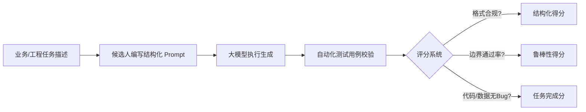

# 美的集团最新校招 AI 面试通关宝典
> **适用批次**：2026/2027 届美的集团校招（美的星 / 研发 / 数字化 / 各业务条线）  
> **考情特点**：破除传统套路，英文转向**日常生活、兴趣与成长话题**；Coding 环节转向**人机协同提示词工程（Prompt Engineering）**。

---

## 目录
1. [最新考情全貌与考核趋势](#一最新考情全貌与考核趋势)
2. [英文问答高频真题与满分模板](#二英文问答高频真题与满分模板)
   - [高频真题 1：最喜欢的运动（Favorite Sport）](#1-高频真题-1最喜欢的运动favorite-sport)
   - [高频真题 2：最想学习的一项新技能（Skill to Learn）](#2-高频真题-2最想学习的一项新技能skill-to-learn)
   - [同类高频生活题备用锦囊（解压方式 / 个人习惯）](#3-同类高频生活题备用锦囊)
   - [英文口语得分核心要点](#4-英文口语得分核心要点)
3. [AI Coding 专项：写提示词（Prompt）完成任务指南](#三ai-coding-专项写提示词prompt完成任务指南)
   - [题型本质与评分维度](#1-题型本质与评分维度)
   - [高分提示词万能结构模型（RTCE 框架）](#2-高分提示词万能结构模型rtce-框架)
   - [实战场景 Prompt 示范](#3-实战场景-prompt-示范)
   - [AI Coding 必须注意的 5 大避坑细节](#4-ai-coding-必须注意的-5-大避坑细节)
4. [中文行为面（BEI）核心题与 STAR 法则速查](#四中文行为面bei核心题与-star-法则速查)
5. [明天面试临场实战检查清单（Checklist）](#五明天面试临场实战检查清单checklist)

---

## 一、最新考情全貌与考核趋势

| 环节 | 传统老题型（已大部分淘汰） | **当前最新考情（重点准备）** | 考察核心 |
| :--- | :--- | :--- | :--- |
| **英文问答** | 机械背诵 "Why Midea"、"三年职业规划" | **日常生活、兴趣爱好、自主学习（如运动、想学的新技能）** | 真实口语流畅度、无准备临场表达能力、积极健康的人格特质 |
| **AI Coding** | 纯手工手写 LeetCode 算法题（ACM 模式） | **人机协同：编写提示词（Prompt）驱动 AI 完成指定任务** | 任务需求拆解能力、工程化约束意识、边界防御思维 |
| **综合测评** | 简单行测/图形推理 + 北森性格测试 | 逻辑推理 + 岗位胜任力性格测试 | 逻辑严谨性、前后回答一致性（测谎） |

---

## 二、英文问答高频真题与满分模板

通常为 **1～2 道题**，准备时间 30～60 秒，作答时间 2～3 分钟。  
**核心采分点**：发音清晰、连接词自然（First, Furthermore, Therefore）、体现正向职业特质（自律、团队协作、终身学习）。

---

### 1. 高频真题 1：最喜欢的运动（Favorite Sport）
> **常见问法**：  
> - *What is your favorite sport and why?*  
> - *What kind of sports or physical exercise do you enjoy the most?*

#### 方案 A：个人耐力运动（跑步 / 游泳 / 羽毛球）—— 突出“自律、毅力与抗压”
* **答题框架**：直接破题 $\rightarrow$ 心理调节（释放压力） $\rightarrow$ 品格塑造（毅力与自律） $\rightarrow$ 映射职场心态。
* **英文范文**：
  > "My favorite sport is **long-distance running** *(或 swimming / badminton)*.  
  > 
  > First and foremost, it serves as the most effective way for me to **release stress and clear my mind** after intense study or complex projects. Whenever I am on the track, I can completely focus on my breathing, cadence, and inner thoughts.  
  > 
  > More importantly, long-distance running has cultivated my **perseverance and self-discipline**. Running teaches me that when you hit the 'wall' and feel like giving up, pushing forward one step at a time will eventually lead you across the finish line.  
  > 
  > This mindset deeply shapes my approach to work: whenever I encounter challenging bottlenecks or tight deadlines, I remain patient, resilient, and focused on finding systematic solutions."

#### 方案 B：团队球类运动（篮球 / 足球）—— 突出“团队协作与敏捷沟通”
* **答题框架**：直接破题 $\rightarrow$ 团队角色 $\rightarrow$ 战术配合与信任 $\rightarrow$ 映射职场协同。
* **英文范文**：
  > "My favorite sport is **basketball**.  
  > 
  > What I love most about basketball is the strong sense of **teamwork and dynamic communication**. It is never a solo game; to win, every player must understand their role, support teammates in defense, and execute offensive strategies seamlessly.  
  > 
  > Playing basketball regularly keeps me energetic and sharp. It has taught me how to trust teammates, give constructive feedback during high-pressure moments, and adapt quickly to unexpected situations—skills that are directly transferable to collaborative cross-functional projects."

---

### 2. 高频真题 2：最想学习的一项新技能（Skill to Learn）
> **常见问法**：  
> - *If you could learn any new skill right now, what would it be and why?*  
> - *What is a new skill you are most eager to develop in the near future?*

#### 方案 A：前沿技术 / AI 应用技能（最贴合数字化制造与科技企业）
* **答题框架**：明确技能 $\rightarrow$ 时代驱动与效率提升 $\rightarrow$ 具体学习路径 $\rightarrow$ 赋能未来业务。
* **英文范文**：
  > "If I could learn a new skill right now, I would definitely choose **advanced AI workflows and Prompt Engineering** *(或 Generative AI development)*.  
  > 
  > The main reason is that artificial intelligence is reshaping industries at an unprecedented pace. Mastering how to effectively collaborate with intelligent agents can help automate repetitive workflows, enhance analytical capabilities, and solve complex problems much faster.  
  > 
  > To acquire this skill, I plan to combine theoretical studies with hands-on practice: exploring open-source frameworks, participating in developer communities, and building small automated tools myself. I believe having an 'AI-first' mindset is essential to staying competitive and creating innovative value for Midea."

#### 方案 B：数据可视化与业务故事力（通用于技术/分析/管理类岗）
* **答题框架**：明确技能 $\rightarrow$ 解决痛点（技术与商业断层） $\rightarrow$ 带来的实际影响。
* **英文范文**：
  > "The skill I am most eager to master is **data visualization and business storytelling**.  
  > 
  > In the era of big data, extracting raw metrics is only half the battle. The true challenge lies in translating intricate technical findings into intuitive, actionable insights for diverse stakeholders.  
  > 
  > By sharpening this skill, I hope to bridge the gap between technical details and strategic decisions, making my arguments more persuasive and helping the team achieve higher alignment."

---

### 3. 同类高频生活题备用锦囊

* **面对压力时如何放松？（How do you handle work/study pressure?）**
  > "I usually manage pressure through three steps: first, taking a 30-minute jog to reset my emotional state; second, breaking down the overwhelming issue into smaller, manageable tasks using a checklist; and third, actively seeking constructive advice from mentors or peers."
* **最近养成的一个好习惯？（A positive habit you developed recently?）**
  > "Recently, I developed the habit of **daily time-blocking and reflective journaling**. Every evening, I spend ten minutes reviewing what worked well and where I can improve. It significantly boosts my productivity and intentionality."

---

### 4. 英文口语得分核心要点
1. **不要出现长时间静音（Dead Air）**：思考时可以用连接短语缓冲：  
   - *"That's an interesting question..."*  
   - *"When it comes to my personal interests, I would say..."*  
   - *"From my perspective, there are two main reasons..."*
2. **直视摄像头**：眼睛看摄像头镜头上方，保持微笑与自信神态，AI 情绪识别模型会记录自信度与面部表情。

---

## 三、AI Coding 专项：写提示词（Prompt）完成任务指南

在最新版本的测评中，技术岗位的题目不再是单纯打开 IDE 刷 LeetCode，而是给定一个**具体的业务/工程任务**，要求在输入框中**编写一段专业、严密的 Prompt（提示词）**，驱动后台的大语言模型输出完全满足需求的结果。

---

### 1. 题型本质与评分维度



系统判分的底层逻辑：
* **指令完备度**：是否涵盖了角色、目标、输入、输出、约束？
* **边界防御意识**：是否显式声明了针对空值、异常值、极端场景的处理逻辑？
* **格式受控度**：是否严格约束了模型的输出（无多余闲聊，纯净可执行格式）？

---

### 2. 高分提示词万能结构模型（RTCE 框架）

答题时**严禁只写一两句口语（如：“请帮我写个脚本处理数据”）**，必须按照以下工程化模板书写：

```text
# Role (角色设定):
你是一名资深 [具体专业，如：Python数据处理 / 全栈开发 / 算法优化] 专家。

# Task (任务目标):
请针对给定的 [输入数据/业务场景]，完成 [核心任务名称]，实现 [预期达成效果]。

# Input & Processing Rules (处理规则与逻辑):
1. 核心处理步骤：[步骤1 -> 步骤2 -> 步骤3]
2. 关键算法/逻辑：[明确处理手段，如正则表达式、双指针、哈希映射等]

# Constraints & Edge Cases (约束与边界条件 - 最核心扣分点):
1. 边界异常：若输入为 null、空字符串、空列表或非法格式时，需返回 [指定的兜底值/默认结构]，严禁报错崩溃。
2. 技术栈约束：使用 [Python 3.10 / 标准库]，禁止使用未经说明的复杂外部第三方依赖。
3. 性能要求：注意优化时间复杂度与空间复杂度，避免冗余嵌套循环。

# Output Format (输出格式限制 - 必须严格限制):
- 严禁包含任何前缀、问候语、操作解释或 Markdown 外部文字。
- 仅输出 [纯代码块 / 严格遵循 RFC8259 的 JSON 格式]。
```

---

### 3. 实战场景 Prompt 示范

#### 场景示例：
> **题目要求**：从一段杂乱的智能家电设备上报日志中，提取出设备 ID（8 位字母数字）、故障代码（形如 `E-xxxx`）、上报时间戳，并输出为纯 JSON。若未检测到故障代码，默认填 `"E-0000"`。

#### 高分满分 Prompt 写法：
```text
# Role:
你是一名精通日志分析与数据清洗的自动化工程师。

# Task:
分析提供的设备上报原始文本，提取关键运维参数，并构建结构化 JSON 输出。

# Extraction Rules:
1. "device_id": 提取由大写字母与数字组成的 8 位唯一设备编码；若不存在则填充 null。
2. "error_code": 提取格式为 "E-" 后接 4 位数字的故障代码；若文本未提及故障则统一填充为 "E-0000"。
3. "timestamp": 提取日志中的标准时间并转换为 "YYYY-MM-DD HH:MM:SS" 格式。

# Constraints:
- 边界处理：输入为空文本或无任何匹配字段时，返回包含上述 key 且 value 全为 null/默认值的有效 JSON 对象。
- 防幻觉限制：严禁臆造文本中未体现的时间或 ID。
- 纯净输出：仅输出标准 JSON 字符串，禁止包裹任何多余的打招呼文本、分析过程或末尾说明。
```

---

### 4. AI Coding 必须注意的 5 大避坑细节

1. **绝对禁止“废话输出”**：  
   自动化测试系统后台往往通过 `json.loads()` 或代码编译器执行结果。如果 AI 输出 `好的，这是为您编写的提示词：`，会导致判题脚本崩溃判定 0 分。在 Prompt 末尾必须加上：  
   > *“仅输出有效产物本身，严禁输出任何解释说明、开场白或客套话。”*
2. **显式要求“边界防御”**：  
   提示词内必须包含对极端情况的防御声明：  
   > *“请充分考虑边界异常输入（包括空值、None、超长字符、非法输入），并实现安全的默认回退机制。”*
3. **隔离指令与输入内容**：  
   如果题目给定了输入示例，在提示词中建议用明确的界定符隔离，如：
   ```text
   待处理文本如下：
   """
   {{INPUT_DATA}}
   """
   ```
4. **技术选型优先使用标准库**：  
   若要求写实现脚本，注明 *“优先基于标准库实现，确保开箱即用，避免引入不必要的庞大外部依赖”*。
5. **复杂逻辑引入“思考步骤”**：  
   对于复杂的算法或多步流转需求，在提示词中加上：  
   > *“在执行输出前，请先在内部逐步验证逻辑严密性与逻辑边界，确保最终代码无语法与逻辑缺陷。”*

---

## 四、中文行为面（BEI）核心题与 STAR 法则速查

无论 AI 面试形式如何升级，中文开放问答的核心始终围绕个人的项目真实性与解决问题能力展开：

| 核心问题类型 | 题目场景 | 核心 STAR 应对策略 |
| :--- | :--- | :--- |
| **项目与技术攻坚** | “分享一次你在项目中遇到的最大难题/挫折” | **S** (项目瓶颈) $\rightarrow$ **T** (你的具体责任) $\rightarrow$ **A** (定位根因、查阅文档、做对比实验) $\rightarrow$ **R** (量化成效、提炼复盘文档)。 |
| **人际沟通与冲突** | “当团队成员对方案产生分歧时，你如何推进？” | **原则**：对事不对人；拿数据和 Benchmark 说话；必要时做最小可行性测试（A/B Test）用事实定夺。 |
| **创新与突破常规** | “举一个你打破常规方法解决问题的例子” | **原则**：原有方案的局限性 $\rightarrow$ 引入跨领域思路/新工具/新工作流 $\rightarrow$ 效率显著提升或成本降低。 |
| **多任务时间管理** | “当面对多个紧急且重要的任务时如何应对？” | **原则**：四象限法则（重要度/紧急度） $\rightarrow$ 明确关键链路（Critical Path） $\rightarrow$ 及时向上对齐预期并分批交付。 |

---

## 五、明天面试临场实战检查清单（Checklist）

* [ ] **硬件与网络**：使用最新版 Chrome 浏览器，关闭电脑蓝牙不稳定耳机，建议使用有线耳机确保录音无杂音。
* [ ] **防作弊红线**：
  * **退出所有后台即时通讯软件**（微信、QQ、钉钉、飞书、邮件客户端），防止突发弹窗被 AI 判定为“切屏作弊”。
  * 保持室内光线明亮，面部无反光遮挡，双手自然摆放在桌面可见区域。
* [ ] **心态与答题节奏**：
  * 读题后利用 30 秒准备时间，在草稿纸上快速列出 **3 个 Bullet Points（关键词）**；
  * 作答时**双眼直视摄像头**，不要盯着屏幕右下角的小窗口；
  * 留意右上角倒计时，若还剩 20 秒，立即用一句话总结收尾（*"In conclusion, that is why..."*），避免被系统硬性截断。
* [ ] **性格测试模块**：
  * 前后保持逻辑一致，不要刻意伪装成“极端完美人设”；
  * 总体基调保持：**务实、自驱、抗压、具备团队协作精神**。
