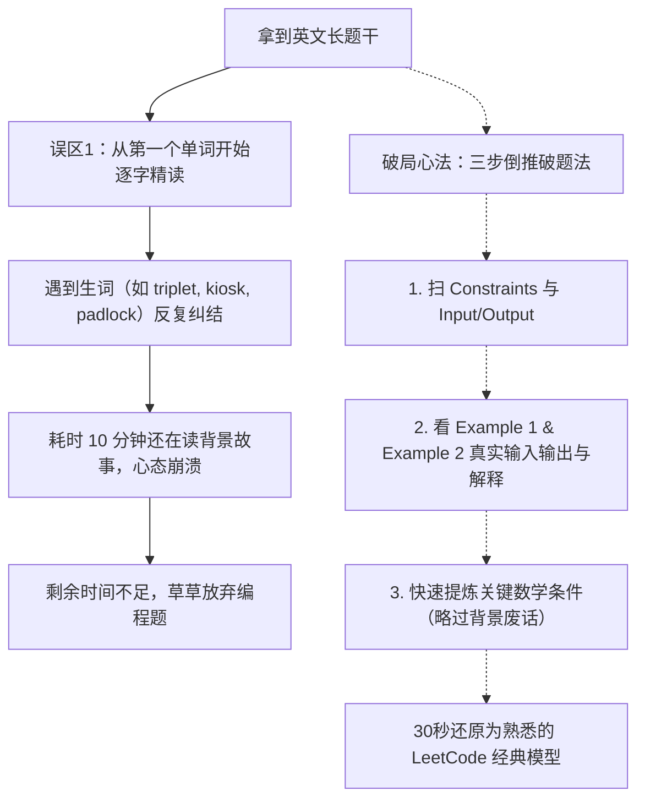

# Klook（客路旅行）后端研发秋招笔试全攻略与英文题破局指南

> **适用对象**：准备 Klook（客路旅行）校招/秋招/春招后端开发岗位的研发同学  
> **核心痛点**：全英文题干阅读吃力、长故事背景抓不住重点、选择题考点杂、编程题无从下手、90分钟时间紧迫  
> **编写目标**：梳理笔试难度、拆解题型分布、提供极速破题技巧、全量汇总高频CS专业英语词库与句型，助你快速看懂英文题并高效拿分。

---

## 目录
1. [Klook 笔试全景解析与难度定位](#1-klook-笔试全景解析与难度定位)
2. [题型结构与考点分布深度剖析](#2-题型结构与考点分布深度剖析)
3. [为什么会“完全看不懂”？——英文题阅读障碍根因](#3-为什么会完全看不懂英文题阅读障碍根因)
4. [“三步倒推破题法”：30秒穿透英文故事包装](#4-三步倒推破题法30秒穿透英文故事包装)
5. [笔试高频 CS 专业英语词汇手册（分类速查）](#5-笔试高频-cs-专业英语词汇手册分类速查)
6. [英文编程题“高频句型模板”与逻辑关键词](#6-英文编程题高频句型模板与逻辑关键词)
7. [真题重现与中英对照拆解实战](#7-真题重现与中英对照拆解实战)
8. [考场实战时间分配与防翻车策略](#8-考场实战时间分配与防翻车策略)

---

## 1. Klook 笔试全景解析与难度定位

### 1.1 公司背景与考查倾向
Klook（客路旅行）是一家总部位于香港、在深圳/新加坡/跨国多地设有技术中心的全球知名旅游体验预订平台（OTA）。其技术团队国际化程度高，日常工作语言、技术文档和协作平台（Jira/Confluence/Slack）均大量采用英语。  
因此，**笔试全英文并非为了“为难学生”，而是检验候选人在实际工作场景中阅读英文需求文档与技术规范的基本素养。**

### 1.2 笔试难度综合评级
* **综合难度评级**：⭐⭐⭐⭐（中等偏上）
* **与大厂横向对比**：
  * **算法纯难度**：略低于美团、拼多多、华为等国内算法强厂；大致处于 **LeetCode Medium（中等）** 到个别 **Medium-Hard（中等偏难）** 水平。
  * **阅读与心理压力**：**显著高于国内大厂**。由于是全英文题干，题干动辄 3~5 段长背景叙述（业务场景包装），且总时长通常仅 **90 分钟**，导致许多平时能刷 LeetCode 中等题的同学因“读题慢、读不懂、误解题意”而无法在规定时间内完成代码。
* **牛客/社区考生普遍反馈**：
  > “18道单选50分，2道编程50分，90分钟全英文，题干老长了，读完题就过了半小时…”  
  > “选择题覆盖面很广（网络、系统、数据库、模拟），编程题第一题是数学/字符串，第二题是贪心/矩阵/前缀和，没看懂题目最亏！”

---

## 2. 题型结构与考点分布深度剖析

### 2.1 试卷基本规格
* **考试时长**：90 分钟（部分年份/批次为 100 分钟）。
* **试卷语言**：**100% 全英文**（题干、选项、样例说明、限制条件均为英文）。
* **考试平台**：牛客网国际化/英文试卷系统 或 HackerRank。
* **题型构成与分值**：
  * **第一部分：客观单项选择题（Multiple-Choice Questions）**
    * 数量：约 15 ~ 20 题（通常为 18 题）。
    * 分值：约 50 分。
  * **第二部分：主观编程算法题（Programming/Coding Tasks）**
    * 数量：2 题。
    * 分值：每题约 25 分，共 50 分。

### 2.2 选择题核心考点清单（计算机专业基础 + 后端实战）
Klook 的英文选择题类似于“408考研综合 + 软件工程 + 后端常见基础”的英文版本：
1. **数据结构与算法基础**：
   * 栈与队列进出顺序（Stack push/pop, Queue FIFO, monotonic stack）。
   * 经典树与图（Binary search tree, complete binary tree, BFS/DFS, in-degree/out-degree）。
   * 排序与复杂度（Quicksort, Mergesort, worst/average case time complexity $O(n \log n)$）。
   * 基础位运算与取模（Bitwise operations, modular arithmetic）。
2. **计算机操作系统与体系结构**：
   * 进程调度与上下文切换（Process scheduling algorithms: Round Robin, Priority, FCFS）。
   * 存储与磁盘（Disk sector, paging, page replacement FIFO/LRU, virtual memory）。
   * 并发与同步（Deadlock conditions, mutex, semaphore, race condition, thread-safe）。
3. **计算机网络与协议**：
   * TCP/UDP 传输机制（Three-way handshake, four-way termination, flow control）。
   * HTTP/HTTPS 与安全（TLS handshake, status codes 2xx/3xx/4xx/5xx, asymmetric encryption, certificate）。
   * 网络协议分层与子网（OSI 7 layers, CIDR subnet masks, IP datagram routing）。
4. **数据库与后端架构**：
   * 关系型数据库与 SQL（Index types, B+ Tree characteristics, Transactions, ACID properties, isolation levels）。
   * 幂等性与缓存（Idempotence, cache-aside, latency vs throughput）。
5. **软件工程与图表理解**：
   * 需求与设计图表（Data Flow Diagram, UML sequence diagram, state machine）。
   * 逻辑伪代码跟踪（Given a recursive snippet, what is the return value?）。

### 2.3 编程题特征与风格
1. **题目背景包装深（Story-based / Real-world Scenario）**：
   * 经常包装成“旅行者行程规划（Travel itinerary）”、“酒店房间锁定（Booking allocation）”、“加密行李锁（Security lock matrix）”、“折扣优惠券选取（Voucher combination）”。
2. **重在“数学规律 / 字符串处理 / 贪心 / 前缀和”**：
   * 第一题偏“数学分析/数论基础（质因数、完全平方数、组合计数模 $10^9+7$）”或“字符串模拟与状态置换”。
   * 第二题偏“二维矩阵操作、动态规划、双指针、前缀和优化、贪心区间调度”。
3. **边界条件与溢出严苛**：
   * 频繁出现 `results modulo 10^9 + 7`（大数取模，防止溢出需使用 `long long` 或 `long`）。
   * 极端情况（如 $n = 0, 1$、负数、全相同元素、无解时输出 `-1`）。

---

## 3. 为什么会“完全看不懂”？——英文题阅读障碍根因

许多国内学生看英文算法题时感到“头大”、“大脑死机”，通常由于以下三个误区：



1. **误区一：把技术题当英语阅读理解精读**：
   * 一道题 80% 的篇幅是在构建“背景故事”（例：*“In a galaxy far away, Alice owns a luxury hotel in Hong Kong with n rooms...”*）。
   * 只要知道本质是求数组的某种特征，这些故事**一个字都不需要读**！
2. **误区二：被数学与算法专业词汇卡死**：
   * 普通英语教学不教 `triplet`（三元组）、`perfect square`（完全平方数）、`coprime`（互质）、`contiguous`（连续的）。一旦遇到，以为是复杂的生僻专业概念。
3. **误区三：不敢借助数据范围（Constraints）逆推算法**：
   * 很多人忽略了题目的数据规模。看到 $N \le 10^5$，就应该立刻明白算法复杂度必须在 $O(N)$ 或 $O(N \log N)$，暴力 $O(N^2)$ 必超时。结合输入输出，往往题干读懂一半就能把思路猜出来。

---

## 4. “三步倒推破题法”：30秒穿透英文故事包装

考场上拿到一道 500 词的长英文编程题，**严格按照以下 3 步倒序阅读**：

### 步骤 1：直奔底部——先看【Constraints（约束）】与【Input/Output Format】
* **看 Constraints 确定算法复杂度与数据类型**：
  * $N \le 20$：通常是暴搜、DFS 回溯、状压 DP（$O(2^N)$ 或 $O(N!)$）。
  * $N \le 1000$ 或 $N \le 2000$：通常是 $O(N^2)$ 的动态规划、双重循环。
  * $N \le 10^5$ 或 $N \le 2 \times 10^5$：通常是 $O(N)$ 或 $O(N \log N)$（二分搜索、贪心、前缀和、单调栈、堆、排序）。
  * $A[i] \le 10^9$ 或计算累加和：结果必然超过 32 位整型范围，**必须使用 `long`（Java）或 `long long`（C++）**。
  * 出现 `modulo 10^9 + 7`（或 `1000000007`）：提示答案非常大，每一步计算都要取模。
* **看 Input/Output 确定输入形态**：
  * 输入是数组、多行字符串，还是邻接矩阵？输出是单个数字（Count/Min/Max）、布尔值（YES/NO），还是数组？

### 步骤 2：穿透核心——精读【Examples（样例与解释）】
样例是全题最精华的部分。英文题往往在样例下方配有详细的 **Explanation**：
```text
Example 1:
Input: n = 4
Output: 8
Explanation: The valid triplets are (1,1,1), (1,1,4), (1,4,1), (1,4,4), (2,2,2), (4,1,1), (4,1,4), (4,4,4).
Each pairwise product satisfies the condition.
```
* **技巧**：看输入 `4`，输出 `8`，再看它列出的合法三元组列表，你甚至**根本不需要读前文的三段故事**，仅凭样例和解释就能立刻明白：“哦！原来是给一个上限 $n$，找满足某种两两乘积为完全平方数的三元组个数！”

### 步骤 3：折返题干——只抓【判断句（Predicates）】与【操作句（Operations）】
过滤掉所有故事名词（人物、公司、旅行地点），只寻找以下信号词后面的内容：
1. **目标（Goal）**：
   * `Return the minimum / maximum number of...`（求最小/最大…）
   * `Determine whether it is possible to...`（判断能否达成…）
   * `Find the total number of ways to...`（求方案总数）
2. **条件（Condition）**：
   * `...is valid if and only if...`（合法的充要条件是…）
   * `...such that...`（使得…）
   * `No two adjacent elements can be...`（任意相邻两元素不能…）
3. **操作规则（Rule/Operation）**：
   * `In each step, you can choose... and replace it with...`（每一步可以选择…并替换成…）
   * `At most once / exactly k times`（至多一次 / 恰好 k 次）

---

## 5. 笔试高频 CS 专业英语词汇手册（分类速查）

以下整理了在 Klook、HackerRank、Codility、LeetCode 英文题中出镜率最高的核心专有名词。**背熟这几张表，题面生词率直降 80%**。

### 5.1 数学与数论基础（编程题必考高频）
| 英文术语 | 中文释义 | 常见搭配 / 典型含义 |
| :--- | :--- | :--- |
| **Triplet / Tuple / Pair** | 三元组 / 元组 / 对（二元组） | `triplet (a, b, c)`, `pairs of integers` |
| **Perfect square** | 完全平方数 | 如 1, 4, 9, 16, 25... 其平方根为整数 |
| **Square root** | 平方根 | `take the square root` |
| **Prime number** | 质数 / 素数 | 只能被 1 和自身整除的自然数 |
| **Prime factorization** | 质因数分解 | $12 = 2^2 \times 3^1$ |
| **Divisor / Factor** | 约数 / 因数 | `number of distinct divisors` |
| **Multiple** | 倍数 | `a multiple of 3`（3的倍数） |
| **Greatest Common Divisor (GCD)** | 最大公约数 | `coprime if gcd(a, b) == 1` |
| **Least Common Multiple (LCM)** | 最小公倍数 |  |
| **Coprime / Relatively prime** | 互质（互素） | 两数公约数仅有 1 |
| **Parity** | 奇偶性 | `same parity`（同奇或同偶） |
| **Odd / Even** | 奇数 / 偶数 | `odd index`（奇数索引）, `even integer` |
| **Modulo / Modulus** | 取模（求余） | `modulo 10^9 + 7`, `remainder` |
| **Permutation** | 全排列（考虑顺序） | $P(n, k)$ |
| **Combination** | 组合（不考虑顺序） | $C(n, k)$ |
| **Non-negative** | 非负数（即 $\ge 0$） | 包含 0！切勿漏掉 0 |
| **Positive / Negative** | 正数 / 负数 | 严格大于 0 / 小于 0 |
| **Consecutive** | 连续的（数值上的连续） | `consecutive integers: 3, 4, 5` |
| **Absolute value** | 绝对值 | `|a - b|` |

### 5.2 数组、字符串与序列（最核心的数据结构术语）
| 英文术语 | 中文释义 | 深度辨析 / 注意点 |
| :--- | :--- | :--- |
| **Contiguous subarray** | **连续子数组** | 元素在原数组中**必须紧密相连**！ |
| **Subsequence** | **子序列** | **保持先后顺序，但不要求连续**（如 `[1,3]` 是 `[1,2,3]` 的子序列） |
| **Substring** | **连续子串** | 字符串的连续片段（与 subsequence 截然不同） |
| **Lexicographically** | **字典序地** | `lexicographically smallest string`（字典序最小的字符串，如 "abc" < "bca"） |
| **Palindrome** | **回文** | 正着读反着读一样（如 "aba", "racecar"） |
| **Distinct / Unique** | **互不相同的 / 唯一的** | `all elements are distinct`（无重复元素） |
| **Duplicates** | **重复元素** | `contains no duplicates`（不含重复） |
| **Prefix** | 前缀 | 从下标 0 开始的连续子段 |
| **Suffix** | 后缀 | 延伸到末尾的连续子段 |
| **Monotonic** | 单调的 | `monotonically increasing`（单调递增） |
| **Strictly increasing** | **严格单调递增** | 每个元素必须严格大于前一个（$a_i < a_{i+1}$，不可相等） |
| **Non-decreasing** | 非递减（等价于单调不减） | 可以有相邻相等元素（$a_i \le a_{i+1}$） |
| **In-place** | 原地修改 | 不允许开辟 $O(N)$ 额外空间 |
| **Index (indices)** | 索引 / 下标 | `0-indexed`（从0开始）或 `1-indexed`（从1开始） |

### 5.3 常见操作动作与状态谓词
| 英文术语 | 中文释义 | 典型考查场景 |
| :--- | :--- | :--- |
| **Toggle** | 翻转 / 切换 | `toggle the bit`（0变1，1变0；灯泡开关） |
| **Swap** | 交换两元素 | `swap adjacent elements` |
| **Prepend / Append** | 在开头添加 / 在末尾追加 | `prepend char to the string` |
| **Truncate** | 截断 / 裁剪 | `truncate to length k` |
| **Partition** | 分割 / 划分 | `partition the array into two subsets` |
| **Traverse** | 遍历 | `traverse the tree/matrix` |
| **Rotate** | 旋转 / 轮转 | `rotate array by k steps to the right` |
| **Prune** | 剪枝 | `prune invalid search branches` |
| **Saturate / Bound** | 饱和 / 上下界截断 | 达到最大值不再增加 |
| **Discard / Eliminate** | 丢弃 / 排除 | 排除不合法状态 |

### 5.4 计算机系统、网络与客观题术语（选择题必备）
| 英文术语 | 中文释义 | 关联常考点 |
| :--- | :--- | :--- |
| **Throughput** | 吞吐量 | 单位时间处理的请求/数据包数量 |
| **Latency / Propagation delay** | 延迟 / 传播时延 | 网络往返延迟（RTT） |
| **Deadlock & Starvation** | 死锁 与 饥饿 | 互斥/持有并等待/不可剥夺/循环等待 |
| **Preemption** | 可剥夺 / 抢占 | 操作系统调度中的抢占式 vs 非抢占式 |
| **Sector / Track / Cylinder** | 扇区 / 磁道 / 柱面 | 磁盘物理存储结构、扇区寻道调度 |
| **Paging & Segmentation** | 分页 与 分段 | 虚拟内存映射、页表（Page Table）、TLB、缺页中断 |
| **Context switch** | 上下文切换 | 进程/线程切换消耗 CPU 寄存器与缓存状态 |
| **Idempotence / Idempotent** | 幂等性 | HTTP GET/PUT 是幂等的，POST 非幂等 |
| **Subnet mask & CIDR** | 子网掩码与 CIDR | 如 `/24` 对应 `255.255.255.0`，计算网络号与可用主机数 |
| **Symmetric / Asymmetric encryption** | 对称 / 非对称加密 | AES vs RSA/ECC，HTTPS/TLS 握手协商密钥 |
| **ACID properties** | ACID 特性 | Atomicity（原子性）, Consistency（一致性）, Isolation（隔离性）, Durability（持久性） |
| **Serialization / Deserialization** | 序列化 / 反序列化 | JSON/Protobuf 转对象 |

---

## 6. 英文编程题“高频句型模板”与逻辑关键词

在读英文题时，只需将目光锁定在带有以下标志性句型特征的段落中：

### 6.1 目标与诉求类句型（寻找题目要你输出什么）
* **求极值 / 方案数**：
  * *"Find the **minimum** number of operations required to..."*（求达到某种状态所需的**最少**操作次数）
  * *"Determine the **maximum** profit Alice can achieve such that..."*（求满足条件下的**最大**收益）
  * *"Count the number of **distinct** ways to... Output the answer **modulo $10^9 + 7$**."*（统计不同的方案总数，结果对 $10^9+7$ 取模）
* **存在性与判定**：
  * *"Determine **whether it is possible** to transform string $S$ into $T$."*（判断能否通过规定操作将字符串 $S$ 转为 $T$，通常输出 `"YES"`/`"NO"` 或 `true`/`false`）
  * *"Check if there exists a valid sequence satisfying..."*（检查是否存在满足…的合法序列）

### 6.2 约束限制与判定规则类句型（决定核心逻辑与剪枝）
* **互斥与去重约束**：
  * *"A matrix is considered unlocked if **no two elements in the same column are identical**."*（矩阵每列中的元素互不相同）
  * *"Every element can be chosen **at most once**."*（每个元素至多选一次——典型的 0/1 背包或组合约束）
  * *"Elements must be chosen **in strictly increasing order** of their indices."*（必须按索引严格升序选取——典型的最长上升子序列 LIS 或子序列 DP）
* **局部关系约束**：
  * *"No two adjacent characters can be the same."*（任意两个相邻字符不能相同）
  * *"The sum of elements in any contiguous subarray of size $k$ must be..."*（任意大小为 $k$ 的连续子数组和必须…——典型的固定窗口滑动窗口）

### 6.3 边界特判与平局规则（防止通过率卡在 80%）
* **无解情况**：
  * *"If no such array exists, return **-1**."*（若不存在满足条件的数组，返回 -1）
  * *"If it is impossible to reach the target, return empty list."*（若不可能到达，返回空列表）
* **平局规则（Tie-breaker）**：
  * *"In case of a tie, choose the string that is **lexicographically smallest**."*（若出现并列/平局，选择**字典序最小**的字符串）
  * *"Ties may be broken arbitrarily."*（若并列，任意返回一种即可）

---

## 7. 真题重现与中英对照拆解实战

### 实战案例 1：数论与完全平方三元组（Klook 经典真题）

#### 【原始英文题干（还原）】
> **Title: Valid Triplets**  
> Given an integer $n$, your task is to determine how many triplets $(a, b, c)$ of positive integers exist such that:  
> 1. $1 \le a, b, c \le n$  
> 2. Each of the pairwise products $a \times b$, $a \times c$, and $b \times c$ is a **perfect square**.  
> 
> Return the total number of such triplets.  
> 
> **Constraints:**  
> * $1 \le n \le 10^5$  
> 
> **Example 1:**  
> Input: `n = 4`  
> Output: `8`  
> *Explanation: The triplets are (1,1,1), (1,1,4), (1,4,1), (1,4,4), (2,2,2), (4,1,1), (4,1,4), (4,4,4).*

#### 【极速破题与阅读剖析】
1. **关键词抓取**：
   * `triplets (a, b, c)` $\to$ 三元组。
   * `pairwise products` $\to$ 两两乘积（即 $a \cdot b, a \cdot c, b \cdot c$）。
   * `perfect square` $\to$ 完全平方数。
   * $n \le 10^5 \to O(n^3)$ 暴力必超时！必须利用数学性质达到 $O(n)$ 或 $O(n \sqrt{n})$。
2. **数学本质还原**：
   * 两个数乘积是完全平方数，意味着两数除去自身所有的完全平方因子后，**剩下的无平方因数部分（Square-free core）必须完全相等**！
   * 即：每个数 $x$ 都可以唯一写成 $x = k \cdot m^2$（其中 $k$ 为无平方因子数，例如 $12 = 3 \times 2^2 \implies k=3$）。
   * 只要 $a, b, c$ 对应的 $k$ 相同，它们两两相乘就必然是完全平方数！
3. **算法解法**：
   * 预处理或直接遍历 $1 \dots n$，计算每个数字去掉所有平方因子后的“核心值” $k$。
   * 用 Hash 表/计数数组统计每个 $k$ 在 $[1, n]$ 范围内出现了多少次（记为 $cnt$）。
   * 每一个核心值组内的任意三元组都合法，贡献为 $cnt^3$。最后把所有核心值的 $cnt^3$ 相加即可！时间复杂度 $O(n)$。

---

### 实战案例 2：字符串置换计数与大数取模（Klook 经典真题）

#### 【原始英文题干（还原）】
> **Title: Character Replacement Game**  
> You are given a string $s$ of length $n$ consisting entirely of the lowercase letter `'a'`.  
> You are allowed to perform **exactly $k$ operations**. In each operation, you can pick any single character at any position in the string and replace it with any other lowercase English letter (from `'a'` through `'z'`).  
> 
> Return the number of **distinct** strings that can be formed after performing all $k$ operations. Since the answer may be very large, return it **modulo $10^9 + 7$**.  
> 
> **Constraints:**  
> * $1 \le n \le 10^5$  
> * $0 \le k \le 10^5$

#### 【极速破题与阅读剖析】
1. **关键词抓取**：
   * `consisting entirely of 'a'` $\to$ 初始全为 `'a'`。
   * `exactly k operations` $\to$ 恰好操作 $k$ 次（注意不是 at most，但一次操作可以换回 `'a'` 也可以换成其他 25 个字母）。
   * `distinct strings` $\to$ 不同的字符串个数。
   * `modulo 10^9 + 7` $\to$ 组合数学，快速幂与逆元取模。
2. **本质模型拆解**：
   * 设最终字符串中有 $i$ 个位置变成了非 `'a'` 字符（有 $26 - 1 = 25$ 种选法），有 $n - i$ 个位置依然保持为 `'a'`。
   * 每个非 `'a'` 位置至少消耗了 1 次修改操作；其余操作如果还有多余（即 $k - i$ 次），可以通过将某个位置替换来替换去消耗掉。
   * 从而转化为：对于可能的非 `'a'` 字符个数 $i$（受 $k$ 的奇偶性与大小限制），选择 $i$ 个位置的组合数 $C(n, i) \times 25^i$。
   * 组合数预处理阶乘 + 费马小定理求逆元，复杂度 $O(n)$。

---

### 实战案例 3：密码矩阵唯一性与列检测（Klook 经典真题）

#### 【原始英文题干（还原）】
> **Title: Padlock Matrix Unlock**  
> A security door is protected by a cylindrical combination lock represented as an $R \times C$ matrix of characters.  
> You can rotate any row cyclically to the left or right any number of times.  
> The door unlocks if and only if **no column contains duplicate characters**.  
> 
> Determine whether it is possible to unlock the door. If possible, return `true`; otherwise, return `false`.  
> 
> **Constraints:**  
> * $1 \le R \le 10$, $1 \le C \le 100$  
> * Matrix contains only uppercase letters.

#### 【极速破题与阅读剖析】
1. **关键词抓取**：
   * `cylindrical combination lock` $\to$ 圆柱滚轮密码锁（背景修饰词，直接忽略）。
   * `rotate any row cyclically` $\to$ 每一行可以循环移位。
   * `no column contains duplicate characters` $\to$ 目标：每列中无重复字符（即每一列的字符全部 distinct）。
   * `R <= 10` $\to$ **行数极小！** 每一行最多只有 $C$ 种旋转偏移量（0 到 $C-1$），典型的暴力/贪心/回溯约束。

---

## 8. 考场实战时间分配与防翻车策略

```mermaid
gantt
    title 90分钟笔试黄金时间分配策略
    dateFormat  m
    axisFormat %m分

    section 客观单选题 (18题/50分)
    英文选择题扫读与答题 :active, 0, 35

    section 编程大题 (2题/50分)
    编程 T1 读题与拿下 100% 满分 :crit, 35, 60
    编程 T2 读题 + 算法实现/暴力拿分 : 60, 85
    检查边界、取模溢出与提交 : 85, 90
```



### 8.1 90分钟答题节奏
1. **0 ~ 35 分钟：速战速决单选题（目标：拿到 35~40 分以上）**
   * 每道选择题平均只有 **1.5 ~ 2 分钟**。
   * 遇到长文本软工分析或复杂图表题，若读不懂题干，先排除明显错项，选定一个后立刻标记并进入下一题，**千万不要在选择题卡 5 分钟以上**！
   * 遇到熟悉的计算机网络（如 TCP 三次握手、HTTPS 对称与非对称）、操作系统（死锁四个必要条件、分页置换）、SQL 基础题，必须秒杀得分。
2. **35 ~ 60 分钟：主攻编程题 T1（目标：100% AC，拿下 25 分）**
   * T1 通常是数学、字符串或基础贪心模拟题。用“三步倒推法”看样例，理清数学规律或边界，写完并本地自测极端样例（$n=1$, 极端取模），争取一次性全部通过测试用例。
3. **60 ~ 85 分钟：攻坚编程题 T2（目标：保底暴力 50% 分，冲击 100% AC）**
   * 如果 T2 题目较难（如复杂 DP 或构造），**先写一个暴力解（Brute Force）吃下 30% ~ 50% 的测试点分**！
   * 只要暴力法能跑过前几个小规模用例，分数就会实实在在录入系统，远强于空着 0 分。
4. **85 ~ 90 分钟：防手抖检查**
   * 检查是否使用了 64 位整型（C++ 的 `long long`，Java 的 `long`），乘法中是否先强转 `(long) a * b % MOD` 以防中间溢出。
   * 检查牛客 ACM 输入输出格式（`Scanner` 是否卡死循环，`cin.tie(NULL)` 是否开启）。

### 8.2 考场翻译与辅助工具使用合规建议
* **摄像头与切屏监控机制**：
  * 牛客网与绝大多数国际笔试系统均有严格的**双机位视频监控**与**切屏计数检测（Focus Out Detection）**。
  * **切忌**频繁切换到桌面其他软件（如翻译软件窗口、浏览器搜索），一旦切屏超过系统阈值（通常为 3~5 次），系统会自动交卷或直接在后台打上“疑似作弊”红标。
* **合规技巧**：
  * 建议平时在 Chrome 浏览器中安装支持“划词翻译”的拓展插件（悬浮气泡显示单字释义），或使用浏览器右键原生的“翻译当前选中文本”（仅在允许的环境下使用，且注意鼠标尽量不离开答题视窗）。
  * 最稳妥的方法：**考前把本指南第 5 节的词汇打印或默写熟记**，考场上直接靠大脑条件反射快速定位核心关键词。

---

## 9. 考前速练行动指南（最后冲刺）

1. **每天 3 道 LeetCode 英文版（切换成 US 界面）**：
   * 登录 [LeetCode.com](https://leetcode.com/)（英文主站），不要看中文翻译，强迫自己只看英文题面。
   * 重点刷题标签：`Math`（数论与完全平方数）、`Greedy`（贪心）、`Prefix Sum`（前缀和）、`String`（字符串状态机）。
2. **训练时只看 Constraints 和 Examples**：
   * 养成“30秒看样例猜模型”的肌肉记忆，克服对长段英文背景故事的恐惧感。
3. **牢记三大避坑要点**：
   * ① 看到求数量且数很大 $\to$ 必考 `modulo 10^9 + 7`，变量全程开 `long`。
   * ② 看到 `contiguous` $\to$ 连续；看到 `subsequence` $\to$ 不连续但保序。
   * ③ 没看懂故事不要紧，样例的 `Explanation` 才是真正的出题说明书！
