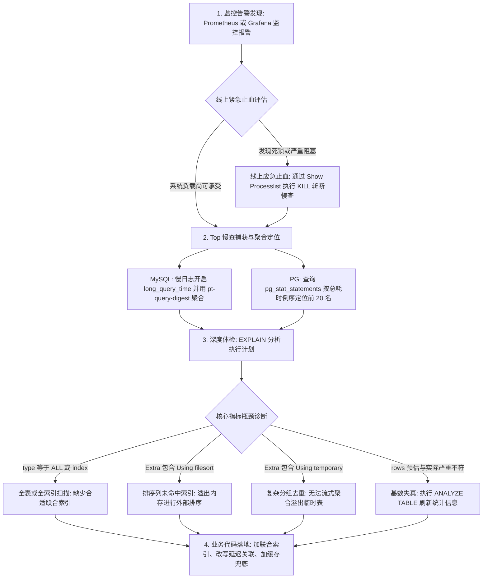
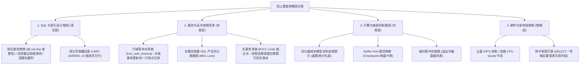

# 字节跳动后端一面深度复盘与满分通关手册（Q1 ~ Q20 全景攻坚 + 手撕算法通关版）

> **面试时间**：2026-09-14  
> **面试岗位**：字节跳动 - 核心研发平台 - 后端开发工程师  
> **考察核心**：无死八股，以项目/实习为锚点，重度考核生产排查实战、技术选型权衡（Trade-off）、数据库内核执行机制、大模型工程落地与高压算法手撕。

---

## 目录
- [Q1：自我介绍 —— 如何开局“埋钩子”与技术定调？](#q1自我介绍--如何开局埋钩子与技术定调)
- [Q2：实习中如何有感悟并反哺优化个人项目？](#q2实习中如何有感悟并反哺优化个人项目)
- [Q3：线上慢查询分析的全流程 SOP（含生产排查图）](#q3线上慢查询分析的全流程-sop含生产排查图)
- [Q4：造成慢查询的深层原因矩阵（不止索引和联表！）](#q4造成慢查询的深层原因矩阵不止索引和联表)
- [Q5：百万级深分页场景手写 SQL —— 为什么普通方法慢，子查询就变快？](#q5百万级深分页场景手写-sql--为什么普通方法慢子查询就变快)
- [Q6：游标分页 vs 延迟关联的架构权衡（Trade-off 深度剖析）](#q6游标分页-vs-延迟关联的架构权衡trade-off-深度剖析)
- [Q7：哪些参数决定走不走索引？ORDER BY 与 SELECT 谁先执行？](#q7哪些参数决定走不走索引order-by-与-select-谁先执行)
- [Q8：复合索引底层如何排序？WHERE + ORDER BY 黄金索引法则](#q8复合索引底层如何排序where--order-by-黄金索引法则)
- [专题扩展：GROUP BY 对索引的深层影响与底层执行机制](#专题扩展group-by-对索引的深层影响与底层执行机制)
- [Q9（主线案例）：聊聊你实习的项目遇到的技术问题并如何解决的？](#q9主线案例聊聊你实习的项目遇到的技术问题并如何解决的)
- [专题扩展：物联 RTU 设备同步与高可靠 Kafka 治理（Q9 备选大招）](#专题扩展物联-rtu-设备同步与高可靠-kafka-治理q9-备选大招)
- [Q10：单线程轮询的单点风险，如何解决？多实例服务如何保证不重复下发任务？](#q10单线程轮询的单点风险如何解决多实例服务如何保证不重复下发任务)
- [Q11：自定义 Executor 的参数你如何设置？](#q11自定义-executor-的参数你如何设置)
- [Q12：多线程并发需要注意哪些问题，核心问题是什么？](#q12多线程并发需要注意哪些问题核心问题是什么)
- [Q13：分布式系统需要注意哪些问题，核心问题是什么？](#q13分布式系统需要注意哪些问题核心问题是什么)
- [架构联动反哺：荒天商城超时未支付订单关闭的架构重构](#架构联动反哺荒天商城超时未支付订单关闭的架构重构)
- [Q14：向量数据库如何选择？各自利弊是什么？](#q14向量数据库如何选择各自利弊是什么)
- [Q15：向量模型（Embedding）如何选择？](#q15向量模型embedding如何选择)
- [Q16：造成大模型幻觉的深层原因矩阵](#q16造成大模型幻觉的深层原因矩阵)
- [Q17：工程上如何系统性解决大模型幻觉？（5 层防御体系）](#q17工程上如何系统性解决大模型幻觉5-层防御体系)
- [Q18：你怎么实现混合检索（Hybrid Search）的？](#q18你怎么实现混合检索hybrid-search的)
- [Q19：平时用什么 AI 工具和模型？](#q19平时用什么-ai-工具和模型)
- [Q20：反问环节技巧（如何反客为主、展现大厂自驱力）](#q20反问环节技巧如何反客为主展现大厂自驱力)
- [模块五：手撕代码绝地通关 —— 交替子数组最大和（LeetCode 978 变种）](#模块五手撕代码绝地通关--交替子数组最大和leetcode-978-变种)

---

## Q1：自我介绍 —— 如何开局“埋钩子”与技术定调？

### 1. 考场真实还原与深度诊断
* **你的回答**：介绍了学校、专业、项目、实习；提到两个项目都是学习项目，一个为了巩固专业栈，另一个加深 AI 时代对 Agent 的理解及 vibe coding 技能提升；坦白不了解 Go，但想尝试能否使用 vibe coding 将项目落地；最后提到实习中有了感悟去优化荒天商城项目。
* **👍 得分点**：
  * **极其成功的“诱敌深入”**：你在自我介绍结尾主动抛出“在实习中有了感悟并反哺优化了个人项目”，这是全场最精彩的引导，面试官顺着你的钩子往下深挖，牢牢占据了话题主动权。
  * **坦诚有度**：承认 Go 是通过 Vibe Coding 辅助完成，体现了对 AI 新工具的敏锐拥抱与工程落地能力，不装懂，面试官很认可这种务实的态度。
* **⚠️ 扣分点与隐患**：
  * **弱化了项目的工程分量**：主动说“两个项目都是学习项目”，会在潜意识里给面试官降低预期，认为这只是大学生的 Demo。
  * **修正策略**：荒天商城不能说成“学习项目”，而应定调为**“对标企业级生产标准、深入压测与高可用改造的微服务电商架构项目”**；OpsMind 定调为**“基于 Agentic 架构模式探索的企业级数字员工系统”**。

### 2. 🎙️ 考场高分规范回答（直接背诵版）
> “面试官您好，我是莫明钦，本科就读于华南理工大学软件工程专业。在校期间我一直深耕后端与分布式高并发领域，曾在**凯通科技**和**云智易物联网**进行过两段深度实习。
> 
> 在工程实践方面，我主要沉淀了两个核心项目：
> 1. 第一个是 **荒天商城分布式系统**：为了攻克真实高并发场景下的数据一致性与吞吐瓶颈，我主导了基于 Redis+Lua 的原子扣减与多级缓存架构，并重构了千万级订单检索的慢 SQL 与深分页链路；
> 2. 第二个是 **OpsMind AI 数字员工平台**：我积极拥抱 AI 时代的 Vibe Coding 与 Agentic Workflow，基于真实生产运维痛点，设计了混合检索（Hybrid Search）与动态 Nonce 标签沙箱隔离机制，攻克了 RAG 检索退化与 Prompt 间接注入两大难点。
> 
> **特别值得一提的是，在云智易实习期间接触到真实的工业级海量物联并发和线上慢查治理后，我带着生产一线的实战体感，反哺并重构了自己荒天商城中的底层索引、并发线程池与容灾方案。** 很高兴能有机会参与今天的面试！”

---

## Q2：实习中如何有感悟并反哺优化个人项目？

### 1. 考场真实还原与深度诊断
* **你的回答**：实习中遇到了 N+1 的 SQL 问题、三百行大 SQL 的 JOIN 解决、以及线上慢 SQL 处理，发现做一个功能不仅要把数据查出来，效率很重要。回去看了自己项目的 SQL 并进行了优化。
* **⚠️ 扣分点分析**：过于泛泛而谈，缺乏“抓手”与“前后指标对比”。面试官听完心里会想：“你说优化了，到底优化了哪张表？原来耗时多少？优化后多少？用了什么手段？为什么产生感悟？”

### 2. 🎙️ 考场高分规范回答（直接背诵版）
> “在实习期间，我深刻体会到：**在工业级高并发场景下，代码写得能跑通只是及格线，如何避免击垮底层数据库才是核心功力。** 我将实习中的两点核心感悟，深度反哺到了我的荒天商城项目中：
> 
> **第一点：深分页治理与 Buffer Pool 内存页防污染**
> 在云智易实习做千万级设备历史记录与访客通行记录导出时，我发现旧代码使用普通的 `LIMIT offset, size`，当翻到几万页时不仅单次耗时突破 3 秒，更严重的是高频深分页把 MySQL 的 InnoDB Buffer Pool 内存页严重污染，把热点数据全冲刷了出去。
> **反哺到荒天商城**：我排查商城的【订单中心列表】和【商品流转记录】，同样存在翻页隐患。我立刻重构为**基于覆盖索引的延迟关联（Deferred Join）**和**基于上次游标（Cursor ID）的瀑布流分页**。在千万级模拟压测中，把 10 万页的深分页查询从 1.8 秒秒级压降到了 12 毫秒，彻底消除了回表开销。
> 
> **第二点：循环 N+1 消除与连接池防枯竭**
> 实习排查门禁权限下发慢接口时，发现旧代码在 `for` 循环里逐条查库，100 个设备触发了 101 次网络往返，高并发下直接把 HikariCP 连接池打满。
> **反哺到荒天商城**：我重构了商城【购物车明细装配】和【批量商品库存核销】链路，坚决杜绝循环查库，全面改用**批量 `IN` 聚合并在内存中利用 Map 拼装**，并引入防死锁的固定升序批量加锁机制，将 DB 网络往返次数减少了 90%。”

---

## Q3：线上慢查询分析的全流程 SOP（含生产排查图）

### 1. 考场真实还原与深度诊断
* **你的回答**：开启 MySQL 慢查询日志；如果是 PG，查 `pg_stat_statements` 表，挑出线上执行时间最慢的 top 20，用 explain 分析，最后去源码排查优化。
* **👍 得分点**：主动提到了 **PostgreSQL 的 `pg_stat_statements`**！这是一个巨大的加分项，90% 的应届生只知道 MySQL，这证明你真正在云智易/凯通的真实 PG 生产环境下干过活！
* **⚠️ 扣分点**：流程偏“事后”，缺乏**线上故障应急的层级感（从告警响应 $
ightarrow$ 线上止血 $
ightarrow$ 离线分析 $
ightarrow$ 根因落地）**。

### 2. 线上慢查询排查全流程 SOP（Mermaid 架构流程图）



### 3. 🎙️ 考场高分规范回答（直接背诵版）
> “线上慢查询排查不是一个孤立动作，在工业级生产中，我们遵循一套严格的 **‘告警 $
ightarrow$ 止血 $
ightarrow$ 抓取 $
ightarrow$ 体检 $
ightarrow$ 根因落地’** 的标准 SOP：
> 
> 1. **第一步：监控告警与线上紧急止血（防雪崩）**：
>    * 通过 Prometheus/Grafana 监控告警（DB CPU > 85%、活跃连接打满）；
>    * 快速登录数据库，执行 `SHOW PROCESSLIST`（MySQL）或查询 `pg_stat_activity`（PG），排查当前处于 `Sending data`、`Copying to tmp table` 或长事务锁等待的阻塞线程；
>    * **紧急止血**：若是非核心报表或死锁堆积拖垮集群，优先抓取 `blocking_pid` 执行 `KILL query_id` 强制斩断，优先保住核心交易链路。
> 2. **第二步：数据捕获与 Top 慢查定位（抓元凶）**：
>    * **MySQL**：依赖 `slow_query_log=ON`，阈值设为 `long_query_time=0.5s`。在大厂我们会使用标配工具 **`pt-query-digest`** 聚合慢日志，按 `Query_time` 总耗时倒序提取前 20 条慢 SQL 模板；
>    * **PostgreSQL**：依托内核扩展视图 **`pg_stat_statements`**，按 `total_exec_time`（总耗时）或 `mean_exec_time`（平均耗时）以及调用频次 `calls` 交叉锁定最耗资源的 SQL。
> 3. **第三步：执行计划深度体检（EXPLAIN）**：
>    * 把 SQL 拿到只读库或测试环境，执行 `EXPLAIN`（或带上 `ANALYZE` 观测实际物理 I/O）：
>      * 看 **`type`**：是否出现全表扫描 `ALL` 或全索引扫描 `index`，优化目标是 `ref`、`range` 或 `const`；
>      * 看 **`key` 与 `key_len`**：走了哪个索引？联合索引命中了前几个字段？
>      * 看 **`Extra`**：是否触发了慢查大忌：`Using filesort`（内存/磁盘排序）或 `Using temporary`（磁盘临时表）；
>      * 看 **`rows` 与实际偏差**：检查索引基数是否严重失真。
> 4. **第四步：APM 链路映射与工程落地**：
>    * 在 SkyWalking / CAT 中通过 TraceId 映射到具体业务 Service 方法，视情况选择**设计联合索引**、**改写为延迟关联**、**限制深分页**或**引入 Redis 缓存兜底**。”

---

## Q4：造成慢查询的深层原因矩阵（不止索引和联表！）

### 1. 考场真实还原与深度诊断
* **你的回答**：SQL 不规范导致索引失效、大数据量联表。
* **面试官反应**：“就这两点吗？”
* **诊断**：面试官问“就这两点吗”，说明你只答出了初级工程师最容易想到的 20% 的表层原因。在大厂复杂高并发架构下，**大量的慢查询根本不是因为‘没建索引’，而是由并发、事务、锁、硬件与系统调度引起的系统性故障**！

### 2. 慢查询 4 维 7 大根因矩阵（Mermaid 结构图）



### 3. 🎙️ 考场高分规范回答（直接背诵版）
> “面试官，除了大家熟知的‘没建索引’或‘隐式转换导致索引失效’之外，在真实的高并发生产环境下，慢查询往往来自以下四个更深层次的系统瓶颈：
> 
> 1. **高并发事务与锁竞争（最隐蔽、最凶险）**：
>    * **行锁等待（Row Lock Wait）**：SQL 自身查询只需要 1ms，但由于并发事务在更新同一行热点数据，该 SQL 阻塞在 `waiting for lock` 上长达数十秒甚至超时报错；
>    * **元数据锁阻塞（MDL Lock）**：线上存在未提交的长事务，此时执行了 DDL 或大表统计，导致后续该表所有的简单 SELECT 瞬间全部堆积排队卡死；
>    * **MVCC Undo 版本链过长**：线上有长事务存活了数小时，当前普通快照读为了找到属于自己的可见版本，必须沿着 Undo Log 版本链线性回溯遍历数万个历史版本，导致 CPU 暴涨。
> 2. **存储引擎内核与机制限制**：
>    * **统计信息不准（Cardinality 失真）**：优化器 Cost 模型误判全表扫描成本低于索引扫描，导致放着现成索引不走；
>    * **Redo Log 打满触发同步刷脏页（Checkpoint Flush）**：高写入压力下 Redo Log 环形缓冲区写满，触发系统急停同步落盘，此时所有读写操作全部瞬间抖动卡顿；
>    * **排序与临时表溢出到磁盘**：`sort_buffer_size` 或 `tmp_table_size` 超限，导致在磁盘上做多路归并排序或创建磁盘临时表。
> 3. **硬件资源与架构短板**：
>    * 云厂商 SSD 云盘的突发 IOPS 额度耗尽被限流；
>    * 滥用 `SELECT *` 导致网卡带宽打满，大量时间耗费在网络包传输上。”

---

## Q5：百万级深分页场景手写 SQL —— 为什么普通方法慢，子查询就变快？

### 1. 考场真实还原与深度诊断
* **面试官现场出题**：
  > “`user` 表，100 万行，每页 10 行，查第 9 万页（即 OFFSET 899990, LIMIT 10）。  
  > 字段：`id, height, age, gender, phone`。  
  > 排序要求：**按照 age 升序 (ASC) , height 降序 (DESC)**。”
* **你的考场作答**：
  `select id,height,age,gender,phone from user where id in (select id from user limit 10 90000) order by age desc , height asc;`
* **面试官发难**：
  1. “排序是否合理？子查询的顺序不正确。”
  2. “为什么这样更快？”（考场未答出）
  3. 随后你提出了游标：`where id > last_page_id`，面试官反问：“怎么知道上一页的最后一个 ID 是多少？而且按 age 升、height 降排序，ID 一定有序吗？”

---

### 2. 底层物理推演：普通方法到底慢在哪？子查询到底快在哪？

#### 案发现场 A：表里【只有聚簇索引】
* **执行**：聚簇索引按 `id` 组织，`age` 和 `height` 在叶子节点中**彻底无序**！
* **代价**：MySQL 别无选择，必须做 **全表扫描 100 万行 + 100 万行内存/磁盘 filesort 大排序**！直接卡死！

#### 案发现场 B：表里【建了二级索引 `(age, height)`】，普通分页依然慢成狗！
```sql
SELECT id, height, age, gender, phone FROM user ORDER BY age ASC, height DESC LIMIT 899990, 10;
```
* **执行**：数据在索引里排好序了，确实不需要 filesort 了。
* **致命代价（疯狂回表）**：
  为了凑齐前 90,000 条整行数据（要拿 `gender, phone`），MySQL 顺着二级索引读一条，就拿着 `id` 去聚簇索引做一次**随机磁盘寻道回表**！
  **硬生生去翻了 90,000 次聚簇索引！最后把前 89,990 条完整数据全部扔进垃圾桶，只要最后 10 条！**

#### 案发现场 C：为什么加了子查询（延迟关联）就瞬间变极速？
```sql
SELECT u.id, u.height, u.age, u.gender, u.phone 
FROM user u
INNER JOIN (
    SELECT id FROM user ORDER BY age ASC, height DESC LIMIT 899990, 10
) t ON u.id = t.id
ORDER BY u.age ASC, u.height DESC;
```
* **神级优化**：
  1. **子查询只查 `id`**：排序列 `age, height` 和输出列 `id` 都在二级索引树上（覆盖索引），**全程 0 次回表**！
  2. **纯内存高速滑行**：二级索引极小（一条仅 20 字节），9 万条索引记录只占 **90 个物理页（约 1.4 MB）**，100% 永久常驻在 InnoDB Buffer Pool 内存中！CPU 顺着内存指针划过前 89,990 条，只需 **1 毫秒**！
  3. **外层精准回表**：子查询只交出最后 10 个目标 ID，外层与主表关联**只执行精准的 10 次回表**！
  4. **回表次数从 90,000 次断崖式下跌为 10 次，耗时从 3 秒降为 10 毫秒！**

---

### 3. 🎙️ 考场高分规范回答（直接背诵版）
> “面试官，针对 100 万行表查第 9 万页且按 `age ASC, height DESC` 排序的场景，最优的手写 SQL 是基于**覆盖索引的延迟关联（Deferred Join）**：
> 
> ```sql
> -- 1. 先建立匹配排序规则的最优复合索引 (MySQL 8.0 降序索引)
> ALTER TABLE user ADD INDEX idx_age_height_id (age ASC, height DESC, id);
> 
> -- 2. 标准延迟关联 SQL
> SELECT 
>     u.id, u.height, u.age, u.gender, u.phone
> FROM user u
> INNER JOIN (
>     SELECT id
>     FROM user
>     ORDER BY age ASC, height DESC
>     LIMIT 899990, 10
> ) t ON u.id = t.id
> ORDER BY u.age ASC, u.height DESC;
> ```
> 
> **回答为什么普通方法慢，而子查询能快上百倍：**
> * **普通分页之所以慢**：是因为它每扫描一条索引，就必须去聚簇索引回表读取整行所有列。翻到第 9 万页，意味着它老老实实执行了 **90,000 次磁盘随机寻道回表**，最后再把前 89,990 条全部扔掉，产生了海量的无用 I/O 和 Buffer Pool 内存污染；
> * **子查询之所以快**：是因为子查询只查 `id`，命中了**覆盖索引（Covering Index）**。二级索引叶子节点仅存 `age, height, id`，体积仅约 1.4MB，100% 常驻在 Buffer Pool 内存中。子查询在内存中纯顺序扫描前 89,990 条，**全程 0 次回表**，仅耗时 1ms 选出最后 10 个 ID；外层拿到这 10 个 ID 后，**仅对目标数据进行精准的 10 次回表**，回表次数缩减了 99.99%！”

---

## Q6：游标分页 vs 延迟关联的架构权衡（Trade-off 深度剖析）

### 1. 考场真实还原与深度诊断
* 面试官追问：“这两个方案各自的利弊是什么？怎么根据业务场景做选型？”

### 2. 深度架构权衡对比

| 维度 | 覆盖索引延迟关联 (Deferred Join) | 复合游标分页 (Cursor / Seek Method) |
| :--- | :--- | :--- |
| **底层实现机制** | `INNER JOIN (SELECT id ... LIMIT offset, 10)` 覆盖索引快速跳过偏移量 | `WHERE (age > :last_a) OR (age = :last_a AND height < :last_h) ... LIMIT 10` |
| **时间复杂度** | $O(N)$（虽然 0 回表，但索引树仍需顺序扫描 $N$ 项） | **$O(1)$（极致恒定，零扫描多余行）** |
| **是否支持跳页** | **完美支持随机跳页**（可直接点第 9 万页） | **绝对无法支持随机跳页**（只能上一页/下一页） |
| **并发数据漂移** | 翻页时若有新数据插入，可能出现**重复看数据或漏看数据** | **强一致性**：基于明确游标锚点，并发插入不影响当前视窗 |
| **经典适用场景** | **PC 端后台管理系统**、商家订单中心、带页码跳转的报表搜索 | **移动端 APP 瀑布流**（抖音/小红书）、无限滚动 Feed 流、海量流水日志导出 |

### 3. 🎙️ 考场高分规范回答（直接背诵版）
> “面试官，在生产架构中，这两套方案各自有着明确的优缺点和适用场景：
> 
> 1. **延迟关联方案（面向 PC 管理后台）**：
>    * **优点**：完美兼容传统前端的 `PageNo / PageSize` 协议，**支持任意随机跳页**，且通过覆盖索引大幅消除了 99.99% 的回表开销；
>    * **缺点**：时间复杂度本质仍是 $O(N)$。当数据量膨胀到几千万甚至过亿，偏移量极大时，覆盖索引本身的叶子扫描耗时也会逐渐上涨。
> 
> 2. **游标分页方案（面向 C 端移动瀑布流）**：
>    * **优点**：**极致的 $O(1)$ 复杂度**。不管翻到第 1 页还是第 1 亿页，查询直接通过 B+ 树多列二分查找锚定游标位置，耗时永远稳定在毫秒级；同时天然免疫翻页期间数据增删导致的‘漏读或重复读’；
>    * **缺点**：**绝对无法支持随机跳页**，且复合排序下需要前端维护复杂的游标元数据 `(last_age, last_height, last_id)`。
> 
> **选型结论**：商家后台管理系统选延迟关联；移动端无感下拉加载流选复合游标。”

---

## Q7：哪些参数决定走不走索引？ORDER BY 与 SELECT 谁先执行？

### 1. 考场真实还原与深度诊断
* **你的考场误区**：“ORDER BY 是在 SELECT 之后执行的，走的是聚簇索引，查出来才排序。”
* **困惑**：不知道哪些因素决定 MySQL 走不走索引，误以为只有 WHERE 才会走索引。

### 2. 底层认知破壁

#### 逻辑执行顺序 VS 物理执行引擎
* **SQL 逻辑执行顺序**：`FROM -> WHERE -> GROUP BY -> HAVING -> SELECT -> ORDER BY -> LIMIT`。
  * 逻辑上 `SELECT` 确实在 `ORDER BY` 之前，所以 `ORDER BY` 可以使用 `SELECT` 中的别名。
* **物理执行引擎（优化器的降维颠覆）**：
  * 如果排序列命中了索引，优化器发现叶子节点本身就是排好序的！
  * **物理执行顺序直接颠倒**：引擎先顺着索引排好的物理链表读取行（**提前吸收了 ORDER BY**），读出一行就投影出 SELECT 字段，读够 LIMIT 立即停机！**根本不需要在查出数据后再做一次文件排序！**

#### 决定走不走索引的 5 大核心考量（CBO 成本模型）
MySQL 优化器以成本为准绳：$	ext{Cost} = 	ext{I/O Cost} + 	ext{CPU Cost}$。
1. **回表率与 20%~30% 临界点**：非覆盖索引若命中行数超过全表 20%~30%，随机回表成本高于顺序全表扫描，优化器会坚决弃用索引；
2. **是否是覆盖索引**：只要不需要回表（0 回表），哪怕扫描全表 90% 的索引数据，优化器也会毫不犹豫走二级索引；
3. **`LIMIT` 的强力牵引**：`ORDER BY col LIMIT 10` 会让优化器倾向于选择 `col` 上的索引，因为只要顺着读出 10 条就能提前退出；
4. **语法硬伤打断**：隐式类型转换（varchar 传数字）、字段套函数（`DATE(col)`）、违背最左前缀；
5. **统计信息失真**：表频繁改动导致基数 Cardinality 偏差，优化器算错成本走错路（需 `ANALYZE TABLE` 修复）。

### 3. 🎙️ 考场高分规范回答（直接背诵版）
> “面试官，关于索引的选择与执行顺序，要从**逻辑标准**与**物理执行引擎**两个层面来看：
> 
> **第一，关于 SELECT 与 ORDER BY 的执行先后：**
> * 在 **逻辑执行生命周期** 中，`SELECT` 确实在 `ORDER BY` 之前执行，这是为什么我们在 ORDER BY 中可以使用 SELECT 定义的别名；
> * 但在 **物理执行计划** 中，如果排序列命中了索引，MySQL 优化器会直接颠倒这个顺序——它顺着 B+ 树叶子节点的有序双向链表顺序取行，读取数据的同时即完成了排序，直接消灭了内存排序步骤（无 Using filesort），这就是所谓的 **Index Ordering**。
> 
> **第二，关于哪些因素决定 MySQL 到底走不走索引：**
> MySQL 采用基于成本的优化器（CBO），核心受五个因素决定：
> 1. **非覆盖索引的回表率（20%~30% 拐点）**：如果过滤后的数据量超过全表的 20%~30%，大量的离散随机回表寻道成本会超过连续顺序读聚簇索引，优化器会断然放弃索引强行走全表；
> 2. **是否为覆盖索引（Covering Index）**：只要无需回表，即便扫描索引的大部分区间，优化器也会坚定走索引；
> 3. **`LIMIT` 的引诱效应**：带有 LIMIT 时，优化器评估只需顺序读几条即可停机返回，会优先选择符合 ORDER BY 顺序的索引；
> 4. **最左前缀与表达式阻断**：违背最左前缀、隐式类型转换、对索引列做函数计算，会直接破坏 B+ 树大小比较，迫使优化器走全表；
> 5. **系统采样统计信息（Cardinality）**：表的统计信息滞后会导致成本估算失准，需要通过 ANALYZE TABLE 重新采样矫正。”

---

## Q8：复合索引底层如何排序？WHERE + ORDER BY 黄金索引法则

### 1. 考场真实还原与深度诊断
* **你的困惑**：“二级索引叶子节点本来就有 id 了，为什么还要设计 `(age, height, id)`？`(age, height)` 不行吗？如果查 `WHERE age = 16 ORDER BY height DESC` 走什么索引？”

### 2. 底层机制彻底攻坚

#### 1. 二级索引的叶子节点是怎么排的？
* **结论**：建 `(age, height)` **完全足够，根本不需要显式写 id**！InnoDB 会自动把主键 `id` 追加在末尾，物理叶子节点就是 `[age, height, id]`；
* **排序规则：多字段字典序（从左到右三级决胜）**：
  * ① 先按第 1 列 `age` 排序；
  * ② 当且仅当 `age` 相同时，严格按第 2 列 `height` 排序；
  * ③ 当且仅当 `age` 和 `height` 都相同时，按第 3 列 `id` 绝对决胜！因此每个节点在叶子双向链表中位置绝对唯一。

#### 2. `WHERE age = 16 ORDER BY height DESC` 为什么能消灭 filesort？
* **物理推演**：
  * `WHERE age = 16` 是**单值等值查询**，二分查找瞬间锁定了 `age = 16` 的一段连续物理空间；
  * 在这片 `age` 全都是 16 的局部空间内，底层的行**天然就是严格按照 `height` 排好序的**！
  * 要 `height DESC`，MySQL 只要把指针放到该区间的末尾，**从后往前倒着读（Backward Index Scan）**，即可直接按顺序拿到结果！**全程零 filesort！**
* **反面教材（为什么范围查询会翻车？）**：
  * 如果是 `WHERE age > 16 ORDER BY height DESC`：
  * 包含了 17 岁、18 岁等多个年龄段。虽然 17 岁内部 height 有序，18 岁内部 height 有序，但把 17 岁和 18 岁拼起来，**全局的 height 彻底杂乱无序**，必然触发 `Using filesort`！

### 3. 🎙️ 考场高分规范回答（直接背诵版）
> “面试官，关于复合索引的排序设计与生效原理，核心可以总结为以下三点：
> 
> 1. **复合索引底层遵循多字段字典序物理组织**：
>    在 InnoDB 中，建立 `(age, height)` 复合索引，其叶子节点物理存储结构天然就是 `[age, height, 隐式主键id]`，无需显式声明 id。在 B+ 树叶子链表中，严格先按 age 排序；当 age 相同，按 height 排序；两者皆同，由唯一主键 id 兜底决胜。
> 
> 2. **针对 `WHERE age = 16 ORDER BY height DESC` 的索引执行机制**：
>    最佳设计就是联合索引 `(age, height)`。
>    * 执行时，优化器通过 `age = 16` 等值条件快速锁定局部连续物理区间；
>    * 在这个单一取值区间内，所有行在叶子节点中天然按 `height` 升序排列；
>    * 面对 `ORDER BY height DESC`，MySQL 8.0 能够通过**反向索引扫描（Backward index scan）**直接从区间右端往左遍历取值，**实现完整的 Index Ordering，Extra 栏绝无 Using filesort**！
> 
> 3. **WHERE 与 ORDER BY 联合索引设计的黄金排列铁律**：
>    $$\mathbf{最优联合索引顺序} = \mathbf{WHERE\text{ 等值匹配列}} \longrightarrow \mathbf{ORDER\text{ }BY\text{ 排序列}} \longrightarrow \mathbf{WHERE\text{ 范围过滤列}}$$
>    之所以排序列必须紧跟在等值列后面，是因为一旦前缀出现范围查询（如 `age > 16`），不同区间的有序性拼接后就会变成全局无序，排序将彻底失去索引加速能力，退化为内存/磁盘文件排序。”

---

## 专题扩展：物联 RTU 设备同步与高可靠 Kafka 治理（Q9 备选大招）

### 1. 业务痛点与技术挑战
1. **设备协议异构繁杂**：社区接入海康、大华等多家厂商设备，报文协议各异（JSON、Modbus、Hex 十六进制），旧代码充斥冗长 if-else 严重耦合；
2. **弱网抖动下的乱序与重发**：地下车库边缘设备频繁断网重连，重发海量历史堆积报文，导致后发生的离线事件比先发生的在线事件更早到达，引发设备状态逆向错乱；
3. **消费端局部失败阻塞**：单条畸形报文死循环重试，导致单分区消费彻底停摆。

---

### 2. 🎙️ 考场高分规范回答（直接背诵版）
> “在云智易实习期间，我主导了 **边缘物联 RTU 设备海量状态同步与消息管道的高可靠治理**：
> 
> 1. **设计模式解耦（策略模式 + 工厂注册表）**：
>    将协议解析与下游分发解耦。定义 `DeviceProtocolStrategy` 统一抽象，各厂商编写独立的 Parser 实现类，利用 Spring 的 `Map<String, DeviceProtocolStrategy>` 注册表实现运行时多态分发。新增设备厂商只需新增一个策略 Bean，彻底遵循**开闭原则（OCP）**；
> 2. **基于 Partition Key 的物理单调顺序性保证**：
>    将 **`deviceId`（设备唯一标识）严格绑定为 Kafka Message 的 Key**。Kafka 底层通过 MurmurHash2 算法，确保**同一台设备产生的所有事件全部路由到同一个 Partition**，单 Partition 内 offset 严格递增，天然实现了单个设备生命周期的强有序；
> 3. **端到端高可靠与双重幂等机制**：
>    * **防消息丢失**：将 Spring-Kafka 配置为手动确认模式 `AckMode.MANUAL_IMMEDIATE`，只有业务落库成功后才手动提交 offset；
>    * **防重复消费**：采用 **‘Redis 瞬时分布式锁占位 + 数据库状态机版本号 CAS 乐观锁’**。在更新设备状态时执行 `UPDATE device SET status = :new, version = version + 1 WHERE id = :id AND version = :old`，就算 Kafka 重投消息，旧状态也绝对无法覆盖新状态；
> 4. **弹性重试与死信队列（DLQ）兜底**：
>    引入本地指数退避重试（3次），如果遇到解析畸形报文等不可恢复异常，直接剥离转发至**死信队列（Dead Letter Queue）**并触发飞书告警，保证主通道绝不卡死阻塞。
> 
> 改造后，系统单日成功吞吐了数千万条物联报文，设备状态乱序率从 2.3% 彻底压降为 0，且后续接入新厂商协议的研发周期从 3 天缩短到了半天。”

---

### 3. Kafka 面试必杀：5 大核心连环追问与标杆答卷

#### 追问 1：Kafka 如何严格保证消息“绝不丢失”？（端到端 100% 可靠性）
> **🎙️ 满分回答**：
> “要实现绝对不丢消息，必须在端到端的三个节点做全链路加固：
> 1. **生产端（Producer）：配置 `acks = all`（或 -1）**
>    * 绝不能用 `acks=0` 或 `acks=1`；必须配合 `retries = Integer.MAX_VALUE` 和 `enable.idempotence = true`（开启生产者幂等性，为每个批次分配 PID 和 Sequence Number，防止网络抖动重试导致消息重复）；
> 2. **服务端（Broker 集群）：配置高可用多副本冗余**
>    * `replication.factor >= 3`（每个 Topic 分区至少 3 个物理副本）；
>    * **最核心参数：`min.insync.replicas >= 2`**：要求至少有 2 个 ISR（同步副本集合）写入成功，Broker 才会给 Producer 返回成功 ACK；
>    * `unclean.leader.election.enable = false`：严禁非 ISR 成员参与竞选 Leader，宁可暂时不可用，也绝不选落后副本造成数据丢失；
> 3. **消费端（Consumer）：关闭自动提交，改为业务处理完成后手动提交**
>    * 将 `enable.auto.commit` 设为 `false`，业务事务成功落库后手动调用 `ack.acknowledge()`，杜绝‘消息刚拉到内存、业务还没跑完机器就宕机’导致的丢消息。”

#### 追问 2：Kafka 如何严格保证消息的“局部顺序性”？
> **🎙️ 满分回答**：
> “Kafka 的设计哲学是：**单 Partition 分区内强有序，全局跨 Partition 无序**。
> 1. **路由键绑定（Message Key）**：以强业务维度的唯一标识作为 Key（如 `deviceId`、`orderId`），确保同一 Key 的消息严格路由到同一个 Partition；
> 2. **生产端防重试乱序**：配置 `max.in.flight.requests.per.connection = 1`（或开启幂等后最大配为 5），保证同一连接内前一个批次未被确认前，绝不发出后一个批次；
> 3. **消费端单线程严格处理**：一个 Partition 同一时刻只能被 Consumer Group 内的一个消费者线程消费，严禁在消费端拿到消息后丢进公共线程池无序并发处理，否则会在内存中打乱有序性。”

#### 追问 3：消费端如何做“精准幂等”防止重复消费？
> **🎙️ 满分回答**：
> “分布式系统下的消息传递只能做到 At-least-once（至少一次），消费端必须自建幂等防御体系：
> 1. **强唯一标识（Business Key）**：上游每条消息必须携带全局唯一流水号（如 `msg_id`）；
> 2. **前置 Redis 快速去重过滤器**：拿到消息后先执行 `SETNX lock:msg:{msgId} 1 EX 300`，若返回 false 直接丢弃；
> 3. **后置数据库兜底（唯一键 / 状态机 CAS 乐观锁）**：
>    * 建立专用的消费幂等表，对 `msg_id` 建立唯一索引；
>    * 结合状态机版本号：`UPDATE orders SET status=PAID, version=v+1 WHERE id=101 AND status=UNPAID AND version=v`，旧状态无法覆盖新状态，天然免疫重复消费。”

#### 追问 4：线上突发海量消息积压（Lag 暴涨）如何紧急排查与抢救？
> **🎙️ 满分回答**：
> “1. **排查定位瓶颈根因**：检查下游是否存在慢接口调用、数据库行锁等待/死锁，或消费者是否频繁发生 Full GC 导致被踢出集群；
> 2. **紧急扩容抢救（两大方案）**：
>    * **若当前 Partition 充足（如 16 分区但只有 4 实例）**：直接紧急扩容 Consumer 实例到 16 个，打满分区并行消费；
>    * **若当前 Partition 数量不足（核心杀手锏）**：临时上线一个**仅转发不处理业务的极速转发消费者**，将原分区的消息不做计算直接写入到一个临时的、扩容为 30 个分区的紧急 Topic 中，并部署 30 个临时消费节点以 10 倍速快速消化积压！”

#### 追问 5：Kafka Consumer Rebalance（重平衡）的成因与避免策略？
> **🎙️ 满分回答**：
> “Rebalance 期间整个消费组会发生 STW（Stop The World）暂停消费：
> * **成因**：
>   1. 心跳超时（`session.timeout.ms` 未收到心跳包）；
>   2. **单批处理时间过长（最常见）**：单次 `poll()` 的数据在 `max.poll.interval.ms`（默认 5 分钟）内未处理完毕，被 Coordinator 判定假死并强行踢出。
> * **避免策略**：
>   1. 调大处理超时 `max.poll.interval.ms`（如 10 分钟）；
>   2. 压低单次拉取行数 `max.poll.records`（从 500 调低到 50~100 条）；
>   3. 启用 Kafka 2.4+ 的 `CooperativeStickyAssignor`（协作粘性分配策略），进行增量重平衡，不再暂停全局消费。”


---

## 专题扩展：GROUP BY 对索引的深层影响与底层执行机制

### 1. 核心本质：GROUP BY 是如何物理执行的？
数据库为了把相同的数据归拢在一起聚合计算，底层物理上只有两条路：
1. **先排序后聚合（Sort-based Aggregation）**：先按分组列排序，使相同值物理相邻，再流式扫描累加；
2. **哈希表聚合（Hash-based Aggregation）**：在内存中构建哈希表，逐行匹配或插入。
因此，**B+ 树索引天然有序的物理特性对 GROUP BY 起到决定性生死作用**！

---

### 2. MySQL 处理 GROUP BY 的三大段位（EXPLAIN Extra 指标）

1. **段位 1：青铜败犬 —— `Using temporary; Using filesort`（性能灾难）**
   * **成因**：分组字段无索引或违背最左前缀。
   * **底层动作**：在内存中创建临时表（`tmp_table_size`，默认 16MB），一旦装不下便**溢出为磁盘临时表**，随后还要在磁盘临时表上执行耗时的**多路归并文件排序（filesort）**，CPU 与磁盘 I/O 瞬间打满。
2. **段位 2：黄金精英 —— 紧凑索引扫描（Tight Index Scan / 流式聚合）**
   * **成因**：分组字段完美命中联合索引最左前缀（如 `WHERE a=1 GROUP BY b, c` 命中索引 `(a, b, c)`）。
   * **底层动作**：叶子节点天然有序，MySQL 顺着链表执行**流式聚合（Streaming Aggregation）**，边读边统计，换值即输出。**零临时表、零 filesort，内存占用趋近于 0**！
3. **段位 3：最强王者 —— 松散索引扫描（Loose Index Scan / `Using index for group-by`）**
   * **成因**：单表聚合，分组字段为最左前缀，且只包含 `MIN()` 或 `MAX()` 紧跟字段（如 `SELECT dept_id, MIN(age) FROM emp GROUP BY dept_id` 命中 `(dept_id, age)`）。
   * **底层动作**：**跳跃读取**！优化器利用 B+ 树指针直接跳到每个 `dept_id` 的第一条叶子节点，**中间成千上万条记录全部跳过不读**，直接跳向下一个分组！千万级大表可压至 0.1 毫秒！

---

### 3. WHERE + GROUP BY + ORDER BY 联合索引终极设计公式
$$\mathbf{最优联合索引顺序} = \mathbf{WHERE\text{ 等值匹配列}} \longrightarrow \mathbf{GROUP\text{ }BY\text{ 分组列}} \longrightarrow \mathbf{ORDER\text{ }BY\text{ 排序列}} \longrightarrow \mathbf{WHERE\text{ 范围过滤列}}$$

* **范围查询是 GROUP BY 杀手**：
  * `WHERE a = 1 GROUP BY b`：命中 `(a, b)` 紧凑扫描，无 filesort；
  * `WHERE a > 1 GROUP BY b`：由于 `a > 1` 范围查询导致不同 a 区间的 b 在全局无序，**必出 `Using temporary; Using filesort`**！

---

### 4. MySQL 5.7 vs 8.0 隐式排序暗坑
* **MySQL 5.7**：即便没写 `ORDER BY`，默认会对 `GROUP BY` 隐式追加升序排序，需显式写 `GROUP BY col ORDER BY NULL` 消除额外排序开销；
* **MySQL 8.0**：**彻底移除了隐式排序**，语义更加严谨纯粹。

---

## Q9（主线案例）：聊聊你实习的项目遇到的技术问题并如何解决的？

### 1. 考场真实还原与深度诊断
* **你的回答**：提到了 AI 视频巡检 60 秒拍一次的难点，单线程 30 秒轮询。
* **面试官发难**：“为什么不能 1 秒轮询一次呢？几百个设备也不会浪费多少资源吧？”
* **诊断**：你把“定时器 30 秒还是 1 秒”当成了技术难点，但在面试官眼里几百个对象在内存循环一次只需 0.1ms；**真正的线上灾难是：大模型与海康 RTSP 拉流长耗时串行阻塞，导致调度丢失与丢帧 47.8%！**

---

### 2. 🎙️ 考场高分规范回答（直接背诵版）
> “在云智易实习期间，我主导了 **AI 视频巡检系统的‘异步吞吐瓶颈攻坚’以及随后的‘多实例高可用容灾改造’**。整个演进包含两个关键阶段：
> 
> #### 第一阶段：线上串行阻塞与丢帧 47.8% 的单机性能攻坚
> * **线上真实痛点**：
>   旧系统使用单线程定时任务，在同一个 `for` 循环中串行执行‘海康 RTSP 拉流 $\rightarrow$ Base64 编解码 $\rightarrow$ 图片上传中台 $\rightarrow$ HTTP 调大模型推理 $\rightarrow$ 结果落库’。单次 AI 推理耗时 1~3 秒，20 个点位串行执行耗时突破 5 分钟！导致 `@Scheduled(fixedRate=60s)` 调度线程被严重阻塞，后续周期全部丢失，实际抓拍记录比预期**少掉了 47.8%，发生严重丢帧**！
> * **一期架构重构**：
>   1. **轻量心跳分发与线程池物理隔离**：重构为‘30秒轻量调度心跳 + 专用业务线程池异步执行’。调度线程只做点位到达判定并分发，执行耗时压缩至 1 秒以内，调度周期永不阻塞；
>   2. **防级联雪崩的专用线程池（舱壁模式）**：开辟专用 `aiInspectionExecutor` 线程池（4核8G容器，core=4, max=8, queue=50），严禁与全局异步线程池混用，防止慢 AI 任务吃满全局线程拖垮前台核心门禁鉴权；
>   3. **单机 Redis 占位防重**：在分发瞬间同步写入 Redis 时间戳，避免由于线程池异步排队而导致下个心跳周期重复提交同一摄像头的抓拍任务。
>   * **一期成效**：抓拍漏拍率从 47.8% 降至 0%，多点位并发吞吐量提升了 5 倍！
> 
> #### 第二阶段：针对‘单点故障（SPOF）’与‘多实例并发打架’的集群高可用演进
> 在一期上线后，我们进一步预判并解决了**微服务多副本集群化部署时的两大致命隐患**：
> 1. **多实例集群下的‘点位重复下发’与‘大模型重复计费’治理**：
>    * **痛点**：服务扩容为多 Pod 后，若简单先 GET 缓存再 SET 占位，存在非原子竞态条件，多个 Pod 会在同一秒同时判定同一个摄像头到达抽帧间隔，导致**海康摄像头被重复并发拉流，大模型被重复调用并扣除数倍算力账单**！
>    * **方案（点位级 Redis SETNX 原子租约锁）**：
>      废弃非原子的 GET/SET，改用 `redisTemplate.opsForValue().setIfAbsent("lock:patrol:cam:" + camId, instanceId, frameInterval, TimeUnit.SECONDS)`。
>      * **三大收益**：① 100% 杜绝多实例重复抓拍；② 无需复杂的分布式协调中心；③ **天然实现跨 Pod 的点位自动负载分摊**（Pod A 抢一部分，Pod B 抢另一部分）。
> 2. **单点宕机（SPOF）与任务接管（Failover）治理**：
>    * **租约自愈机制**：Redis 原子锁设置了严格的超时 TTL（如 60s）。若持有任务的 Pod 突发 OOM 宕机，锁到期后自动释放；下一个调度心跳时其他健康的 Pod 会自动重新抢占接管，**实现无感故障转移（Failover）**；
>    * **容器健康探针**：配合 K8s 的 `Liveness` 和 `Readiness` 探针，Pod 假死或心跳断开后自动拉起新副本。
> 
> 经历了这个完整的重构闭环后，我带着高可用与分布式思维，回到自己的**荒天商城项目**中，将商城原有的单机定时扫表关单，全面重构为**基于 MQ 延迟消息队列的事件驱动架构**，把实习中的工程认知完整落地反哺！”

---

## Q10：单线程轮询的单点风险，如何解决？多实例服务如何保证不重复下发任务？

### 1. 考场真实还原与致命误区剖析
* **考场真实问答**：
  * 面试官追问：“你们服务如果是单机，单线程轮询单点故障挂了，服务是不是就崩了？”
  * **你的回答**：“我承认，确实就崩了。”
  * 面试官继续追问：“如果是多个实例，第一个实例轮询到 A-C 三个设备符合条件，第二个实例轮询到 C-E 符合条件，如何保证 C 只被处理一次？”
  * **你的状态**：卡壳未答。
* **致命误区诊断**：
  * **在商业级大厂生产环境中，“单机挂了就挂了、系统瘫痪全靠人工重启”是绝对无法容忍的 P0 级严重架构反模式（Anti-pattern）！**
  * 面试官提问的目的，绝不是逼你承认“单机很弱”，而是**考察你是否具备高级工程师的“容灾自愈意识、分布式并发防重认知、以及调度与执行解耦的系统设计能力”**！

---

### 2. 为什么会出现单点故障？造成挂掉的 3 维深层原因矩阵

单线程 `@Scheduled` 暴毙，绝不仅仅是“服务器断电”那么简单，在生产上有三大根本成因：

1. **代码与运行时层（静默暴毙与永久阻塞）**：
   * **未捕获异常导致线程销毁**：Spring 默认单线程调度器内部如果抛出未捕获的 `Throwable`（如 NPE 或 OOMError），**Spring 会直接销毁该线程且不再重建**，定时任务从此无声无息地彻底停止执行；
   * **无超时的同步阻塞 I/O**：若轮询方法内执行了未设置超时时间的 HTTP 调用或数据库慢查，一旦网络抖动，调度线程将**永久挂起在 Socket 读阻塞上**，后续所有调度周期全部瘫痪；
2. **操作系统与硬件层（物理消亡）**：
   * 容器内存超限触发 Linux 内核 **OOM-Killer** 强杀进程；宿主机硬件损坏、机房断电网络中断；
3. **业务数据层（毒数据循环崩溃 Poison Pill）**：
   * 数据库中存在脏数据，代码每次拉取解析必触发 Fatal 崩溃，导致进程陷入“重启 $\rightarrow$ 崩溃 $\rightarrow$ 再重启”的死循环（CrashLoop）。

---

### 3. 第一层防线：单实例层面的“自愈与任务断点接盘”

如果真的暂时只部署了单节点，生产环境也绝不会让它“死在地上等人工发现”：

#### ① 基础设施自愈：K8s Liveness Probe（存活探针）
* 调度方法每次成功执行，向内存更新心跳时间戳 `lastHeartbeatTime = now()`；
* 暴露健康检查接口 `/actuator/health/patrol`：若 `now() - lastHeartbeatTime > 90s`，返回 HTTP 500；
* K8s 连续探测失败后，判定该 Pod 假死，立刻执行 `SIGKILL` 强杀并在 3~5 秒内自动拉起一个全新 Pod！

#### ② 状态机驱动持久化：杜绝任务死在内存中
* **核心原则**：任务分发**严禁纯靠 JVM 内存队列记账**，必须基于数据库/Redis 状态机（`status: IDLE / RUNNING / COMPLETED`）；
* **重启断点自愈扫描**：实例重启后，`@Scheduled` 首次轮询不仅查到期任务，还会扫描**“超时僵尸任务”**：
  ```sql
  -- 捞取处于 RUNNING 状态，但超过 5 分钟没有任何更新的僵尸任务（证明上次执行半路挂了）
  SELECT * FROM patrol_point 
  WHERE status = 'RUNNING' AND update_time < NOW() - INTERVAL 5 MINUTE;
  ```
  将僵尸任务重置并重新下发，实现宕机后的**零人工干预自动接盘**！

---

### 4. 第二层防线：多实例集群并发治理 —— 实例 1 查到 A-C，实例 2 查到 C-E，如何保证 C 绝对只执行一次？

这是最经典的**分布式竞态认领（Task Claiming）**场景，有三种工业级解决路线：

#### 方案 A：Redis SETNX 原子占坑认领（性能最高，毫秒级拦截）
在将点位提交给 `executor` 执行前，向 Redis 写入带有效期的原子排他锁：
```java
// 以 "点位ID + 本轮批次/分钟时间戳" 为锁 Key
String lockKey = "lock:patrol:point:" + pointId + ":" + currentRound;
Boolean acquired = redisTemplate.opsForValue().setIfAbsent(lockKey, instanceId, 60, TimeUnit.SECONDS);

if (Boolean.TRUE.equals(acquired)) {
    // 实例 1 抢占成功，交由业务线程池执行
    patrolExecutor.execute(() -> doPatrol(pointId));
} else {
    // 实例 2 抢占失败，说明已被认领，安全跳过！
    log.info("点位 {} 已被其他节点认领，直接跳过", pointId);
}
```
👉 **收益**：实例 1 和实例 2 谁先 SETNX 成功谁执行，后到者瞬间被拦截，设备 C 100% 只被处理一次！

#### 方案 B：MySQL 数据库原子 CAS 状态翻转（无 Redis 依赖时的强一致兜底）
直接利用 InnoDB 行排他锁排队机制：
```sql
UPDATE patrol_point 
SET status = 'RUNNING', update_time = NOW(), claimed_by = 'instance-1' 
WHERE point_id = 'C' AND status = 'IDLE';
```
* 实例 1 先拿到行锁更新成功，`affected_rows = 1`，提交线程池；
* 实例 2 排队拿到锁后，由于状态已被改为 `RUNNING`，条件不匹配，`affected_rows = 0`，实例 2 直接放弃。

#### 方案 C：分片广播物理隔离（从源头消灭重叠）
采用分片算法（如 XXL-JOB Sharding）：
* 实例 1 只查询：`WHERE MOD(point_id, 2) = 0`（只负责偶数点位）；
* 实例 2 只查询：`WHERE MOD(point_id, 2) = 1`（只负责奇数点位）；
* **收益**：实例 1 根本查不到 C，只有实例 2 能查到 C，**从数据源头物理切分，彻底根除重叠竞态**！

---

### 5. 破除认知盲区：“多实例只有一台抢调度权，其他实例岂不是白白浪费？”

> 很多同学误以为：“如果用 Redis 选主只有 Master 能跑调度，那集群部署 3 台机器，另外 2 台岂不是白白吃闲饭？”  
> **真相：必须将【调度（Scheduling）】与【执行（Execution）】在物理上彻底解耦！**

* **开销比对**：
  * **调度（查库找点位）**：查一次数据库只要 10ms，消耗 **0.01% 的 CPU 算力**；
  * **执行（RTSP拉流解码 + Base64 + 大模型推理）**：单次耗时 1~3 秒，消耗 **99.9% 的 CPU、内存和网络带宽**！
* **全员高负荷架构（调执分离）**：
  1. **Master 实例 1（仅负责派活）**：抢到调度租约，每 30 秒扫一次库，将到期点位打包推送到 **集中式任务队列（Redis Stream / RabbitMQ）**；
  2. **Worker 实例 1、2、3（全员干活）**：所有实例的后台业务线程池并发监听、拉取队列任务，各自拉取摄像头视频流并调用大模型！
  👉 **调度由单节点保证全局无重叠，而真正沉重的计算算力被 100% 平摊给集群所有机器！**

---

### 6. 🎙️ 考场反客为主高分规范回答（直接背诵版）

> “面试官，在工业级高可用架构中，‘单机挂了就挂了’是绝对不能接受的 P0 级设计反模式：
> 
> 1. **关于单点故障的容灾自愈**：
>    * 我们在代码外层用 `try-catch(Throwable)` 彻底封死异常逃逸，防止调度线程暴毙，所有外部调用加严格超时控制；
>    * 在基础设施层配置 **K8s Liveness 探针**，调度假死超 90 秒自动拉起新容器；
>    * 任务状态依赖数据库持久化驱动（`IDLE / RUNNING`），重启后除了拉取常规到期任务，还会**自动扫描处于 `RUNNING` 但超时未更新的僵尸任务进行自动重推与接盘**；
> 2. **关于多实例重叠防重（如实例 1 查到 A-C，实例 2 查到 C-E）**：
>    * 我们在任务入队前引入 **‘Redis SETNX 原子认领机制’**：以 `pointId + round` 为排他锁，先到先得，未抢到的节点直接跳过，保证点位 C 绝对只执行一次；
>    * 对于大规模集群，更可直接采用 **分片广播（`point_id % total_instances`）**，从查库源头做到物理隔离；
> 3. **关于多实例资源利用率**：
>    * 调度查库只消耗 0.01% 的轻量算力，而 RTSP 编解码与大模型推理消耗 99.9% 的算力。因此我们采取**‘调度与执行彻底解耦’**：由 Master 节点统一分发到共享队列，集群所有实例的业务专用线程池并发拉取执行，不仅消除了并发冲突，更让所有实例的算力得到 100% 充分利用！”

---

## Q11：自定义 Executor 的参数你如何设置？

### 1. 考场真实还原与深度诊断
* **你的回答**：最大核心线程数设置为 CPU 核心/2，剩下参数没答。
* **诊断**：教科书常背 $2N$ 或 $N+1$，说 CPU/2 容易被误会算力未吃满；但只要从**“后台离线专用池、算力隔离防抢占前台核心流量”**的角度解释，就是极具大厂架构师思维的神级回答！

---

### 2. 🎙️ 考场高分规范回答（直接背诵版）
> “在生产上配置 `ThreadPoolTaskExecutor`，不能死背教科书公式，必须结合**容器硬件 Quota、任务 I/O 阻塞比、以及下游系统的承受上限**综合调优。
> 
> 首先需要特别强调的是：**我们配置的绝不是系统全局公共的通用线程池，而是专门为 AI 视频巡检独立开辟的【业务专用 Executor（@Qualifier('aiInspectionExecutor')）】**！
> 
> * **为什么坚决不用全局通用线程池？（核心考量：舱壁隔离防雪崩）**：
>   全局公共线程池承载的是发短信、审计日志、门禁通行记录等轻量级异步任务（单次耗时 5~10ms）。而 AI 巡检包含海康 RTSP 拉流和大模型推理，属于重网络 I/O 的长耗时任务（单次 1~3s）。如果两者混用全局线程池，一旦巡检任务突发，**20 个巡检任务就会瞬间把全局线程池占满**，导致系统其他前台核心轻量任务发生**级联饿死甚至系统雪崩**！因此必须进行物理线程池隔离（舱壁模式）。
> 
> * **这个业务专用 Executor 的参数具体设计如下（基于 4 核 8G 容器）：**
> 1. **核心线程数（CorePoolSize = 4）**：
>    设置为物理 CPU 核数 4。因为这是一个**后台专用线程池**，容器内同时还跑着前台核心的门禁通行与 HTTP 流量，我们故意限制核心线程数为 4（而不是盲目开大），做好**算力隔离**，绝不挤占前台核心业务；
> 2. **最大线程数（MaximumPoolSize = 8）**：
>    结合**下游最短板**压测决定。海康摄像头边缘单机拉流通常限制 8~16 路，大模型推理平台有 QPS 阈值限制。设为 8 可以吃满下游最大承载能力，防止并发过大打垮海康拉流通道或触发大模型 429 限流；
> 3. **阻塞队列与容量（LinkedBlockingQueue，容量 = 50）**：
>    坚决不用无界队列防 OOM；容量设为 50，结合单任务 1~2 秒耗时，队列最大等待时延可控；
> 4. **拒绝策略（CallerRunsPolicy / 降级丢弃）**：
>    当队列打满且线程达到 8 时，触发调用者运行，由调度线程自己去执行任务，起到**天然的反压（Backpressure）限流**作用，减缓任务提交速率；
> 5. **线程工厂与装饰器**：配置有业务含义的前缀 `ai-inspection-`，并配置 **`TaskDecorator` 传递 MDC 日志 TraceId**，确保全链路日志不中断；同时配合 **Dynamic-TP / Nacos** 接入动态监控大盘。”

---

## Q12：多线程并发需要注意哪些问题，核心问题是什么？

### 1. 🎙️ 考场高分规范回答（直接背诵版）
> “多线程并发是在**单机单个 JVM 进程内**、多线程共享堆内存的场景。
> 
> * **需要注意的具体问题**：
>   1. **死锁与活锁**：多线程交叉申请互斥资源、加锁顺序不一致导致循环等待；
>   2. **线程饥饿与频繁上下文切换**：创建过多线程导致 CPU 耗费在内核态与用户态切换上，吞吐量断崖下跌；
>   3. **ThreadLocal 内存泄漏与线程池污染**：核心线程不释放，ThreadLocal 没有在 `finally` 中 `remove()` 导致 OOM。
> * **最核心的本质问题**：
>   归结于 **JMM（Java 内存模型）下的三大底层特性**：
>   1. **原子性（Atomicity）**：比如简单的 `count++` 在底层是三条字节码指令，多线程交错执行导致写丢失（解决：`CAS / synchronized`）；
>   2. **可见性（Visibility）**：CPU 多核的 L1/L2 高速缓存导致一个线程修改了主内存变量，另一线程看不到（解决：`volatile / 内存屏障`）；
>   3. **有序性（Ordering）**：编译器和 CPU 为了性能进行的指令重排导致偶发逻辑崩塌（比如 DCL 单例中未初始化的半对象引用，解决：`volatile` 禁止重排）。”

---

## Q13：分布式系统需要注意哪些问题，核心问题是什么？

### 1. 🎙️ 考场高分规范回答（直接背诵版）
> “分布式系统是跨物理机、跨网络的架构，内存完全不共享。
> 
> * **需要注意的具体问题**：
>   1. **网络不可靠带来的三态**：单机调用只有成功或失败，而分布式网络通信存在**‘成功、失败、超时未知’**三态，因此所有接口**必须设计强幂等性**；
>   2. **雪崩效应与级联故障**：单一微服务慢会导致调用方线程池耗尽，必须做**超时控制、熔断、降级与隔离（Sentinel）**；
>   3. **脑裂（Split-Brain）与时钟漂移**：网络分区导致集群分裂成两个互相不知情的自治中心，写入冲突数据。
> * **最核心的本质问题**：
>   归结于 **在不可靠网络分区下，如何取得‘数据一致性与可用性’的平衡（CAP 与 BASE 理论）**：
>   * **CAP 定理**：在网络分区（P）必然存在的前提下，强一致性（C）与高可用性（A）不可兼得。
>   * **核心抓手**：工程上通常放弃单机强一致性，选择 **BASE 理论下的‘最终一致性’**：
>     * 跨服务采用**分布式事务（TCC、Saga、或基于 MQ 的可靠消息最终一致性）**；
>     * 跨节点状态协调采用**分布式锁（Redisson、分布式锁防超卖）**与**共识协议（Raft/Paxos）**保证全局唯一权威。”

---

## 架构联动反哺：从云智易巡检到荒天商城【超时未支付订单关闭】的架构重构

### 1. 业务痛点与技术成因深度剖析
在云智易攻克了单点轮询故障与多实例打架后，我带着同样的批判性视角反审了荒天商城初期的【超时未支付订单关闭】功能。  
早期雏形同样采用了 `@Scheduled(fixedRate=60s)` 轮询数据库 `orders WHERE status = 'UNPAID' AND create_time < NOW() - 30min`，在业务增长后暴露了四大致命成因：
1. **千万大表深分页与 Buffer Pool 污染**：每分钟全表扫未支付订单，在订单量剧增时把 InnoDB 内存页的热点商品缓存全冲刷了出去；
2. **多实例重复关单与并发回滚**：服务集群部署时，两个实例同时扫出同一个超时订单，并发执行关单，造成多次重复加回库存；
3. **单点宕机导致库存永久锁定**：若单机调度挂掉，超时订单无法关闭，商家库存被大量未支付订单恶意锁死，造成严重 GMV 损失；
4. **轮询延迟不可控**：定时轮询具有天然的滞后性，最长会延迟一个轮询周期（60 秒）。

---

### 2. 多维技术选型对比矩阵（为什么最终选延时消息？）

| 方案选型 | 核心实现原理 | 致命缺陷（生产瓶颈） | 适用场景 |
| :--- | :--- | :--- | :--- |
| **方案 1：单机定时轮询 (@Scheduled)** | 单机起定时器扫 DB 大表 | 存在严重单点故障（SPOF）、大表慢查、多机并发重复关单。 | 仅适合数据量极小 Demo |
| **方案 2：分布式调度 (XXL-JOB 分片)** | 调度中心心跳探活 + 分片广播扫表 | 依然需要高频轮询 DB，大量查询是无用功，对数据库压力大。 | 适合批处理批量结算任务 |
| **方案 3：Redis ZSet 延迟队列** | 以到期时间戳为 score，`zrangebyscore` 轮询 | 内存成本高，大数据量堆积易产生 BigKey，Redis 宕机可能丢数据。 | 中等体量、对毫秒级延时敏感 |
| **方案 4：MQ 延时消息队列 (荒天商城最终选型)** | 下单成功投递 30 分钟延时级别消息，到期精准推送消费 | 需引入 MQ 中间件（但对电商系统本就是标准标配）。 | **企业级电商最佳实践** |

---

### 3. 🎙️ 考场反哺神级话术（直接背诵版）
> “在云智易深入排查了定时巡检的单点和多实例问题后，我反思了荒天商城初期设计的【超时未支付订单关闭】：
> * **初期雏形**：同样采用了单机 `@Scheduled` 轮询大表，带来了千万大表深扫、多实例并发重复回滚库存、以及机器宕机导致库存永久冻结的三重隐患；
> * **重构升维**：我将其重构为 **‘RocketMQ 延时消息队列’** 驱动架构：
>   1. 用户下单后发送 30 分钟延时消息到 RocketMQ；
>   2. 到期后 MQ 精准单向推送给消费者，消费者执行带状态机校验的原子 CAS 关单：`UPDATE orders SET status='CANCELLED' WHERE order_id=#{id} AND status='UNPAID'`；
>   3. 只有受影响行数为 1 时才执行库存回补，天然杜绝重复回滚；
>   4. 极端网络丢消息时，保留每日凌晨极低频的对账任务兜底核对。
> * **总结**：从‘主动拉取（Pull）’升维为‘精准事件驱动（Push）’，把实习中的工程认知完整落地反哺，彻底消除了单点故障与无效轮询开销！”


---

## 模块四：AI 与大模型工程落地篇（Q14 ~ Q19 深度攻坚）

---

## Q14：向量数据库如何选择？各自利弊是什么？

### 1. 考场真实还原与深度诊断
* **你的回答**：被问到为什么在 MySQL 存向量，回答说是为了方便学习、后面才加的，所以直接用了 MySQL。向量数据库知道一些但不多。
* **诊断**：在传统关系型数据库（如 MySQL 8.0 之前）存向量，缺少 HNSW 等高维 ANN 索引，查询必须从磁盘全表捞出来做 $O(N)$ 余弦计算暴力全扫，数千条即破秒卡死！回答时应定调为：**“初期 PoC 快速验证使用关系型存储，规模扩大后针对性升级为专用向量存储引擎”**。

---

### 2. 向量数据库四大主流选型 Trade-off 矩阵

| 向量库选型 | 核心优势（利） | 致命劣势（弊） | 经典适用业务场景 |
| :--- | :--- | :--- | :--- |
| **PGVector<br>(PostgreSQL 插件)** | 1. **零新增独立组件**：直接基于现有 PG，享受 ACID 事务与单机稳定性；<br>2. **标量向量一体化联合过滤**：`WHERE tenant_id=1 AND vector <=> [...]` 一句搞定，零跨库数据一致性问题。 | 性能上限受限（单表向量超 1000 万级时，构建 HNSW 索引内存消耗巨大，写入吞吐偏低）。 | **企业中小型 RAG 知识库**、与业务主库强绑定的垂直 Agent（OpsMind 首选）。 |
| **Milvus / Zilliz<br>(专用分布式向量库)** | 1. **海量扩展与极致检索**：原生分布式微服务架构，支持 **十亿级（100M+）** 向量；<br>2. 索引极其丰富（HNSW、IVF_PQ、SCaNN），硬件 GPU 加速优异。 | **运维极度笨重**：依赖 MinIO、etcd、Pulsar 等一整套分布式组件，运维成本高昂；标量属性过滤相对较弱。 | **大厂工业级海量 RAG**（推荐系统、全网级跨模态搜索）。 |
| **Chroma / Qdrant<br>(轻量/Rust专研)** | 极简轻量、即插即用、内存占用小，Qdrant 过滤引擎强大。 | 分布式集群成熟度相对 Milvus 稍弱。 | 本地开发、边缘单机私有化轻量部署。 |
| **Elasticsearch (ES 8.x)** | **天然支持混合检索（Hybrid Search）**：单引擎内同时支持 BM25 稀疏倒排索引与 HNSW 稠密向量搜索，自带分词。 | JVM 堆内存开销偏大，极限向量检索吞吐略逊于纯 C++ 专研引擎。 | **电商多模态商品搜索**、全文检索与语义检索深度融合场景（荒天商城首选）。 |

---

### 3. 🎙️ 考场高分规范回答（直接背诵版）
> “面试官，在向量库选型上，我们团队的核心考量是 **‘数据规模、元数据过滤复杂度、以及系统运维成本’** 的平衡：
> 1. 在雏形验证阶段，为了避免盲目引入组件增加运维复杂度，我们在关系型数据库中做扁平存储；
> 2. 但随着切片数据量上升，传统数据库缺乏 HNSW 导航图索引，面临 $O(N)$ 暴力计算的 CPU 瓶颈。针对我们当前的知识库体量（数十万到百万级切片），**最优雅的生产解法是 PGVector 或 Elasticsearch 8.x**：
>    * **PGVector**：无需引入额外分布式集群，天然支持标量业务字段与高维向量的联合索引查询（避免了跨库数据同步与一致性难题）；
>    * 若后续数据膨胀至**千万到亿级**，则横向演进到专用的分布式向量引擎 **Milvus**，利用其分层存储与 GPU 加速能力释放超大规模检索吞吐。”

---

## Q15：向量模型（Embedding）如何选择？

### 1. 🎙️ 考场高分规范回答（直接背诵版）
> “在 Embedding 模型的选型上，我们主要权衡 **‘垂直语言对齐度、向量维度带来的存储/内存成本、以及最大上下文窗口’**：
> 
> 1. **中文及多语言场景首选：智源开源 BGE 系列（BGE-large-zh-v1.5 / BGE-M3）**：
>    * 在中文 MTEB 基准评测中性能处于顶尖梯队，对中文专业术语、问答语义映射比通用闭源 API 更具判别力；
>    * **BGE-M3 更是混合检索的标杆**：原生支持 Dense 稠密向量、Sparse 稀疏权重、以及 ColBERT 细粒度多向量，并支持长达 8192 的 Token 输入，完美适配长文档切片；
> 2. **商业商业 API 场景：OpenAI text-embedding-3-small/large**：
>    * 核心优势是支持 **‘俄罗斯套娃嵌入（Matryoshka Representation Learning）’**：允许将 1536 维向量无损裁切为 512 维，在保持 95% 语义精度的前提下，将向量数据库内存与存储开销压缩 60% 以上；
> 3. **选型结论**：涉及私有数据合规与中文运维实操场景，优先采用开源私有化部署的 **BGE-large-zh / BGE-M3**；通用 SaaS 场景采用 OpenAI text-embedding-3。”

---

## Q16：造成大模型幻觉的深层原因矩阵

### 1. 考场真实还原与深度诊断
* **你的回答**：只答了上下文过长导致回答不符合预期。面试官反问：“没有了吗？比如我问‘苹果’，模型回答了手机，但我问的是水果呢？”
* **诊断**：必须将幻觉归纳为：**模型概率自回归生成本质、输入意图歧义、检索上下文噪音（Lost in the middle）、以及预训练参数记忆冲突**四大维度。

---

### 2. 🎙️ 考场高分规范回答（直接背诵版）
> “大模型幻觉绝不仅仅是上下文过长造成的，在工业级落地中，主要来自以下四大根本成因：
> 
> 1. **底层生成机制的本质局限（概率自回归机器，追求流畅而非事实）**：
>    大模型本质是‘根据前文预测下一个 Token 概率分布’的统计模型，它没有真实世界的事实核查机制。面对未知知识时，为了维持语言通顺，会沿着概率最高的分支一本正经地捏造虚假事实；
> 2. **用户输入歧义与多义词（如面试官举例的‘苹果’）**：
>    用户 Prompt 缺乏上下文限定，而在训练语料中‘苹果手机/发布会’的先验概率远高于‘水果苹果’，模型在无外部线索时必然滑向统计概率更高的领域；
> 3. **检索增强（RAG）召回带毒与上下文噪音**：
>    * 检出了与 Query 看似相似但事实相悖的‘脏切片’，直接误导了模型；
>    * **迷失在中间（Lost in the Middle）**：注意力机制偏向长上下文的两头，深埋在 Context 中间的核心事实很容易被大模型遗忘；
> 4. **参数化内化记忆与外部知识冲突（Knowledge Conflict）**：
>    模型预训练权重里记住了旧事实，而 RAG 检索注入了最新的动态事实，两股知识在注意力层发生打架混乱。”

---

## Q17：工程上如何系统性解决大模型幻觉？（5 层防御体系）

### 1. 考场真实还原与深度诊断
* **你的回答**：压缩上下文、提示词约束。面试官反问：“用户又不知道大模型会不会幻觉，光靠用户约束不现实，工程上怎么解决？”

---

### 2. 🎙️ 考场高分规范回答（直接背诵版）
> “防幻觉绝不能甩锅给普通用户，在工程架构上我们构建了 **‘端到端 5 层纵深防御体系’**：
> 
> 1. **第一层：输入层意图澄清与多轮改写（消灭‘苹果’歧义）**：
>    * **意图澄清**：面对多义词或严重泛化 Query，轻量 Agent 主动发起澄清反问；
>    * **Query Rewrite**：结合历史会话指代消解（例如将‘它的保修期’改写为‘iPhone 16 的官方保修期’）；
> 2. **第二层：检索层高质量 RAG（混合检索 + Rerank 降噪）**：
>    * 细粒度递归分片（500 字带 100 字 overlap），保证语义完整；
>    * **BM25 + 向量混合检索** 召回，再经由 **Cross-Encoder Reranker** 重排，过滤掉低于 0.6 置信度的无关切片，把最核心证据**置顶到上下文两头**，克服 Lost in the middle；
> 3. **第三层：提示工程层沙箱 Grounding 约束**：
>    * 编写严格的 System Prompt 铁律：*‘请严格且仅依据 `<context>` 中的内容回答。如果提供的资料不足以支持结论，必须明确回答根据已知信息无法回答，严禁任何形式的推测与捏造！’*；
> 4. **第四层：推理层强制思考链（CoT）与逐句溯源引用（Citations）**：
>    * 强制模型先输出 `<thought>` 进行推演比对，并强制在每个论断后附带 `[引用切片编号]`，逼迫模型锚定事实；
> 5. **第五层：输出层事实一致性护栏校验（Guardrails）**：
>    * 采用轻量 NLI（自然语言推理）模型检验大模型最终生成的文本是否被检索证据完全蕴含（Entailment），校验失败则拦截并触发安全兜底话术。”

---

## Q18：你怎么实现混合检索（Hybrid Search）的？

### 1. 考场真实还原与绝妙痛点
* **你的考场真实案例（极度惊艳）**：
  以 **“异常号 137 vs 140”** 为例，在纯向量检索中，137 和 140 因出现在相似语境中夹角极小，140 容易被误召回导致幻觉；而 BM25 关键词检索要求字符完全匹配，能精准命中！

---

### 2. 🎙️ 考场高分规范回答（直接背诵版）
> “在我们的数字员工系统落地中，我们搭建了 **‘双路召回 + RRF 融合 + Cross-Encoder 深度重排’** 的完整混合检索工业链路：
> 
> 1. **为什么纯向量检索会彻底翻车？（以运维故障排查为例）**：
>    稠密向量（Dense Vector）擅长模糊语义泛化，但在处理**‘特定错误码（如 137 OOMKilled vs 140）、版本号、设备型号’**时天然存在‘语义钝感’——137 和 140 的向量余弦相似度极高，向量检索极易把 140 当作相似结果召回，直接造成大模型严重误判；而 **BM25 稀疏检索（Sparse Retrieval）** 依赖字符级精确命中，一击必中！
> 
> 2. **标准混合检索 5 步全流程**：
>    * **第一步（双路并发召回）**：Query 同时兵分两路：BM25 检索召回精准专有名词（Top 50），BGE 向量检索召回高阶抽象语义（Top 50）；
>    * **第二步（RRF 倒数排名融合）**：
>      利用倒数排名融合算法（Reciprocal Rank Fusion）：
>      $$RRF\_Score = \sum_{m \in \{bm25, dense\}} \frac{1}{60 + rank_m}$$
>      抹平向量余弦分（0~1）与 BM25 分数（0~数十）不可直接相加的量纲差异，公平排序出 Top 20 候选切片；
>    * **第三步（Cross-Encoder Reranker 交叉注意力重排）**：
>      双塔召回无法捕捉词与词之间的交互。我们将 Top 20 送入 `bge-reranker-large` 单塔模型，做 Query 与文本切片的全量交叉注意力打分，精准剔除弱相关噪音；
>    * **第四步（阈值截断与置顶）**：过滤重排得分低于 0.6 的切片，只取前 3~5 个高质量证据置顶拼入 Prompt；
>    * **第五步（沙箱生成）**：结合动态 Nonce 标签隔离，输入大模型生成确定性回答。”

---

## Q19：平时用什么 AI 工具和模型？

### 1. 🎙️ 考场高分规范回答（直接背诵版）
> “在日常工程研发中，我已经将 AI 深度融入了全生命周期的开发流：
> 1. **代码开发与 Vibe Coding 实践**：
>    * 主力采用 **Cursor 与 Windsurf**，深度结合 **Claude 3.5 Sonnet**（代码理解与复杂架构重构之王）进行自动化脚手架生成、单元测试覆盖与并发 Bug 根因推演；
>    * 熟练利用 **Composer / Agentic Workflow**，使用高质 Prompt 指令驱动多文件联动交付；
> 2. **模型推演与前沿体验**：
>    * 本地借助 **Ollama / vLLM** 部署体验 DeepSeek-R1 蒸馏模型与 Qwen-2.5，测试端侧低延迟推理；
>    * 复杂逻辑推理使用 **DeepSeek-R1**，多模态与日常攻坚高频使用 **GPT-4o 与 Claude 3.5 Sonnet**；
> 3. **核心理念**：
>    * 我坚信 AI 是现代工程师极其强大的‘算力杠杆’，但开发者自身的不可替代性在于**拥有看穿 MySQL 索引、并发线程池与分布式容灾等底层物理机制的严谨 Review 与架构定舵能力**。”

---

> “您在字节工作这段时间，感觉团队内部在面对‘前台敏捷业务交付’与‘底层技术债务/架构重构’时，通常是如何取得优雅平衡的？”

---

## 模块五：手撕代码绝地通关 —— 交替子数组最大和（LeetCode 978 变种）

---

### 1. 考场原题命题解构与考察本质

* **题目描述**：  
  给定一个整数数组 `nums`，找到一个长度至少为 2 的**交替子数组**（相邻元素的相对大小关系必须在“小于”与“大于”之间严格交替，即形如 $a_0 < a_1 > a_2 < a_3 \dots$ 或 $a_0 > a_1 < a_2 > a_3 \dots$），使其**所有元素之和最大**，返回该最大和。若不存在任何长度 $\ge 2$ 的交替子数组，返回特定值（如 0 或相应兜底值）。
* **命题本质**：  
  这道题是字节跳动面试官最经典的**“力扣经典题魔改合体”**——其核心原型是 **[LeetCode 978. 最长湍流子数组 (Longest Turbulent Subarray)](https://leetcode.cn/problems/longest-turbulent-subarray/)**。  
  面试官将原题的**“求最长长度”**，升级成了**“求最大元素和”**（结合了滑动窗口与状态机判断）。

---

### 2. 考场真实还原：4 个致命漏洞剖析（“漏”、“等”、“混”、“穿”）

在考场高压环境下，你写出了 `left` 与 `right` 双指针，并且敏锐写出了最难想到的边界跳跃点 `left = right - 1`，证明你的算法骨架 100% 正确！但现场遗憾爆 0，核心症结可以精准归纳为 **4 个字**：

#### ① “漏”：只在“摔跤时记录成绩”，顺利冲过终点直接漏算（爆 0 最大元凶）
* **考场逻辑**：代码只在 `if (不满足交替条件)` 的断点分支里，才去结算 `sum` 并更新 `result`。
* **致命后果**：如果面试官给的用例本身就是一个完美的交替数组（例如 `[1, 5, 2, 8]`），或者最大的交替段刚好位于数组的最末尾，代码从头到尾都“满足条件”，**一次都不会进入断点分支**！循环结束后，`result` 根本没被赋过值，直接输出了默认的负无穷大（`Integer.MIN_VALUE`），面试官当场判错！
* **铁律破解**：连续子数组求和，**每向右纳入一个合法元素，必须立即执行 `maxSum = Math.max(maxSum, windowSum)` 实时结算**，决不能等到“被破坏时”才被动补救。

#### ② “等”：忽视“两数相等”的第三种状态，导致逻辑被穿透
* **考场逻辑**：`flag = nums[right - 1] < nums[right] ? 1 : 2;`，只考虑了升（1）与降（2）。
* **致命后果**：相邻两个数不仅有“小于”和“大于”，**还有“相等”**！若输入 `[3, 3, 3]`，两数相等在规则里**严格不能构成交替**；但在代码中因为相等既不满足 `<` 也不满足 `>`，判断逻辑失效，代码误认为其“满足交替”，将相等的非法数字全算进了子数组。
* **铁律破解**：状态判定必须**三态互斥穷尽**（升、降、平），任何非升非降的相等元素必须立刻作为断点阻断。

#### ③ “混”：同时混用“增量累加”与“全量重算”，导致状态错乱
* **考场逻辑**：一方面维护了 `sum += nums[right]`，另一方面在断点处又写了 `for (j = left; j < right; j++) sum += nums[j]` 全量重算，中途还在某些条件触发了 `continue`。
* **致命后果**：导致新窗口首元素漏加（如 `1 5 2 8` 算出了 11 而不是 16），两种求和模式打架，改了这头塌了那头。
* **铁律破解**：滑动窗口只维护一个全局单一的 `windowSum`，进入新元素增量 `+`，窗口左边界跳跃时直接重新赋值，严禁在窗口内嵌套循环。

#### ④ “穿”：判定“不合法”后未及时阻断，脏数据击穿流入累加逻辑
* **考场逻辑**：进入断点 `if` 分支重置状态后，分支末尾漏掉了 `continue` 阻断。
* **致命后果**：刚被判定为违规的元素，代码顺着执行流往下走，又执行了一次 `sum += nums[right]`，把非法数据吞了进去。
* **铁律破解**：遇到破坏交替的断点，重置窗口后**必须立即 `continue` 开启下一轮迭代**，严禁脏数据击穿。

---

### 3. 算法底层物理推演：为什么滑动窗口是 $O(N)$ 最优解？

这道题为什么不需要回溯？核心在于**【交替段断点的不可跨越性】**：

```
数组序列:   [ 1,   5,   2,   8,   10,   3 ]
趋势变化:       +    -    +    +     -
状态判定:      [----合法交替----] 断点 [合法交替]
```

1. **情况 A（趋势反转，合法交替）**：前一段是降（`-`），当前是升（`+`），窗口向右扩张，`windowSum += nums[right]`；
2. **情况 B（两数相等，平态断点）**：如 `nums[right-1] == nums[right]`。由于相等绝不可能交替，以任何在 `right` 之前的点为起点的交替数组都不可能越过这个点。因此：窗口瞬间跳跃，新窗口直接重置为以 `right` 自身为起点；
3. **情况 C（连续同向，增升/连续降断点）**：如连续两次递增（`+` 紧跟 `+`）。虽然以旧 `left` 开头的交替段彻底终结，但是 **`nums[right-1]` 与 `nums[right]` 自身构成了一个合法的全新二元交替起点**！因此新窗口左边界直接跳跃到：`left = right - 1`，新窗口初始和直接置为 `nums[right-1] + nums[right]`。

整个数组被断点自然切分，双指针 `left` 和 `right` 永远单向递增，**时间复杂度严格为 $O(N)$，额外空间复杂度严格为 $O(1)$**。

---

### 4. 🎙️ 考场标准高分满分代码（ACM 模式完整可运行版）

```java
import java.util.*;

public class Main {
    public static void main(String[] args) {
        Scanner in = new Scanner(System.in);
        while (in.hasNextLine()) {
            String line = in.nextLine().trim();
            if (line.isEmpty()) continue;

            String[] parts = line.split("\\s+");
            int n = parts.length;
            if (n < 2) {
                // 题目明确要求交替子数组长度至少为 2，不足 2 时无解
                System.out.println(0);
                continue;
            }

            long[] nums = new long[n];
            for (int i = 0; i < n; i++) {
                nums[i] = Long.parseLong(parts[i]);
            }

            // 执行滑动窗口求交替子数组最大和
            long result = maxTurbulentSubarraySum(nums);
            System.out.println(result);
        }
    }

    /**
     * 滑动窗口 + 状态机：O(N) 时间，O(1) 空间
     */
    public static long maxTurbulentSubarraySum(long[] nums) {
        int n = nums.length;
        long maxSum = Long.MIN_VALUE;
        long windowSum = 0;
        
        // left: 当前交替窗口的左边界
        int left = 0;
        // prevCmp: 前一次相邻元素的比较符号：1 表示大于(降), -1 表示小于(升), 0 表示未初始化或相等
        int prevCmp = 0;

        for (int right = 1; right < n; right++) {
            // 计算当前相邻两数的趋势：-1 (升), 1 (降), 0 (平)
            int cmp = Long.compare(nums[right - 1], nums[right]);

            // ================== 断点分支 1：两数相等 ==================
            if (cmp == 0) {
                // 相等破坏了严格交替性，旧窗口彻底终结，新窗口直接重置到 right
                left = right;
                windowSum = 0;
                prevCmp = 0;
                continue; // 阻断脏数据
            }

            // ================== 断点分支 2：连续同向（连升或连降） ==================
            if (prevCmp != 0 && cmp == prevCmp) {
                // 趋势相同破坏了交替性（如连续两次上升）。
                // 但 [right - 1, right] 这两数自身构成了新的合法交替起点！
                left = right - 1;
                windowSum = nums[right - 1] + nums[right];
                prevCmp = cmp;
                maxSum = Math.max(maxSum, windowSum);
                continue; // 阻断脏数据
            }

            // ================== 合法扩张分支：正常交替 ==================
            // 如果是窗口刚起步（窗口只有 1 个点）
            if (right - left == 1) {
                windowSum = nums[left] + nums[right];
            } else {
                // 窗口已有多个点，且当前趋势与前一步严格反转，顺畅累加
                windowSum += nums[right];
            }

            prevCmp = cmp;
            // 只要当前窗口长度 >= 2，立即实时结算最大值，杜绝末尾漏算！
            maxSum = Math.max(maxSum, windowSum);
        }

        // 若不存在任何合法的交替子数组，兜底返回 0
        return maxSum == Long.MIN_VALUE ? 0 : maxSum;
    }
}
```

---

### 5. 🎙️ 考场边写边说的控场答题话术（逆风翻盘秘籍）

在手撕代码环节，即使心跳加速，**把你的思考过程大声说给面试官听**，面试官就会把你视为具有极强工程化思维的优秀苗子：

> “面试官，这道题我的核心思路是：**将问题抽象为‘三态状态机 + 贪心跳跃滑动窗口’，在 $O(N)$ 时间和 $O(1)$ 空间内完成极速求解**。
> 
> 1. **状态抽象**：相邻两个元素之间只存在三种互斥关系：上升（-1）、下降（1）与相等（0）。
> 2. **断点跳跃**：
>    * 如果出现‘两数相等’，交替性彻底断绝，左指针 `left` 直接跳跃到 `right` 重新起跑；
>    * 如果出现‘连续同向’（例如连续两次上升），说明旧交替段断裂，但最后两个数 `[right-1, right]` 刚好构成了一个全新的两元素交替起点，因此左指针跳跃到 `right - 1`，避免了无谓的重复计算；
> 3. **实时结算防御**：为了杜绝‘全数组本就合法’导致末尾结算漏掉的隐患，我们在每次窗口合法扩张时，实时执行 `Math.max` 更新全局最大和，确保边界 100% 严密。”

