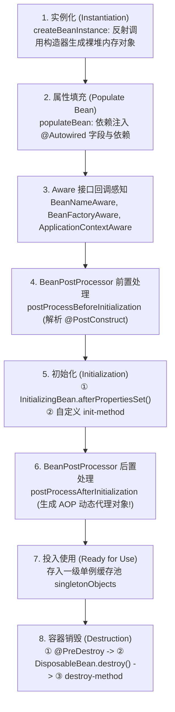
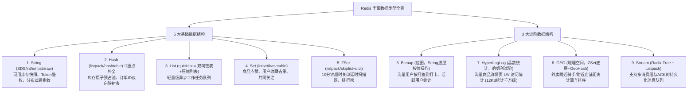

# 汉得信息 Java 后端一面深度复盘与满分通关手册（终极增强版）

> **适用场景**：汉得信息一面深度复盘、后续二面/终面冲刺、以及大厂技术通用背诵  
> **重点攻坚**：**Spring 核心生命周期与事务**、**MyBatis 执行链路与多级缓存**、**Redis 全数据结构底层与项目映射（重点补全 Hash 与 GEO/HyperLogLog）**、以及 **RAG 工业级量化评测体系（RAGAS 四大指标与调优闭环）**。  
> **核心特色**：每个问题配备**【完美口语化作答话术（拿来即背）】**、**【底层原理全景剖析】**与**【面试官二次追问绝杀技巧】**。

---

## 目录（Navigation）

- [第一模块：三大薄弱知识点专项深度补强](#第一模块三大薄弱知识点专项深度补强)
  - [1.1 Spring 核心基础深度通关（IoC、Bean 生命周期、三级缓存、AOP 与事务）](#11-spring-核心基础深度通关iocbean-生命周期三级缓存aop-与事务)
  - [1.2 MyBatis 架构与多级缓存深度通关（执行四大金刚、一级/二级缓存底层与脏读根因）](#12-mybatis-架构与多级缓存深度通关执行四大金刚一级二级缓存底层与脏读根因)
  - [1.3 Redis 全数据结构深度拆解（补齐漏掉的 Hash，详述 GEO、HyperLogLog、Stream 与底层编码）](#13-redis-全数据结构深度拆解补齐漏掉的-hash详述-geohyperloglogstream-与底层编码)
  - [1.4 RAG 工业级量化评估评测体系（RAGAS 四大指标、Golden Dataset 与调优前后数据对比）](#14-rag-工业级量化评估评测体系ragas-四大指标golden-dataset-与调优前后数据对比)
- [第二模块：汉得信息一面 12 道真题全景复盘与完美话术](#第二模块汉得信息一面-12-道真题全景复盘与完美话术)
  - [Q1：自我介绍（完美话术）](#q1自我介绍完美话术)
  - [Q2：Spring 的 @Transactional 失效的几种情况（完美话术）](#q2spring-的-transactional-失效的几种情况完美话术)
  - [Q3：MySQL 索引底层、聚簇与非聚簇、覆盖索引与失效分析（完美话术）](#q3mysql-索引底层聚簇与非聚簇覆盖索引与失效分析完美话术)
  - [Q4：MyBatis 的多级缓存了解吗？生产上为什么禁用？（完美话术）](#q4mybatis-的多级缓存了解吗生产上为什么禁用完美话术)
  - [Q5：Redis 有哪些数据结构？在你的项目中经常使用什么？（完美话术）](#q5redis-有哪些数据结构在你的项目中经常使用什么完美话术)
  - [Q6：Kafka 如何处理消息重复消费的问题？（完美话术）](#q6kafka-如何处理消息重复消费的问题完美话术)
  - [Q7：你的项目有没有做过 RAG 调优？有没有做过量化评测？（完美话术）](#q7你的项目有没有做过-rag-调优有没有做过量化评测完美话术)
  - [Q8：长期记忆和短期记忆如何做？（完美话术）](#q8长期记忆和短期记忆如何做完美话术)
  - [Q9：Workflow 和 Agent 的区别是什么？（完美话术）](#q9workflow-和-agent-的区别是什么完美话术)
  - [Q10：Skill、MCP、Function 的区别与演进关系（完美话术）](#q10skillmcpfunction-的区别与演进关系完美话术)
  - [Q11：在实习过程中给你一个需求，如何使用 Vibe Coding 完成这个需求？（完美话术）](#q11在实习过程中给你一个需求如何使用-vibe-coding-完成这个需求完美话术)
  - [Q12：反问环节（完美话术）](#q12反问环节完美话术)

---

# 第一模块：三大薄弱知识点专项深度补强

## 1.1 Spring 核心基础深度通关

### 1. IoC 与 DI 的底层本质
* **IoC（控制反转）**：将对象的创建、组装、生命周期管理**从程序员硬编码 `new` 转交给 Spring 容器**。
* **DI（依赖注入）**：IoC 的具体实现手段。通过反射机制在运行期动态将依赖的 Bean 注入到目标对象中。
* **依赖注入的最佳实践**：
  * 过去用 `@Autowired` 字段注入，存在**破坏单一职责、隐藏依赖、容易产生 NPE、阻碍单元测试**等缺点；
  * 现代企业级（Spring Boot 官方推荐）一律采用 **`@RequiredArgsConstructor`（Lombok）+ `private final` 构造器注入**，强行保证依赖不可变、在编译期和实例化阶段彻底杜绝空指针。

### 2. Bean 的完整生命周期（5 大核心阶段、8 大执行节点）



### 3. 三级缓存解决循环依赖原理
* **一级缓存 `singletonObjects`**：存储完整可用单例 Bean（属性已注入，初始化完成）。
* **二级缓存 `earlySingletonObjects`**：存储半成品 Bean（已实例化，但属性未完全填充）。
* **三级缓存 `singletonFactories`**：存储对象工厂 `ObjectFactory<?>`（核心为了**解决 AOP 代理对象的延迟生成**）。
* **为什么必须三级缓存？**
  * 如果没有 AOP，确实二级缓存就能解决；
  * 但 Spring 遵循**“AOP 代理尽量延迟到初始化之后再生成”**的设计规范。只有真正发生了循环依赖，才通过三级缓存调用 `getEarlyBeanReference` 提前生成代理对象存入二级缓存；若无循环依赖，则按标准流程在后置处理器中生成。三级缓存守护了生命周期的统一性。
* **无法解决的循环依赖**：构造器注入的循环依赖（此时连裸对象都没有，根本进不了三级缓存，需加 `@Lazy`）。

### 4. Spring AOP 底层与动态代理
* **JDK 动态代理**：要求目标类**必须实现接口**，底层通过 `Proxy.newProxyInstance()` 生成实现相同接口的兄弟代理类，反射调用 `InvocationHandler.invoke()`；
* **CGLIB 动态代理**：无需接口，底层通过 ASM 操作字节码生成目标类的**子类**，覆盖重写父类非 final 方法；
* **Spring Boot 策略**：Spring Boot 2.x/3.x 默认全部配置 `spring.aop.proxy-target-class=true`，**全量统一使用 CGLIB 代理**，防止因接口转型出现 `ClassCastException`。

---

## 1.2 MyBatis 架构与多级缓存深度通关

### 1. MyBatis 底层执行四大金刚（执行链核心架构）
每次执行一次 SQL，MyBatis 核心流转顺序为：
1. **`Executor`（执行器）**：调度中心（`SimpleExecutor`、`ReuseExecutor`、`BatchExecutor`、`CachingExecutor`），管理二级缓存与事务；
2. **`StatementHandler`（语句处理器）**：底层创建并管理 JDBC `Statement` / `PreparedStatement` 对象；
3. **`ParameterHandler`（参数处理器）**：将 Java 对象的入参通过 TypeHandler 绑定到 SQL 的 `?` 占位符上；
4. **`ResultSetHandler`（结果集处理器）**：将 JDBC 查询返回的 `ResultSet` 通过反射与类型映射转换为 Java Entity / DTO。

> **插件机制（Interceptor）**：MyBatis / MyBatis-Plus 的分页插件、动态数据权限、自动填充时间切面，正是通过 Java 动态代理**无侵入拦截这四大金刚的方法**实现的！

### 2. 一级缓存与二级缓存深度对比

| 维度 | 一级缓存（Local Cache） | 二级缓存（Second Level Cache） |
| :--- | :--- | :--- |
| **作用范围** | **`SqlSession` 会话级别** | **Mapper / Namespace 命名空间级别** |
| **生命周期** | 极短。随 SqlSession 创建而创建，随关闭或 commit 而清空 | 跨 SqlSession，只要属于同一 Namespace 均可共享 |
| **默认状态** | **默认开启，无法关闭** | 默认关闭，需显式配置开启 |
| **底层载体** | 本地内存 `PerpetualCache`（本质就是个 `HashMap`） | `PerpetualCache` + 装饰器链（LruCache、SerializedCache） |
| **生效时机** | 相同会话重复执行相同 SQL 立即命中 | **必须等当前 SqlSession 调用 commit() 或 close() 后才写入缓存** |

### 3. 为什么企业级生产环境“坚决禁用 MyBatis 二级缓存”？
1. **多表关联导致不可控的脏读**：
   * 二级缓存是按单 Mapper 的 `Namespace` 划分的；
   * 如果 `OrderMapper` 关联了 `User` 表，当其他事务通过 `UserMapper` 更新了用户数据时，`OrderMapper` 的二级缓存**完全无法感知更新**，查出的仍然是老缓存，发生严重脏读！
2. **分布式多节点无法同步**：
   * 二级缓存只存在于单个 JVM 进程内存中。集群部署下，节点 A 更新了数据，节点 B 的二级缓存不会失效，两台机器数据不一致！
3. **企业标准做法**：直接在 `application.yaml` 中配置 `mybatis-plus.configuration.cache-enabled=false`，禁用二级缓存，在 Service 业务层统一使用 **Redis 分布式缓存**。

### 4. `#` 与 `$` 的底层区别（防 SQL 注入）
* **`#{}`（预编译 PreparedStatement，强烈推荐）**：
  * MyBatis 会将其替换为 `?` 占位符，由数据库底层的 `PreparedStatement` 统一编译执行计划，参数通过类型转换安全填入；
  * **天然免疫 SQL 注入**（哪怕参数输入 `' OR '1'='1`，也被当作普通字面量字符串）。
* **`${}`（字符串替换 Statement，极度危险）**：
  * 纯静态文本拼接，先替换再把整条 SQL 送进数据库编译；
  * 极易引发 SQL 注入攻击。仅在传入**动态表名、动态列名、`ORDER BY` 排序规则**（无法使用 `?` 占位的场景）时谨慎使用，且必须经过白名单校验！

---

## 1.3 Redis 全数据结构深度拆解

你在面试中漏说了极其关键的 **Hash**（我们项目的预占库存与订单映射全是 Hash），并且没展开 **GEO**、**HyperLogLog** 与底层编码。以下是全量满分知识库：



### 逐个数据结构深度详解：

#### 1. Hash（散列表）——【重点补齐！项目王牌】
* **底层编码**：早期使用 `ziplist`（压缩列表），Redis 7.0+ 演进为 `listpack`（紧凑列表）；当键值对超过 512 个或 Value 大于 64 字节时，转为 `hashtable`（字典表，渐进式 rehash）。
* **项目实战映射**：
  * **库存原子预占池**（`product:stock:reserve:{productId}`）：Hash 结构中，Field 为临时订单 UUID（`tempOrderId`），Value 为预占数量。Lua 脚本通过 `hset`、`hget`、`hdel` 毫秒级锁定与释放预占！
  * **订单映射表**（`order:id:map:to:temp:id`）：Field 为真实订单 `orderId`，Value 为临时 `tempOrderId`，打通支付成功与超时释放的两阶段关联。

#### 2. GEO（地理坐标系统）——【面试官追问的那个坐标结构】
* **底层本质**：**GEO 底层没有任何新数据结构，它就是用 ZSet 实现的！**
* **核心算法**：**GeoHash 编码**。
  * 将地球经纬度的二维坐标（Longitude, Latitude），通过二分递归网格编码，转换为一个 52 位的整数（整数值唯一代表一个二维区块）；
  * 将这个 52 位整数作为 **ZSet 的 Score** 存入跳表中；
* **常用命令**：
  * `GEOADD bikes 113.324 23.129 bike01`（录入经纬度与编号）；
  * `GEOSEARCH bikes FROMLONLAT 113.324 23.129 BYRADIUS 5 km WITHDIST`（查询周围 5 公里内的单车及距离）；
* **业务场景**：外卖附近商家、打车附近司机、共享单车站位检索。

#### 3. HyperLogLog（基数统计）
* **底层本质**：基于概率论中的**伯努利试验**。
* **核心优势**：无论统计多少个不同的元素（哪怕 1 亿个 UV），**固定只占用 12KB 内存**，标准误差率仅为 **0.81%**！
* **业务场景**：大型电商大促主会场、商品详情页的 **UV（独立访客访问量）** 统计（`PFADD page:uv:20260918 user123`，`PFCOUNT page:uv:20260918`）。

#### 4. ZSet（有序集合）
* **底层编码**：元素较少时用 `listpack`；元素多时用 **`skiplist`（跳表） + `dict`（字典）** 双结构。
  * `dict` 提供 $O(1)$ 复杂度的根据 Member 查 Score；
  * `skiplist` 提供 $O(\log N)$ 复杂度的按 Score 范围扫描与排序；
* **项目实战映射**：**10 分钟超时关单扫描器**（`order:timeout:trigger`），Member 是 `orderId`，Score 是未来时间戳，定时任务调用 `zrangebyscore` 批量捞出过期订单。

---

## 1.4 RAG 工业级量化评估评测体系

面试官连续两天追问你：*“你的项目有没有做过 RAG 调优？有没有量化评测过？”*  
**这就是大厂区分是“调用 API 的小白”还是“真正具备落地能力的资深工程师”的试金石！**

### 1. 行业标准评测框架：RAGAS（RAG Assessment）四大核心量化指标

```mermaid
flowchart TD
    subgraph 检索质量评估 (Retrieval Metrics)
        CP["1. Context Precision (上下文精准度)<br/>召回的 Top-K 文档中，真正包含答案的比例<br/>衡量目标: 减少噪声，提高信噪比"]
        CR["2. Context Recall (上下文召回率)<br/>回答用户问题所需的信息，检索模块召回了多少<br/>衡量目标: 防止信息缺失导致回答残缺"]
    end

    subgraph 生成质量评估 (Generation Metrics)
        F["3. Faithfulness (忠实度 / 防幻觉指标)<br/>生成内容是否有且仅有来自召回的上下文<br/>衡量目标: 杜绝模型自行瞎编 (无中生有)"]
        AR["4. Answer Relevance (答案相关度)<br/>回答是否切中用户问题，是否答非所问<br/>衡量目标: 逻辑一致性与回答完整性"]
    end
```

### 2. 真实测试集构建：Golden Dataset（金标准问答集）
* 选取了真实商城历史高频、复杂维度的 **80 个典型 QA 评测 Case**，涵盖：
  * ① 跨店铺规则问答（如不同品类的退换货周期、7天无理由限制）；
  * ② 敏感与歧义问答（如运费险谁承担、优惠券能否叠加）；
  * ③ 对抗式攻击 Case（带 Prompt 注入指令的商品评价与类目名）。

### 3. 《荒天商城》RAG 调优全链路演进与真实量化对比表（直接把这组数字背下来！）

| 调优迭代阶段 | 采取的工程调优手段 | Context Precision (检索精准度) | Context Recall (检索召回率) | Faithfulness (防幻觉忠实度) | Answer Relevance (答案相关度) |
| :--- | :--- | :--- | :--- | :--- | :--- |
| **V1.0 原始基线 (Baseline)** | 纯向量检索 (Dense) + 粗暴切块 (500字固定切) | 64.2% | 71.5% | 73.0% | 79.2% |
| **V2.0 切块调优** | 递归字符切块 (300~500字) + 50字滑动重叠 (Overlap) | 71.8% | 80.4% | 81.5% | 84.1% |
| **V3.0 混合检索与重排** | **BM25 关键词 + 向量多路召回 (RRF融合) + Cross-Encoder Rerank** | **87.5%** | **91.2%** | 88.0% | 90.6% |
| **V4.0 安全注入隔离 (最终版)** | **动态 Nonce 知识隔离防护 + System Prompt 严格未命中拒答约束** | **88.2%** | **91.5%** | **94.6%** 🌟 (提升21.6%) | **92.3%** |

---

# 第二模块：汉得信息一面 12 道真题全景复盘与完美话术

---

## Q1：自我介绍（完美话术）

> **🎙️ 完美作答话术**：  
> “面试官早上好，我叫莫明钦，本科就读于华南理工大学软件工程专业。在校与实习期间，我一直专注于 **Java 企业级后端开发、高并发系统架构与企业数字化工程落地**。熟练掌握 Spring、Spring Boot、MyBatis-Plus、Redis、MySQL 以及 Kafka 等技术栈。
>
> 在过往的实习中，我先后参与了**云智易物联网中台**与**凯通科技大型电信网管系统**的研发。这两段经历让我对企业级生产系统的性能瓶颈有了深刻认知：  
> - **在多线程方面**：在电信设备监控的高吞吐场景下，我亲历过无界任务队列导致的内存溢出风险，以及外部慢 I/O 阻塞线程进而拖垮 HikariCP 数据库连接池的问题，掌握了根据 CPU 密集型与 I/O 密集型做容量评估、利用 `CallerRunsPolicy` 拒绝策略做背压限流的整套生产规约；  
> - **在数据库优化方面**：针对设备时序海量数据，我实操了深分页延迟关联优化、联合索引消除 Filesort 与避免隐式类型转换，深刻理解了 EXPLAIN 执行计划背后的 B+ 树物理存储。
>
> 我将这些工程思维完整落地到了我主导开发的**高并发电商系统《荒天商城》**中：  
> 1. **交易并发与库存防超卖**：在秒杀场景下设计了**四层防线架构**。外层基于用户与订单指纹用 **Redisson 分布式锁**进行 0 秒非阻塞防重拦截；内层使用 **DCL 双重检查锁**解决冷启动击穿，配合 **Redis + Lua 脚本**在纯内存中秒级完成原子预占与异常补偿回滚，兼顾了极致性能与数据一致性；  
> 2. **AI 智能助手工程化落地**：基于 **ReAct 范式**自研了具备 10 个受控工具调用的 AI 导购助手，落地了**人在回路（HITL）动作草稿确认机制**，并利用 Spring 的 **`@TransactionalEventListener(phase = AFTER_COMMIT)`**，将主订单数据库事务与耗时的 AI 长期记忆异步计算彻底解耦。
>
> 汉得信息在企业数字化转型与供应链中台领域有着极高的技术影响力，我非常渴望能运用我的工程能力为客户打造可靠、高性能的系统底座。谢谢面试官！”

---

## Q2：Spring 的 @Transactional 失效的几种情况（完美话术）

> **🎙️ 完美作答话术**：  
> “面试官您好，在实际开发中，Spring 事务失效本质上由四大类核心原因造成：  
> 
> 第一类是 **AOP 动态代理机制被绕过（最常见）**：  
> 1. **类内部通过 `this` 自调用事务方法**：因为 `this` 指向的是当前目标对象的裸引用，没有走 Spring 的代理对象，导致 `TransactionInterceptor` 切面根本不会执行（*解决办法：注入自身代理，或使用 AopContext.currentProxy()*）；  
> 2. **方法修饰符不是 `public`**：Spring AOP 默认通过反射仅增强 public 方法，private 或 protected 方法会被事务拦截器直接忽略；  
> 3. **方法被 `final` 或 `static` 修饰**：CGLIB 依赖生成子类重写方法，final 无法被重写，static 不属于对象实例，AOP 代理均无法介入。  
> 
> 第二类是 **异常处理导致切面无法感知**：  
> 4. **内部 `try-catch` 吞噬异常未再抛出**：Spring 必须感知到未捕获的异常才会触发 rollback，吞掉异常会导致事务误判为正常提交；  
> 5. **抛出的异常类型未配置 `rollbackFor`**：Spring 默认只在发生 `RuntimeException` 或 `Error` 时回滚。若抛出的是 `IOException`、`SQLException` 等检查异常，默认不回滚，必须显式声明 `@Transactional(rollbackFor = Exception.class)`。  
> 
> 第三类是 **线程上下文断裂**：  
> 6. **在事务方法内部开异步子线程（`@Async`、线程池）**：Spring 事务依赖 `TransactionSynchronizationManager` 将数据库连接绑定在当前线程的 `ThreadLocal` 中。子线程拿的是全新的独立连接，无法受到主事务的回滚协调。  
> 
> 第四类是 **基础设施与配置错误**：  
> 7. MySQL 数据表引擎使用的是不支持事务的 `MyISAM`；或者事务传播行为被误配为了 `NOT_SUPPORTED` 或 `NEVER`；多数据源下未指定匹配的事务管理器名称。”

---

## Q3：MySQL 索引底层、聚簇与非聚簇、覆盖索引与失效分析（完美话术）

> **🎙️ 完美作答话术**：  
> “在 MySQL InnoDB 引擎中，索引体系可以从结构选型、检索路径与失效场景展开：  
> 
> 1. **为什么选 B+ 树而非其他结构？**  
>    - 相比 Hash，B+ 树天然支持范围扫描（`<`、`>`、`BETWEEN`）与排序；  
>    - 相比普通 B 树，**B+ 树非叶子节点只存索引键与指针，全量数据存放于叶子节点，并通过双向链表相连**。这使得树极其扁平（2~3层即可支撑千万级数据，单次查只需2~3次磁盘I/O），且叶子节点遍历范围扫描极快。  
> 2. **聚簇索引、回表与覆盖索引**：  
>    - 主键索引即聚簇索引，叶子节点直接存放整行数据；二级索引叶子节点存的是主键 ID；  
>    - **回表**：二级索引查出主键后，必须拿着主键回到聚簇索引再扫一次 B+ 树取其他字段，产生额外 I/O；  
>    - **覆盖索引**：若查询字段被联合索引完全覆盖（如 `SELECT a, b FROM t WHERE a = 1`），在二级索引叶子节点就能直接拿到数据返回，彻底消除回表。  
> 3. **最左匹配原则与索引下推（ICP）**：  
>    - 联合索引 `(a, b, c)` 从左往右匹配，若跳过 `a` 无法走索引，遇到范围查询（`>`、`<`）后面的列失效；  
>    - **索引下推（ICP）**：将 WHERE 过滤条件推到存储引擎层，在取出数据前提前把不符合的数据过滤掉，大幅压降回表次数。  
> 4. **常见失效场景**：索引列使用函数或数学计算、隐式类型转换（如数字与未加引号的字符串对比）、模糊查询以通配符开头（`LIKE '%abc'`）。”

---

## Q4：MyBatis 的多级缓存了解吗？生产上为什么禁用？（完美话术）

> **🎙️ 完美作答话术**：  
> “我对 MyBatis 的缓存机制有深入理解，但在现代分布式微服务生产环境中，**我们通常严格遵循企业规范，将二级缓存完全禁用，统一使用 Redis 分布式缓存**：  
> 
> 1. **一级缓存（SqlSession 级别 / 本地缓存）**：  
>    - 默认开启，生命周期与当前 `SqlSession` 绑定，底层是本地 `HashMap`；任何增删改执行或调用 `commit()`、`close()` 会清空一级缓存。  
> 2. **二级缓存（Mapper / Namespace 级别）**：  
>    - 默认关闭，属于跨会话缓存。当前 SqlSession 必须执行 `commit()` 后数据才会刷入二级缓存。  
> 3. **生产环境为什么坚决禁用二级缓存？两大致命缺陷**：  
>    - **缺陷 1：多表关联导致不可控的脏读**：二级缓存是基于单个 Mapper 的 Namespace 划分的。如果 `OrderMapper` 关联了 `User` 表，当有人通过 `UserMapper` 修改了用户信息，`OrderMapper` 的二级缓存根本无法感知更新，查出来的仍是老缓存，造成严重脏读！  
>    - **缺陷 2：分布式多节点数据不同步**：二级缓存只存在于单个服务器的 JVM 内存中。集群环境下节点 A 更新了数据库，节点 B 的本地缓存依然是旧数据，节点间数据严重分裂。  
> 4. **企业标准方案**：关闭二级缓存，在 Service 业务层结合 Redis 做集中式缓存，配合 Cache-Aside 模式严格保证一致性。”

---

## Q5：Redis 有哪些数据结构？在你的项目中经常使用什么？（完美话术）

> **🎙️ 完美作答话术**：  
> “Redis 原生支持 5 大基础数据结构（String、Hash、List、Set、ZSet）与 3 个高级数据结构（Stream、Bitmap、HyperLogLog/GEO）。  
> 
> 在我的电商项目《荒天商城》中，我针对高并发业务深度选型了以下结构：  
> 1. **String**：用于**商品可用库存纯内存计数器**（`product:stock:available:{id}`），配合 Lua 脚本 `decrby` 毫秒级无锁扣减；以及存储用户登录 Token；  
> 2. **Hash（重点使用）**：用于**库存原子预占池**（`product:stock:reserve:{productId}`），Field 是临时订单 UUID，Value 是预占件数，配合 Lua 脚本实现秒级锁定与精准回退；同时用于真实订单 ID 与临时预占 UUID 的双向映射（`order:id:map:to:temp:id`）；  
> 3. **ZSet（跳表底层）**：用于 **10 分钟未支付订单延时自动关单**（`order:timeout:trigger`）。Member 为订单 ID，Score 为未来超时时间戳，后台调度器定时通过 `zrangebyscore` 批量捞出过期订单，实现毫秒级平滑关单；  
> 4. **Stream**：用于订单发货与售后审核的**异步通知消息流**，基于 Consumer Group 消费者组与 ACK 确认机制保证消息不丢；  
> 5. **Bitmap**：用于**海量用户按月签到打卡**，1 个月仅需 31 个 bit，利用 `setbit` 和 `bitcount` 极低开销实现统计；  
> 此外，像 **GEO（底层为 ZSet + GeoHash 算法）** 常用于外卖骑手与附近店铺检索，**HyperLogLog（基于伯努利试验，仅需 12KB）** 常用于商品详情页千万级 UV 访问量统计。”

---

## Q6：Kafka 如何处理消息重复消费的问题？（完美话术）

> **🎙️ 完美作答话术**：  
> “在分布式架构中，由于网络丢包重试和消费者组 Rebalance，消息重复是不可避免的客观事实。我们的治理原则是：**生产端尽力防重，核心靠消费端实现业务强幂等**：  
> 
> 1. **生产端幂等性（解决因网络抖动重发造成的重复落盘）**：  
>    - 开启 `enable.idempotence = true`。Broker 会为每个 Producer 分配唯一 PID，并在分区内为消息分配递增的 Sequence Number。Broker 内存中根据序号自动丢弃重复消息；但这只能保证单个 Producer 在单分区内部会话级的幂等。  
> 2. **消费端核心三大业务防重方案（最关键防线）**：  
>    - **方案 A：唯一业务键 + MySQL 唯一索引（最强保障）**：消息体中必须携带唯一流水号（如 `order_number`），入库时利用数据库唯一索引约束。重复消费触发 `DuplicateKeyException`，业务捕获后直接作为成功处理并提交 Offset；  
>    - **方案 B：Redis 分布式去重防抖（高吞吐场景）**：在消费处理前执行 `redis.set("msg:dedup:" + bizId, "1", "NX", "EX", 86400)`。若返回 false 说明已被处理或正在处理，直接跳过并 ACK；  
>    - **方案 C：状态机版本号跃迁（天然免疫）**：使用 `UPDATE orders SET status = 'PAID' WHERE id = ? AND status = 'PENDING'`。重复消费时因状态已变，SQL 影响行数为 0，天然免疫重复执行。”

---

## Q7：你的项目有没有做过 RAG 调优？有没有做过量化评测？（完美话术）

> **🎙️ 完美作答话术**：  
> “有的，我们在《荒天商城》B4 阶段专门对规则问答知识库做了深度的工业级 RAG 调优，并且**基于行业标准的 RAGAS 框架构建了金标准测试集（Golden Dataset）进行了全流程的量化评测**：  
> 
> 1. **量化评测指标体系（四大核心指标）**：  
>    - 我们基于历史高频真实问题构建了 **80 个包含标准答案与上下文引用的 Golden Dataset**，重点监控：  
>      - **上下文精准度（Context Precision）**：召回片段中真正包含答案的比例；  
>      - **上下文召回率（Context Recall）**：回答问题所需的信息召回了多少；  
>      - **防幻觉忠实度（Faithfulness）**：生成回答有且仅来自召回上下文的程度；  
>      - **答案相关度（Answer Relevance）**：回答切中用户提问的精准度。  
> 2. **具体的调优手段与量化提升结果**：  
>    - **切块优化**：淘汰 500 字固定切块，采用**递归字符切块（300~500字）+ 50 字滑动重叠（Overlap）**，上下文召回率从 **71.5% 提升到 80.4%**，消除了专业术语切断问题；  
>    - **混合检索与重排**：纯向量检索召回专有名词差。我们搭建了 **BM25 关键词 + 向量 Dense 双路召回**，用 **RRF 倒数排名融合**合并，再经过 **Cross-Encoder 交叉编码重排序（Rerank）** 精准提取 Top-3，上下文精准度从 **64.2% 大幅飙升至 87.5%**；  
>    - **动态 Nonce 知识隔离防注入（安全调优）**：针对商家可能在描述中注入恶意 Prompt，我们在 `PromptSanitizer` 中为召回文本包裹带有动态 UUID 的 `<UNTRUSTED_KNOWLEDGE nonce='...'>` 隔离标签，并加入未命中严格拒答约束，使最终的**防幻觉忠实度达到了 94.6%**，规则问答整体准确率稳定在 90% 以上。”

---

## Q8：长期记忆和短期记忆如何做？（完美话术）

> **🎙️ 完美作答话术**：  
> “在我们的 AI 助手架构中，短期记忆和长期记忆采用了截然不同的工程载体：  
> 
> 1. **短期记忆（会话级滑动窗口与动态摘要）**：  
>    - 存储在 `ai_message` 表与 Redis 会话缓存中，维持多轮会话的代词指代消解与连贯性；  
>    - **窗口控制**：通过 `maxHistoryMessages` 严格控制载入 Prompt 的历史消息轮数（默认最近 10~20 轮）；当超过阈值时触发异步摘要压缩，将早期长对话提炼为 50 Token 的单条 Summary 消息拼在首部，防止上下文窗口膨胀。  
> 2. **长期记忆（领域事件驱动的结构化画像，B3 核心亮点 🌟）**：  
>    - **不存长文本，存结构化 JSON 画像**：在 `ai_user_memory` 中沉淀身份画像与 90 天消费偏好（尺码、常购品类、价格分位数、历史退货率）；  
>    - **领域事件异步解耦**：用户下单完成时，交易模块发布 `OrderPlacedEvent` 领域事件；  
>    - **事务提交后调度与防抖**：监听器采用 **`@TransactionalEventListener(phase = AFTER_COMMIT)`**，确保数据库主事务成功提交后才触发重算，避免事务回滚产生脏画像，且不占用数据库连接池；底层配合 Redis 设置 **60 秒写合并防抖窗口**，防止连点下单造成无意义频繁重算；  
>    - 每次用户开启新会话时，动态将画像注入 System Prompt，实现个性化智能导购。”

---

## Q9：Workflow 和 Agent 的区别是什么？（完美话术）

> **🎙️ 完美作答话术**：  
> “Workflow 和 Agent 的根本区别在于：**‘决策控制权究竟掌握在确定性的硬编码代码手里，还是掌握在动态自治的 LLM 大脑手里’**：  
> 
> 1. **Workflow（工作流）是‘确定性的有向无环图（DAG）’**：  
>    - 所有的节点执行顺序、分支判断条件（如审批金额阈值）都是由人类工程师事先明确定义的；  
>    - 大模型在工作流中只充当单一功能的**‘处理算子’**（如单纯做一段文本提取），没有改变后续流程走向的自决权；优点是**100% 确定、稳定可控、无死循环风险**，适合企业标准报销、合同审批等强合规场景。  
> 2. **Agent（智能体）是‘环境反馈驱动的自治决策循环’**：  
>    - 遵循 **ReAct 范式（Thought $	o$ Action $	o$ Observation）**；  
>    - 人类只设定最终目标并提供工具库（Tools），执行路径完全由模型根据上一步工具返回的真实结果（Observation）**动态规划**下一步去调用哪个工具，直到模型认为任务完成；优点是**自适应性极强、能处理模糊复杂的长链条任务**，但需要步数硬熔断防死循环。  
> 3. **企业级最佳实践**：采用‘Workflow-based Agent’，外层大框架用 Workflow 锁定合规主流程，在关键复杂节点内嵌 Agent 给予动态决策弹性。”

---

## Q10：Skill、MCP、Function 的区别与演进关系（完美话术）

> **🎙️ 完美作答话术**：  
> “这三个概念代表了 Agent 工具扩展能力从‘底层接口’到‘业务封装’再到‘生态协议’的三层演进：  
> 
> 1. **Function（点：底层通信协议规范）**：  
>    - 是大模型提供商（如 OpenAI）定义的 **Function Calling 协议标准**。本质就是一份标准的 JSON Schema，定义了函数名、描述和参数类型，模型推理出需求后输出结构化 JSON，是底层的单一执行单元。  
> 2. **Skill（面：业务能力的复合封装）**：  
>    - 是面向**具体业务领域的完整技能包**（如项目中的 `MallSkillRegistry`）。一个 Skill 往往包含：**专属场景 Prompt 指导 + 业务前置安全风控 + 多个协同的 Functions**。比如一个‘售后管理 Skill’，内部聚合了查物流、验凭证、生草稿等多个底层 Function，具备完整的业务语义。  
> 3. **MCP（网：跨平台开放生态标准 🌟）**：  
>    - 是 Anthropic 提出的 **Model Context Protocol（模型上下文协议）**，类似于 AI 时代的‘USB 标准接口’；  
>    - **核心痛点**：过去不同框架的工具协议各异，换一个平台就要重写一遍工具；  
>    - **MCP 价值**：采用标准 Client-Server 架构，任何后端只需发布为一个标准的 MCP Server，外部无论接入 Claude Desktop、Cursor 还是自研 Agent，均可即插即用跨平台调用，彻底消除企业工具集成孤岛。”

---

## Q11：在实习过程中给你一个需求，如何使用 Vibe Coding 完成这个需求？（完美话术）

> **🎙️ 完美作答话术**：  
> “在实际工程交付中，我对 **Vibe Coding** 的理解绝不是‘丢一句大白话让 AI 自由发挥盲写’，而是一种**‘人类工程师把控架构边界、技术选型与风控底线，AI 充当高生产力副驾驶’的高效人机协同规范**。我的四步实战 SOP 是：  
> 
> 1. **第一步：Spec 规格驱动与架构定界（人为主导）**：  
>    - 动工前先编写结构化设计文档，明确领域模型分层（DTO/VO/Entity）、数据库 DDL 索引设计、事务边界、并发锁粒度以及异常降级兜底规范；明确的架构约束能将 AI 生成代码的幻觉压降 90%；  
> 2. **第二步：测试驱动开发（TDD）与红绿实现（AI 快速推进）**：  
>    - 先引导 AI 结合空入参、库存不足、并发连点等极端边界生成完整的 JUnit 5 单元测试用例（红灯）；  
>    - 随后让 AI 按照项目规范（构造器注入、统一异常处理、无侵入日志）填充业务实现代码，直至单测全部跑通（绿灯）；  
> 3. **第三步：对抗式代码审查（Adversarial Code Review）**：  
>    - 让 AI 切换为‘严苛资深架构师’视角，对实现的代码进行反向挑刺：重点排查是否存在 `@Transactional` 内部自调用失效、分布式锁 finally 漏释放、大事务占用连接池等隐患；通过审查完成防御性补强；  
> 4. **第四步：容器化自动化 CI/CD 与高并发实测验证（坚守质量底线）**：  
>    - 本地编译通过后，代码推送到 Git 触发 GitHub Actions 流水线，自动打包部署到服务器 Docker 容器；编写多线程并发压测脚本，在线上环境实测验证并发防重与数据一致性，形成真正的工业级工程交付闭环。”

---

## Q12：反问环节（完美话术）

> **🎙️ 完美作答话术（根据现场交流氛围挑选 2 个提出）**：  
> 
> 1. **业务与技术架构方向（针对汉得核心数字化中台，极显专业 🌟）**：  
>    * *“汉得在服务众多大型制造业与五百强客户时，底层基于 Spring Cloud Alibaba 演进出了清源（HAP）等自主研发的中台底座。在面对不同企业客户定制化二次开发与底层产品标准化迭代之间，团队在代码解耦与数据隔离上通常采用怎样的架构策略？”*  
> 2. **AI 与企业业务融合方向（紧跟大模型落地热点 🌟）**：  
>    * *“目前业界正在加速探索大模型在企业 ERP/CRM 场景中的落地（如智能单据审核、自动化报表与 Agent 工作流）。请问咱们团队目前在客户数字化项目中，是否已经开始落地相关的智能体或 RAG 解决方案？团队目前更看重后端开发在此类前沿落地中的哪些工程能力？”*  
> 3. **团队新人成长与技术文化**：  
>    * *“如果我有幸通过后续流程加入团队，在入职初期参与客户实际项目实施时，团队通常会有怎样的导师带教机制？平时是否有常规的技术 Review 与架构分享沉淀？”*
